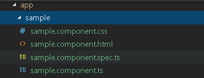

### Angular コンポーネントを使用した UI の作成

> [!Video https://www.youtube.com/embed/z1SZUezpRXY]

Angular アプリケーションでユーザー インターフェイスを作成する場合、Angular コンポーネントを使用して処理を効率化できます。

Angular で UI を作成する方法は、WPF で UI を作成する方法と非常に似ています。通常、UserControl クラスで表されるユーザー コントロールを使用します。`UserControl` は、マークアップとコードを再利用可能なコンテナにグループ化し、複数の異なる場所で同じインターフェイスと機能を使用できるようにします。このユーザー コントロールには、UI マークアップ用の .xaml ファイルとロジック用の C# ファイルがあります。さらに、このユーザー コントロール用の任意のタイプのスタイリング情報を含むリソース ディクショナリがあります。Angular では、`Component` と呼ばれるものを使用します。コンポーネントには、UI マークアップに使用される html ファイルがあります。プロパティとロジックに使用される typescript ファイルがあり、すべてのスタイル情報に CSS ファイルを使用します。以下は比較ですが類似点が多くあります。


左側には、`Sample` というユーザー コントロールを備えた WPF アプリケーションがあります。また、スタイリング情報を含む `SampleResources` と呼ばれるリソース ディクショナリもあります。
右側には、`AppComponent` を持つ Angular アプリケーションがあります。先に進み、Angular アプリ コンポーネントを WPF アプリケーションのサンプル ユーザーコントロールのコンポーネントと比較します。

アプリ コンポーネントの typescript ファイルを開きます。このファイルをコンポーネントの背後にあるコードと考えることができます。その理由は、WPF にアクセスして `Sample` ユーザー コントロールの背後にあるコードである Sample.xaml.cs を開いて多くの類似点を確認できます。


はじめに、`AppComponent` と呼ばれるエクスポートするクラスがあることがわかります。現在、この AppComponent には title というプロパティもあります。したがって、このクラス内で、コンポーネントの実行に必要なすべてのプロパティ、メソッド、およびイベントを定義でき、ユーザー コントロールと非常に似ています。クラス (この場合は `Sample`) があり、このクラス内で、ユーザーコントロールが機能するために必要なすべてのプロパティ、メソッド、およびイベントを定義します。

次に、typescript ファイル内で数行上へ移動し、`@` 記号とコンポーネントを使用した構文を示します。これは実際にはデコレータと呼ばれます。このデコレータは、エクスポートするこのクラスをどのように扱うかを Angular に伝えています。この場合、コンポーネントとして処理しますが、コンポーネントとして処理するため、デコレーターで情報を提供する必要があります。情報を取得する前に、まず typescript ファイルの一番上の行に注意を払いましょう。`import { Component } from '@angular/core'` をインポートします。これは using ステートメントと考えることができます。基本的に、このコンポーネントが機能するために必要なオブジェクトをインポートしています。この場合、`@angular/core` モジュールから`コンポーネント`をインポートするため、実際にこのコンポーネントにデコレータを使用できます。これは、ユーザー コントロールの背後にあるコード内の using ステートメントに非常に似ています。C# 内の `using` ステートメントを使用して、ユーザー コントロールが機能するために必要なクラス内のオブジェクトを使用します。

次にコンポーネント デコレータの内部に戻ります。
 - 4 行目のコード行は、セレクターと呼ばれます。セレクタは、html でこれらの要素をどのように定義するかを決定するのに役立ちます。このセレクタは `app-root` と呼ばれるため、先に進んで index.html を開くと、本文内に `app-root` という要素が表示されます。その要素は、コンポーネント デコレータで定義されたセレクタを使用して、このコンポーネントのインスタンスを定義しています。
 - 次に、5 行目には、テンプレート URL と呼ばれるものがあります。これは、`app.component.html` というファイルを指します。このコンポーネントの視覚的なレンダリングを表す html ファイル。これは、WPF のユーザーコントロールの `Sample.xaml` ファイルと非常によく似ています。xaml は、このコントロールのレンダリング方法を表すマークアップです。
 - 6行目はスタイル URL です。スタイル URL は CSS ファイルを指しています。このファイルは、コンポーネントのスタイル情報を表します。したがって、`app.component.css` ファイルにスタイリング情報はありませんが、CSS ファイルはリソース ディクショナリへの直接マッピングと考えることができます。XAML のリソース ディクショナリには、ユーザー コントロールまたはユーザー コントロール内の要素のすべてのスタイル情報が含まれているため、デザインに従ってレンダリングされます。これは、CSS で行う場合と全く同じです。

### コンポーネントの生成

Angular コンポーネントが WPF ユーザー コントロールにどれだけ似ているかを確認したため、新しいコンポーネントを作成してアプリケーションに追加します。デスクトップ開発者の場合、WPF で新しいユーザー コントロールの追加は、プロジェクトを右クリックして、**[追加]> [ユーザーコントロール]**を選択します。Visual Studio Code に同様のオプションはなく、新しいファイル、新しいフォルダーのみです。つまり、端末にアクセスし、Angular CLI を使用してコンポーネントを生成する必要があります。`Control + Backtick` と入力して、ターミナルを切り替えましょう。ターミナルで、生成に **NG G**、コンポーネントに **C** を入力し、コンポーネントの名前 (`sample` など) を入力します。

```cmd
ng g c sample
```

コマンドが完了すると、多くのことが実行されているのを確認できます。まず、コンポーネントに指定したのと同じ名前の新しいフォルダーがあります。また、html ファイル、SPEC ファイル、typescript ファイル、CSS ファイルの 4 つの新しいファイルがあります。`app.module.ts` ファイルも更新しました。



新しく作成したコンポーネントを含む `sample` フォルダーを確認します。コンポーネントに必要な 3 つのファイルすべてに加えて、SPEC ファイルがありますが、このトピックでは必要ないテスト ファイルです。また、app.module.ts に変更を加え、NgModule の`宣言`セクションにサンプルコンポーネントを追加しました。
> [!NOTE]
> 重要: 新しいコンポーネントが作成されるたびに、NG モジュールの宣言セクションで宣言する必要があります。このセクションでは、このモジュールに属するコンポーネントについて説明します。

`sample.component.ts` ファイルに戻りましょう。上記で説明した `app.component.ts` ファイルに非常によく似ています。この場合、コンポーネントをインポートする import ステートメントがあります。セレクターを `app-sample` として定義するコンポーネント デコレーターがあります。`sample.component.html` というテンプレート URL と、`sample.component.html` というスタイル URL があります。

次は html ファイルのサンプルの動作を説明する段落です。app.component.html をアプリケーションの起動時に確認します。タイトル以外の初期マークアップのほとんどを削除し、`<app-sample></app-sample>` を追加します。
```html
<div style="text-align:center">
  <h1>
    Welcome to {{ title }}!
  </h1>
  <app-sample></app-sample>
</div>
```

### アプリケーションの実行

ターミナルで `npm start` と入力すると、アプリケーションがコンパイルおよびビルドされ、ブラウザー内で起動されます。問題がなければ、アプリケーションがブラウザで実行されます。`アプリへようこそ` - アプリ コンポーネントのマークアップとサンプル。これは、先ほど追加したサンプル コンポーネントのマークアップです。
テキストを「このサンプルはよく機能します！」に変更して、サンプル コンポーネントを少し変更します。
```html
<p>
  This sample works very well!
</p>
```
ブラウザを保存して確認すると、サンプル コンポーネントのレンダリングを担当する html を実際に編集していることがわかります。
コンポーネントのスタイルを設定する場合は、スタイル URL を確認する必要があります。それでは、`sample.component.css` ファイルを開いて、段落タグの色を赤にしましょう。
```css
p {
    color: red;
}
```
保存してブラウザーを開くと、CSS ファイルのスタイル設定がサンプル コンポーネントに適用されていることがわかります。

## その他のリソース
* [デスクトップから Web: はじめての Angular アプリを作成](https://www.youtube.com/watch?v=z1SZUezpRXY&t)
* [Angular Introduction to Components (英語)](https://angular.io/guide/architecture-components)

<div class="divider--half"></div>
コミュニティに参加して新しいアイデアをご提案ください。

* [Ignite UI for Angular **フォーラム** (英語)](https://www.infragistics.com/community/forums/f/ignite-ui-for-angular)
* [Ignite UI for Angular **GitHub** (英語)](https://github.com/IgniteUI/igniteui-angular)


