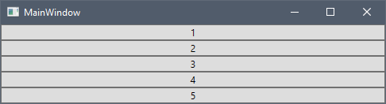
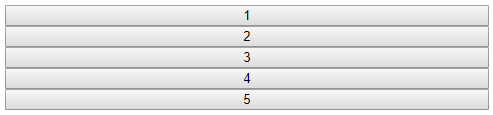
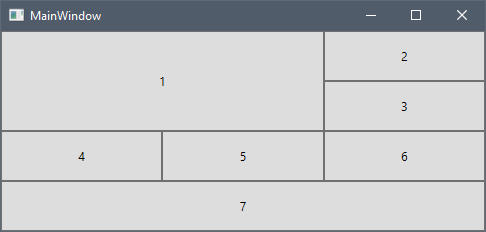
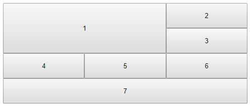

## ページ レイアウト

WPF では、アプリケーション内で要素をレイアウトするには、要素を [`Panel`](https://docs.microsoft.com/ja-jp/dotnet/api/system.windows.controls.panel?view=netframework-4.8) 内に配置する必要があります。パネルは、子要素の配置を制御するコンテナ要素です。Angular では、ページ レイアウトとその子要素をカスタマイズするには、CSS を使用する必要があります。WPF で最も一般的なパネルを示し、CSS で同様のレイアウトを実現する方法を説明します。

### StackPanel


 [`StackPanel`](https://docs.microsoft.com/ja-jp/dotnet/api/system.windows.controls.stackpanel?view=netframework-4.8) は、子要素を水平方向または垂直方向に配置できる単一行に配置します。StackPanel にボタンを追加して、WPF でどのように表示されるかを確認します。

```xml
<StackPanel>
    <Button>1</Button>
    <Button>2</Button>
    <Button>3</Button>
    <Button>4</Button>
    <Button>5</Button>
</StackPanel>
```



Angular で同様のレイアウトを実現する場合は、CSS Flexbox レイアウトを使用できます。フレキシブル ボックス レイアウト モジュールは、柔軟でレスポンシブなレイアウト構造の設計が可能な構造になっています。Flexbox レイアウトを使用するには、[`display`](https://www.w3schools.com/cssref/pr_class_display.asp) プロパティを `flex` に設定したコンテナを定義する必要があります。また、アイテムを垂直に積み重ねるために、[`flex-direction`](https://www.w3schools.com/cssref/css3_pr_flex-direction.asp) プロパティを `column` に設定する必要があります。

```html
<div class="flex-container">
    <button>1</button>
    <button>2</button>
    <button>3</button>
    <button>4</button>
    <button>5</button>
</div>
```

```css
.flex-container {
    display: flex;
    flex-flow: column;
}
```

ブラウザでの最終結果は次のとおりです。



[`flex-direction`](https://www.w3schools.com/cssref/css3_pr_flex-direction.asp) プロパティのデフォルト値は `row` です。これは、WPF の水平方向の StackPanel と同等です。フレックス ボックスは、アイテムを右から左、下から上にそれぞれ積み重ねる `row-reverse` と `column-reverse` 方向もサポートしています。

### WrapPanel

[`WrapPanel`](https://docs.microsoft.com/ja-jp/dotnet/api/system.windows.controls.wrappanel?view=netframework-4.8) は、子要素を左から右へ順番に配置し、コンテンツを含むボックスの端の次の行に分割します。その後の順序は、Orientation プロパティの値に応じて、上から下または右から左に順番に発生します。以下は、WrapPanel にボタンを追加し、WPF でどのように表示されるかを確認します。

```xml
<WrapPanel>
    <WrapPanel.Resources>
        <Style TargetType="Button">
            <Setter Property="Width" Value="150"></Setter>
        </Style>
    </WrapPanel.Resources>
    <Button>1</Button>
    <Button>2</Button>
    <Button>3</Button>
    <Button>4</Button>
    <Button>5</Button>
</WrapPanel>
```


Angular で同様の結果を得るために、Flexbox レイアウトを再び使用します。StackPanelの場合と同様に、[`display`](https://www.w3schools.com/cssref/pr_class_display.asp) プロパティを `flex` に設定する必要がありますが、[`flex-wrap`](https://www.w3schools.com/cssref/css3_pr_flex-wrap.asp) プロパティを `wrap` に設定する必要もあります。

```html
<div class="flex-container">
    <button>1</button>
    <button>2</button>
    <button>3</button>
    <button>4</button>
    <button>5</button>
</div>
```

```css
.flex-container {
    display: flex;
    flex-wrap: wrap;
}

button {
    width: 150px;
}
```

以下は、ブラウザーでの最終結果です。


Orientation="Vertical" の WrapPane と同様の結果を得るには、[`flex-direction`](https://www.w3schools.com/cssref/css3_pr_flex-direction.asp) プロパティを `column` に設定する必要があります。[`flex-flow`](https://www.w3schools.com/cssref/css3_pr_flex-flow.asp) プロパティは、`flex-direction` プロパティと `flex-wrap` プロパティの両方を設定するための略記プロパティです。 

```css
.flex-container {
    display: flex;
    flex-flow: row wrap;
}
```

フレックス ボックスは、アイテムを配置するための CSS プロパティをさらにサポートしています。詳細については、[チュートリアル](https://www.w3schools.com/css/css3_flexbox.asp)をご覧ください。

### Grid

[`Grid`](https://docs.microsoft.com/ja-jp/dotnet/api/system.windows.controls.grid?view=netframework-4.8) は、列と行で構成される柔軟なグリッド領域を定義します。以下は、グリッドにボタンを追加し、WPF でどのように表示されるかを確認します。

```xml
<Grid>
    <Grid.ColumnDefinitions>
        <ColumnDefinition />
        <ColumnDefinition />
        <ColumnDefinition />
    </Grid.ColumnDefinitions>
    <Grid.RowDefinitions>
        <RowDefinition Height="50" />
        <RowDefinition Height="50" />
        <RowDefinition Height="50" />
        <RowDefinition Height="50" />
    </Grid.RowDefinitions>
    <Button Grid.RowSpan="2" Grid.ColumnSpan="2">1</Button>
    <Button Grid.Column="2">2</Button>
    <Button Grid.Row="1" Grid.Column="2">3</Button>
    <Button Grid.Row="2">4</Button>
    <Button Grid.Row="2" Grid.Column="1">5</Button>
    <Button Grid.Row="2" Grid.Column="2">6</Button>
    <Button Grid.Row="3" Grid.ColumnSpan="3">7</Button>
</Grid>
```



Angular では、CSS グリッド レイアウト モジュールを使用できます。CSS グリッド レイアウト モジュールは、行と列を持つグリッド ベースのレイアウト システムを提供します。グリッド レイアウトを使用するには、`grid` または `inline-grid` に設定された [`display`](https://www.w3schools.com/cssref/pr_class_display.asp) プロパティを持つコンテナを定義します。

```html
<div class="grid-container">
    <button class="button1">1</button>
    <button>2</button>
    <button>3</button>
    <button>4</button>
    <button>5</button>
    <button>6</button>
    <button class="button7">7</button>
</div>
```

```css
.grid-container {
    display: grid;
}
```

> [!NOTE]
> CSS グリッドレイアウトは、Internet Explorer 11 などの古いブラウザーでは[サポートされていません](https://caniuse.com/#feat=css-grid)。

次に、[`grid-template-columns`](https://www.w3schools.com/cssref/pr_grid-template-columns.asp) プロパティを使用してグリッドの列を定義します。

```css
.grid-container {
    display: grid;
    grid-template-columns: auto auto auto;
}
```

width `auto` を使用して 3 つの列を定義すると、同じ幅になります。WPF のスターサイズ設定に比例して利用可能なスペースを分配する場合は、CSS のフレックスサイズ設定ユニット `fr` を使用できます。次のコード スニペットは 2 つの列を定義します。最初の列は使用可能なスペースの 1 倍を受け取り、2 番目の列は使用可能なスペースの 2 倍を受け取ります。

```css
.grid-container {
    display: grid;
    grid-template-columns: 1fr 2fr;
}
```

次に、[`grid-template-rows`](https://www.w3schools.com/cssref/pr_grid-template-columns.asp) プロパティを使用して、高さ 50px の行を追加します。

```css
.grid-container {
    display: grid;
    grid-template-columns: auto auto auto;
    grid-template-rows: 50px 50px 50px 50px;
}
```

アプリケーションを開くと、以下のようになります。


WPF グリッドと CSS グリッドの重要な違いが 1 つあります。WPF では、Grid.Row および Grid.Column のデフォルト値は 0 ですが、CSS グリッド レイアウトは、次に使用可能な行と列をその子に自動的に割り当てます。

次に、列と行のスパンを最初と 7 番目のボタンに適用します。ここでは、[`grid-row`](https://www.w3schools.com/cssref/pr_grid-row.asp) と [`grid-column`](https://www.w3schools.com/cssref/pr_grid-column.asp) プロパティを使用します。

```css
.button1 {
    grid-column: 1 / 3;
    grid-row: 1 / 3;
}

.button7 {
    grid-column: 1 / span 3;
}
```

最初に開始行/列を指定し、次に `/` 記号の後に、終了行/列、または項目がまたがる行/列の数を指定できます。WPF とは異なり、CSS グリッドの列番号は 0 から始まり、最初の行/列は 1 です。

以下は、完全な CSS とブラウザーでの最終結果です。

```css
.grid-container {
    display: grid;
    grid-template-columns: auto auto auto;
    grid-template-rows: 50px 50px 50px 50px;
}

.button1 {
    grid-column: 1 / 3;
    grid-row: 1 / 3;
}

.button7 {
    grid-column: 1 / span 3;
}
```



`grid-row` および `grid-column` プロパティは、[`grid-row-start`](https://www.w3schools.com/cssref/pr_grid-row-start.asp)、[`grid-row-end`](https://www.w3schools.com/cssref/pr_grid-row-end.asp)、[`grid-column-start`](https://www.w3schools.com/cssref/pr_grid-column-start.asp)、[`grid-column-end`](https://www.w3schools.com/cssref/pr_grid-column-end.asp) プロパティの略記プロパティです。CSS グリッド コンテナと項目プロパティの詳細については、**その他のリソース**セクションのチュートリアルをご覧ください。

## その他のリソース
* [CSS Flexbox](https://www.w3schools.com/css/css3_flexbox.asp)
* [CSS Grid 概要](https://www.w3schools.com/css/css_grid.asp)
* [CSS Grid コンテナ](https://www.w3schools.com/css/css_grid_container.asp)
* [CSS Grid Item](https://www.w3schools.com/css/css_grid_item.asp)

<div class="divider--half"></div>
コミュニティに参加して新しいアイデアをご提案ください。

* [Ignite UI for Angular **フォーラム** (英語) ](https://www.infragistics.com/community/forums/f/ignite-ui-for-angular)
* [Ignite UI for Angular **GitHub** (英語) ](https://github.com/IgniteUI/igniteui-angular)