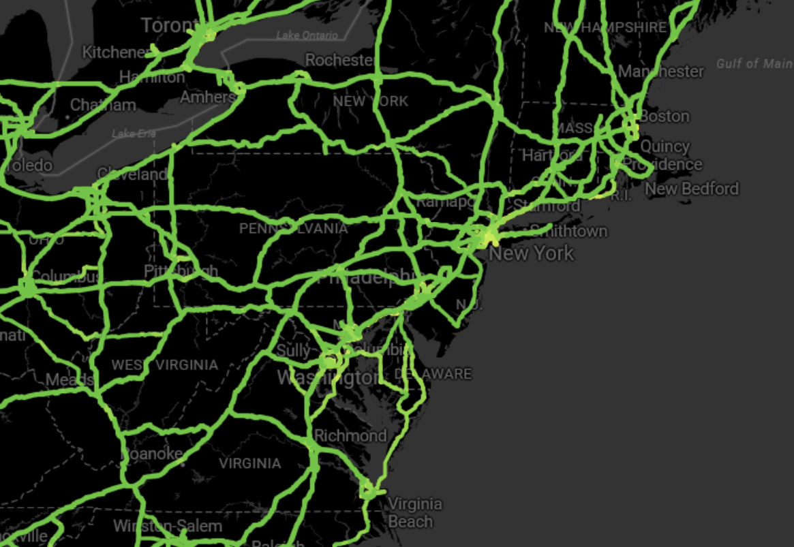

# Angular Azure Maps からの画像の表示 <label class="badge badge--preview">PREVIEW</label>

Angular [`IgxAzureMapsImagery`]({environment:dvApiBaseUrl}/products/ignite-ui-angular/api/docs/typescript/latest/classes/igniteui_angular_maps.igxazuremapsimagery.html) は、Microsoft® が提供する地理的画像マッピング サービスです。
世界の地理的画像タイルを複数のスタイルで供します。この地理的画像サービスは、<a href="https://azure.microsoft.com/ja-jp/products/azure-maps" target="_blank">www.azure.microsoft.com</a> ウェブサイトから直接アクセスできます。Ignite UI for Angular Map コンポーネントは、[`IgxAzureMapsImagery`]({environment:dvApiBaseUrl}/products/ignite-ui-angular/api/docs/typescript/latest/classes/igniteui_angular_maps.igxazuremapsimagery.html) クラスを使用して、地図の背景コンテンツに Azure Maps の地理的画像を表示します。

## Angular Azure Maps からの画像の表示例


<div class="divider--half"></div>

<code-view style="height: 600px" alt="Angular Azure Maps からの画像の表示例"
           data-demos-base-url="{environment:dvDemosBaseUrl}"
                    iframe-src="{environment:dvDemosBaseUrl}/maps/geo-map/display-azure-imagery"
                                                 github-src="maps/geo-map/display-azure-imagery">
</code-view>


## コード スニペット

以下のコード スニペットは、[`IgxAzureMapsImagery`]({environment:dvApiBaseUrl}/products/ignite-ui-angular/api/docs/typescript/latest/classes/igniteui_angular_maps.igxazuremapsimagery.html) クラスを使用して Angular [`IgxGeographicMapComponent`]({environment:dvApiBaseUrl}/products/ignite-ui-angular/api/docs/typescript/latest/classes/igniteui_angular_maps.igxgeographicmapcomponent.html) で Azure Maps からの地理的画像タイルを表示する方法を示します。

```html
<igx-geographic-map #map
    width="100%"
    height="100%"
    zoomable="true" >
</igx-geographic-map>
```

```ts
import { IgxGeographicMapComponent } from 'igniteui-angular-maps';
import { IgxAzureMapsImagery } from 'igniteui-angular-maps';
// ...
const tileSource = new IgxAzureMapsImagery();
tileSource.apiKey = "YOUR_Azure_MAPS_API_KEY";
tileSource.imageryStyle = AzureMapsImageryStyle.Satellite; // or
tileSource.imageryStyle = AzureMapsImageryStyle.TerraOverlay; // or
tileSource.imageryStyle = AzureMapsImageryStyle.Road; //or Traffic & Weather etc.

this.map.backgroundContent = tileSource;
```

## Angular Azure Maps の画像上にタイル シリーズ オーバーレイを表示する例

[`IgxGeographicTileSeriesComponent`]({environment:dvApiBaseUrl}/products/ignite-ui-angular/api/docs/typescript/latest/classes/igniteui_angular_maps.igxgeographictileseriescomponent.html) を使用する際には、**ベース マップ スタイル** (例: **Satellite**, **Road**, **DarkGrey**) の上に**オーバーレイ** (交通情報、天気、ラベル) を重ね合わせることができます。例えば **Satellite** と **TerraOverlay** を組み合わせることで、地形を視覚化できます。

- **ベース スタイル**: Satellite、Road、Terra、DarkGrey がコアとなる背景タイルを提供します。
- **オーバーレイ スタイル**: 交通情報や天気の画像 (`TrafficRelativeOverlay`、`WeatherRadarOverlay` など) は、タイル シリーズに割り当てることでベース スタイル上に重ねられるよう設計されています。
- **ハイブリッド スタイル**: `HybridRoadOverlay` や `HybridDarkGreyOverlay` などのバリエーションは、ベース スタイルにラベルや道路などのオーバーレイをあらかじめ組み合わせているため、複数のレイヤーを手動で管理する必要はありません。

この設計により、より豊かなマップ表現が可能になります。例えば:

- **Satellite** 画像に **TrafficOverlay** を重ねて、実際の地図上に渋滞状況をハイライト表示。
- **Terra** に **WeatherRadarOverlay** を組み合わせて、地形と降水を同時に視覚化。
- **DarkGrey** と **LabelsRoadOverlay** を適用し、ダッシュボードに適したコントラストの高いビューを実現。



<div class="divider--half"></div>

## コード スニペット

次のコード スニペットは、[`IgxAzureMapsImagery`]({environment:dvApiBaseUrl}/products/ignite-ui-angular/api/docs/typescript/latest/classes/igniteui_angular_maps.igxazuremapsimagery.html) クラスと [`IgxGeographicTileSeriesComponent`]({environment:dvApiBaseUrl}/products/ignite-ui-angular/api/docs/typescript/latest/classes/igniteui_angular_maps.igxgeographictileseriescomponent.html) クラスを使用して、Angular [`IgxGeographicMapComponent`]({environment:dvApiBaseUrl}/products/ignite-ui-angular/api/docs/typescript/latest/classes/igniteui_angular_maps.igxgeographicmapcomponent.html) の交通情報と濃い灰色のマップを結合した背景画像の上に地理画像タイルを表示する方法を示しています。

```html
<igx-geographic-map #map height="100%" width="100%" zoomable="true">
  <igx-geographic-tile-series #tileSeries></igx-geographic-tile-series>
</igx-geographic-map>
```

```ts
export class AppComponent implements AfterViewInit {
  @ViewChild('map', { static: true }) public map!: IgxGeographicMapComponent;
  @ViewChild('tileSeries', { static: true }) public tileSeries!: IgxGeographicTileSeriesComponent;

  public azureImagery!: IgxAzureMapsImagery;
  public azureKey: string = "<YOUR_KEY_HERE>";

  ngAfterViewInit(): void {
    // Update TileSeries
    const overlay = new IgxAzureMapsImagery();
    overlay.apiKey = this.azureKey;
    overlay.imageryStyle = AzureMapsImageryStyle.TrafficAbsoluteOverlay;
    this.tileSeries.tileImagery = overlay;

    // Update Map Background
    this.azureImagery = new IgxAzureMapsImagery();
    this.azureImagery.apiKey = this.azureKey;
    this.azureImagery.imageryStyle = AzureMapsImageryStyle.DarkGrey;
    this.map.backgroundContent = this.azureImagery;
  }
}
```

## プロパティ

以下の表で、[`IgxAzureMapsImagery`]({environment:dvApiBaseUrl}/products/ignite-ui-angular/api/docs/typescript/latest/classes/igniteui_angular_maps.igxazuremapsimagery.html) クラスのプロパティを説明します。

| プロパティ名  | プロパティ タイプ   | 説明   |
|----------------|-----------------|---------------|
|[`apiKey`]({environment:dvApiBaseUrl}/products/ignite-ui-angular/api/docs/typescript/latest/classes/igniteui_angular_maps.igxazuremapsimagery.html#apiKey)|string|Azure Maps 画像サービスで必要となる API キーを設定するためのプロパティを表します。このキーは <a href="https://azure.microsoft.com/ja-jp/products/azure-maps" target="_blank">azure.microsoft.com</a> ウェブサイトから取得してください。|
|[`imageryStyle`]({environment:dvApiBaseUrl}/products/ignite-ui-angular/api/docs/typescript/latest/classes/igniteui_angular_maps.igxazuremapsimagery.html#imageryStyle)|[`AzureMapsImageryStyle`]({environment:dvApiBaseUrl}/products/ignite-ui-angular/api/docs/typescript/latest/enums/igniteui_angular_maps.azuremapsimagerystyle.html)|Azure Maps 画像タイルのマップ スタイルを設定するプロパティを表します。このプロパティは、以下の [`AzureMapsImageryStyle`]({environment:dvApiBaseUrl}/products/ignite-ui-angular/api/docs/typescript/latest/enums/igniteui_angular_maps.azuremapsimagerystyle.html) 列挙値に設定できます。<ul><li>Satellite - 道路またはラベルのオーバーレイなしの衛星地図スタイルを指定します。</li><li>Road - 道路およびラベル付きの衛星地図スタイルを指定します。</li><li>DarkGrey - コントラストやオーバーレイのハイライト表示に適したダーク グレーのベース マップ スタイルを指定します。</li><li>TerraOverlay - 標高や地形の特徴をハイライト表示する陰影起伏付きの地形マップ スタイルを指定します。</li><li>LabelsRoadOverlay - 航空写真オーバーレイなしで都市ラベルを表示する複数のオーバーレイの 1 つです。</li><li>HybridRoadOverlay - 衛星画像の背景に道路とラベルのオーバーレイを組み合わせます。</li><li>HybridDarkGreyOverlay - 衛星画像の背景にダーク グレーのラベル オーバーレイを組み合わせます。</li><li>LabelsDarkGreyOverlay - ダーク グレーのベース マップ上に都市ラベルを表示する複数のオーバーレイの 1 つです。</li><li>TrafficDelayOverlay - 交通遅延や渋滞エリアをリアルタイムで表示します。</li><li>TrafficAbsoluteOverlay - 現在の交通速度を絶対値で表示します。</li><li>TrafficReducedOverlay - 減少した交通流を光ベースの視覚化で表示します。</li><li>TrafficRelativeOverlay - 通常の状況に対する相対的な交通速度を表示します。</li><li>TrafficRelativeDarkOverlay - 通常時と比較した交通速度をダーク ベースマップ上に表示し、コントラストを強調します。</li><li>WeatherRadarOverlay - 降水のほぼリアルタイムのレーダー画像を表示します。</li><li>WeatherInfraredOverlay - 雲量の赤外線衛星画像を表示します。</li></ul> |

## API リファレンス

- [`AzureMapsImageryStyle`]({environment:dvApiBaseUrl}/products/ignite-ui-angular/api/docs/typescript/latest/enums/igniteui_angular_maps.azuremapsimagerystyle.html)
- [`IgxAzureMapsImagery`]({environment:dvApiBaseUrl}/products/ignite-ui-angular/api/docs/typescript/latest/classes/igniteui_angular_maps.igxazuremapsimagery.html)
- [`IgxGeographicMapComponent`]({environment:dvApiBaseUrl}/products/ignite-ui-angular/api/docs/typescript/latest/classes/igniteui_angular_maps.igxgeographicmapcomponent.html)
