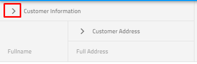

---
title: Angular 列グループの折りたたみ | Ignite UI for Angular | インフラジスティックス
_description: 複数列ヘッダーで折りたたみ機能使用すると、現在の列の下にあるネストされた列のサブセットを折りたたみ、ネストされたヘッダーを表示して、要約した情報の例を示します。
_keywords: 列ヘッダーの折りたたみ, ignite ui for angular, インフラジスティックス
_language: ja
---

### グリッド列グループの折りたたみ

複数列ヘッダーを使用すると、複数レベルのネストされた列と列グループを使用できるため、各列グループを**折りたたみ可能**としてマークできます。**折りたたみ可能な複数列ヘッダー**では、折りたたみ/展開が可能です。現在のヘッダーの下にネストされたヘッダーを表示および非表示にします。これにより、たとえば短縮/要約された情報を示すことができます。

##### デモ

@@if (igxName === 'IgxGrid') {
<div class="sample-container loading" style="height:600px">
    <iframe id="grid-collapsible-groups-iframe" src='{environment:demosBaseUrl}/grid/grid-collapsible-groups' width="100%" height="100%" seamless frameBorder="0" onload="onSampleIframeContentLoaded(this);"></iframe>
</div>
<div>
<button data-localize="stackblitz" disabled class="stackblitz-btn" data-iframe-id="grid-collapsible-groups-iframe" data-demos-base-url="{environment:demosBaseUrl}">StackBlitz で表示</button>
</div>
<div class="divider--half"></div>
}

@@if (igxName === 'IgxTreeGrid') {
<div class="sample-container loading" style="height:600px">
    <iframe id="tree-grid-collapsible-groups-iframe" data-src='{environment:demosBaseUrl}/tree-grid/tree-grid-collapsible-groups' width="100%" height="100%" seamless frameborder="0" class="lazyload" onload="onSampleIframeContentLoaded(this);"></iframe>
</div>
<div>
<button data-localize="stackblitz" disabled class="stackblitz-btn" data-iframe-id="tree-grid-collapsible-groups-iframe" data-demos-base-url="{environment:demosBaseUrl}">StackBlitz で表示</button>
</div>
<div class="divider--half"></div>
}
@@if (igxName === 'IgxHierarchicalGrid') {
<div class="sample-container loading" style="height:600px">
    <iframe id="hierarchical-grid-collapsible-column-groups-iframe"
    data-src='{environment:demosBaseUrl}/hierarchical-grid/hierarchical-grid-collapsible-column-groups' width="100%" height="100%" seamless frameborder="0" class="lazyload" onload="onSampleIframeContentLoaded(this);"></iframe>
</div>
<div>
<button data-localize="stackblitz" disabled class="stackblitz-btn" data-iframe-id="hierarchical-grid-collapsible-column-groups-iframe" data-demos-base-url="{environment:demosBaseUrl}">StackBlitz で表示</button>
</div>
<div class="divider--half"></div>
}

### 構成

IgxGrid および縮小可能な複数列ヘッダーを使用するには、まず以下のコマンドを入力して、Ignite UI for Angular をインストールする必要があります。

```cmd
ng add igniteui-angular
```
Ignite UI for Angular については、[*はじめに*](general/getting_started.md) トピックををご覧ください。

次に app.module.ts ファイルに @@if (igxName === 'IgxGrid') {`IgxGridModule`} @@if (igxName === 'IgxTreeGrid') {`IgxTreeGridModule`} @@if (igxName === 'IgxHierarchicalGrid') {`IgxHierarchicalGridModule`} をインポートします。そのため、[*複数列グループ*](./multi_column_headers.md)のトピックを簡単に確認することを強くお勧めします。グリッドで列グループを設定する方法の詳細情報を参照してください。

### 使用方法

縮小可能な列グループは複数列ヘッダー機能の一部で、列グループをより小さいデータ セットに縮小/展開する方法を提供します。列グループが折りたたまれると、列のサブセットがエンドユーザーに表示され、グループの他の子列が非表示になります。折りたたまれた/展開された各列は、グリッド データソースにバインドすることも、非バインドにして計算することもできます。

列グループを `collapsible` に定義するには、プロパティを `[collapsible]="true"` に設定する必要があり、プロパティ `visibleWhenCollapsed` を少なくとも 2 つの子列に定義する必要があることに注意してください。グループが折りたたまれたときに少なくとも 1 列が表示され (`[visibleWhenCollapsed]="true"`)、グループが展開されたときは少なくとも 1 列が非表示になります (`[visibleWhenCollapsed]="false"`)。それ以外は、折りたたみ機能は無効になります。子列の一部に `visibleWhenCollapsed` が指定されていない場合、この列は、親の状態が展開または折りたたまれているかに関係なく常に表示されます。

それでは、以下のマークアップを見てみましょう。

```html
<igx-column-group header="Customer Information" [collapsible]="true"> <!-- Initially the column groups will be expanded--->
    <!--The column below will be visible when its parent is collapsed-->
    <igx-column field="CustomerName" header="Fullname" [dataType]="'string'" [visibleWhenCollapsed]="true"></igx-column>
    <!--The three columns below will be visible when its parent is expanded-->
    <igx-column field="CustomerID" header="Customer ID" [dataType]="'string'" [visibleWhenCollapsed]="false"></igx-column>
    <igx-column field="FirstName" header="First Name" [dataType]="'string'" [visibleWhenCollapsed]="false">
    </igx-column>
    <igx-column field="LastName" header="Last Name" [dataType]="'string'" [visibleWhenCollapsed]="false">
    </igx-column>
    <igx-column-group header="Customer Address"> <!--This column visibility will not be changed based on parent expand/collapsed state-->
        <igx-column field="Country" header="Country" [dataType]="'string'" [sortable]="true">
        </igx-column>
        <igx-column field="City" header="City" [dataType]="'string'" [sortable]="true">
        </igx-column>
    </igx-column-group>
</igx-column-group>
```

すべての子列にツリー状態があります。
-	親の展開状態に関係なく、常に表示できます。
-	親が展開されているときに表示できます。
-	親が折りたたまれているときに表示できます。

折りたたみ可能として指定されている列グループの初期状態は、`[expanded]="true"` です。ただし、プロパティ `[expanded]="false"` を設定することにより、この動作を簡単に変更できます。

### 展開 / 縮小インジケーター (ハンドル)

igxGrid のデフォルトの展開インジケーターは次のとおりです。

 

igxGrid のデフォルトの展開インジケーターは次のとおりです。



したがって、デフォルトの展開/折りたたみインジケータを変更する必要がある場合、2 つの簡単な方法を紹介します。
##### 入力プロパティ

**collapsibleIndicatorTemplate** 入力プロパティを使用して、カスタムの展開/折りたたみテンプレートを定義し、それを各折りたたみ可能な列グループに提供できます。以下のマークアップを確認してください。

```html
<ng-template #indTemplate let-column="column">
    <igx-icon [attr.draggable]="false" >{{column.expanded ? 'remove' : 'add'}} </igx-icon>
</ng-template>
<igx-column-group header="Customer Information" [collapsible]="true" [collapsibleIndicatorTemplate]="indTemplate">
    <igx-column field="CustomerName" header="Fullname" [dataType]="'string'" [visibleWhenCollapsed]="true"></igx-column>
    <igx-column field="CustomerID" header="Customer ID" [dataType]="'string'" [visibleWhenCollapsed]="false"></igx-column>
    <igx-column-group header="Customer Address" [collapsible]="true" [collapsibleIndicatorTemplate]="indTemplate">
        <igx-column field="Country" header="Country" [dataType]="'string'" [sortable]="true" [visibleWhenCollapsed]="true"></igx-column>
        <igx-column field="City" header="City" [dataType]="'string'" [sortable]="true" [visibleWhenCollapsed]="false"></igx-column>
    </igx-column-group>
</igx-column-group>
```
##### igxCollapsibleIndicator ディレクティブの使用

この動作を実現する別の方法は、以下の例に示すように igxCollapsibleIndicator ディレクティブを使用することです。

```html
<igx-column-group header="Customer Information" [collapsible]="true">
    <ng-template igxCollapsibleIndicator let-column="column">
        <igx-icon [attr.draggable]="false">{{column.expanded ? 'remove' : 'add'}} </<igx-icon>
    </ng-template>
    <igx-column field="CustomerName" header="Fullname" [dataType]="'string'" [visibleWhenCollapsed]="true"></igx-column>
    <igx-column field="CustomerID" header="Customer ID" [dataType]="'string'" [visibleWhenCollapsed]="false"></igx-column>
    <igx-column-group header="Customer Address" [collapsible]="true">
        <igx-column field="Country" header="Country" [dataType]="'string'" [sortable]="true" [visibleWhenCollapsed]="true"></igx-column>
        <igx-column field="City" header="City" [dataType]="'string'" [sortable]="true" [visibleWhenCollapsed]="false"></igx-column>
    </igx-column-group>
</igx-column-group>
```


> [!Note]
> プロパティを使用して列を非表示にすると宣言した場合、最初にグループを折りたたむオプションは非表示の列よりも優先されることに注意してください。
> 非表示で、同じ列が表示される場所にグループが定義されている場合、列が表示されます。


### API リファレンス
<div class="divider--half"></div>

* [IgxColumnComponent]({environment:angularApiUrl}/classes/igxcolumncomponent.html)
* [IgxGridComponent]({environment:angularApiUrl}/classes/igxgridcomponent.html)
* [IgxGridComponent スタイル]({environment:sassApiUrl}/index.html#mixin-igx-grid)

### その他のリソース
<div class="divider--half"></div>

* [Grid の概要](grid.md)
* [仮想化とパフォーマンス](virtualization.md)
* [ページング](paging.md)
* [フィルタリング](filtering.md)
* [ソート](sorting.md)
* [集計](summaries.md)
* [列移動](column_moving.md)
* [列のピン固定](column_pinning.md)
* [選択](selection.md)

<div class="divider--half"></div>
コミュニティに参加して新しいアイデアをご提案ください。

* [Ignite UI for Angular **フォーラム** (英語)](https://www.infragistics.com/community/forums/f/ignite-ui-for-angular)
* [Ignite UI for Angular **GitHub** (英語)](https://github.com/IgniteUI/igniteui-angular)