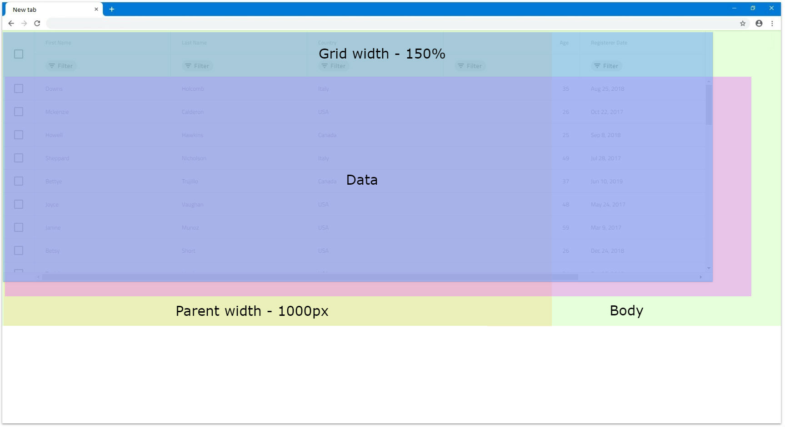
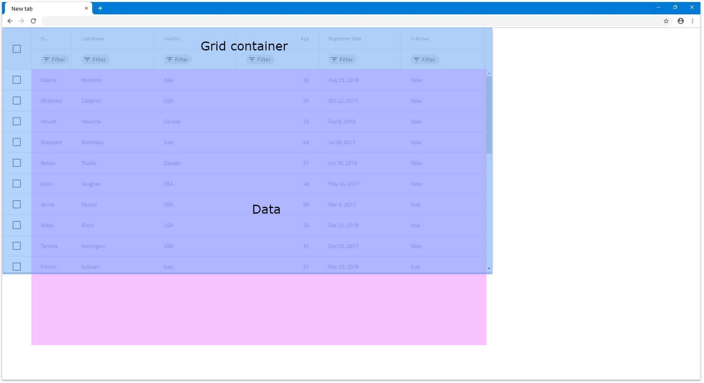
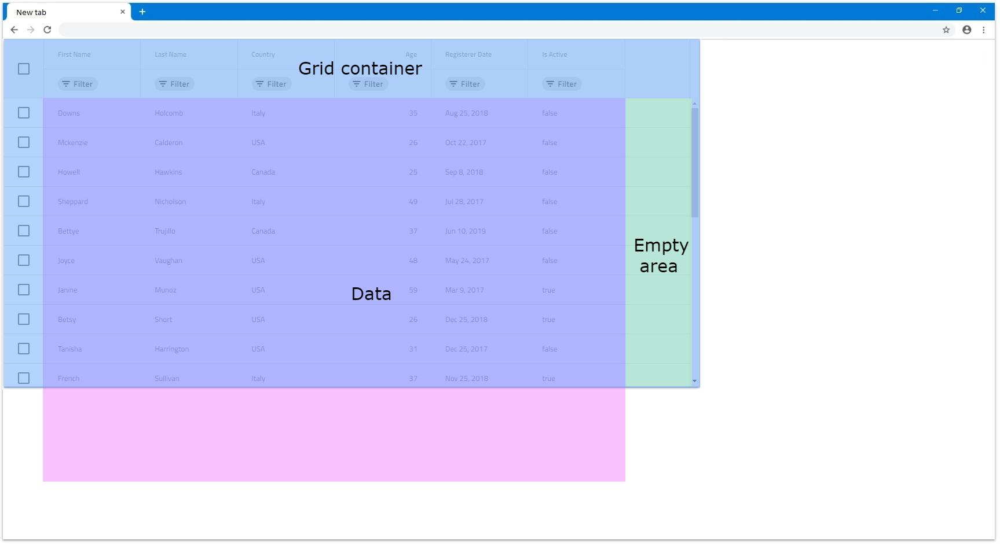
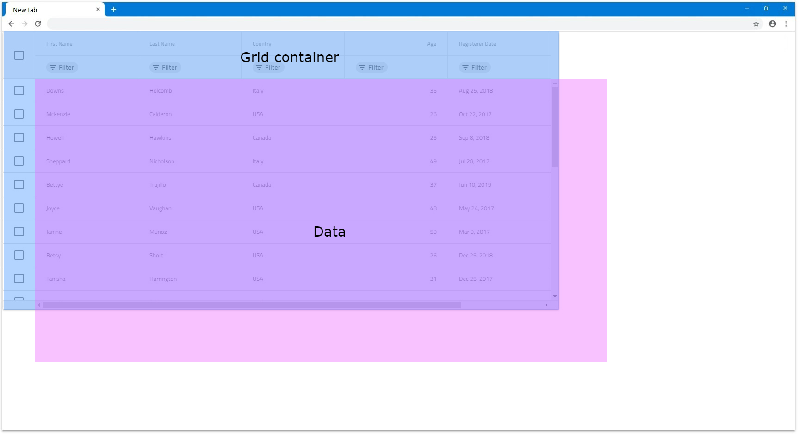

@@if (igxName === 'IgxGrid') {
---
title: Angular Grid サイズ変更|Ignite UI for Angular |infragistics 
_description: Angular グリッドのサイズ設定がどのように機能するかを理解し、ユーザーが遭遇するさまざまな状況に対応するために幅と高さを使用する方法を学びます。
_keywords: angular grid sizing, igniteui for angular, infragistics, グリッド, サイズ変更,
_language: ja
---
}
@@if (igxName === 'IgxTreeGrid') {
---
title: Angular Tree Grid サイズ変更|Ignite UI for Angular |infragistics 
_description: Understand how the Angular grid sizing works and learn how to use the width and height in order to accomodate the different scenarios that users can have.
_keywords: angular grid sizing, igniteui for angular, infragistics, グリッド, サイズ変更,
_language: ja
---
}
@@if (igxName === 'IgxHierarchicalGrid') {
---
title: Angular Hierarchical Grid サイズ変更 | Ignite UI for Angular |infragistics 
_description: Understand how the Angular grid sizing works and learn how to use the width and height in order to accomodate the different scenarios that users can have.
_keywords: angular grid sizing, igniteui for angular, infragistics, グリッド, サイズ変更,
_language: ja
---
}

### グリッド サイズ変更の概要

[**@@igxName**]({environment:angularApiUrl}/classes/@@igTypeDoc.html) はサイズ変更する方法が多数あり、ユーザーのさまざまな状況に対応できます。方法は簡単なものから複雑なものまでさまざまです。それぞれを取り上げて、より詳しく説明します。パーセンテージを使用する場合など、いくつかの違いがあるため、`width` と `height` は別々に設定します。

[**@@igxName**]({environment:angularApiUrl}/classes/@@igTypeDoc.html) の境界線とパディングのサイズに関しては、幅/高さのサイズ計算、または[ボーダー ボックス](https://developer.mozilla.org/ja/docs/Web/CSS/box-sizing)のサイジングとも呼ばれます。すべてのシナリオに適用されます。

> [!Note]
> ユーザーがボーダー ボックスのサイズ変更をオーバーライドした場合に正しい [**@@igxName**]({environment:angularApiUrl}/classes/@@igTypeDoc.html) になるかどうかは保証できません。

### 幅

入力`幅`に値が割り当てられていない場合のデフォルト値は `100%` で、[**@@igxName**]({environment:angularApiUrl}/classes/@@igTypeDoc.html) は使用可能なスペースを埋めようとします。`Percentages` セクションで、グリッドがグリッドにどのように反応するかを確認できます。

> [!Note]
> [**@@igxName**]({environment:angularApiUrl}/classes/@@igTypeDoc.html) 自体の幅スタイルを手動で設定すると、予期しない動作が生じます。

#### Null

グリッドの `幅` は `null` 値を許容でき、設定すると、DOM のすべての列がレンダリングされます。それに応じてグリッドのサイズが決定されて列の仮想化が適用されないため、グリッドの水平スクロールバーはありません。

* 6 列あり、どれも幅が定義されていない場合、グリッドの`幅`は `816px` になります。この場合、デフォルトで各列に `136px` の幅が割り当てられています。列の`幅`がパーセンテージである場合も同様です。垂直スクロールバーがレンダリングされるか、追加の列をレンダリングする機能がある場合、幅も追加されます。

    

* 列幅が `200px` に設定された 6 つの列がある場合、それらはウィンドウに収まり、すべて表示されます。

    

* その他の列やブラウザーのビューに入らない幅の広い列がある場合もすべてレンダリングされます。同じ量の列がありますが、それぞれの列の幅は `300px` です。これらはブラウザーのビュー領域にすべて収まらないため、スクロールバーがネイティブに作成されます。以下は、その例です。

    

* グリッドに並べ替えの親要素があり、overflow セットがない場合、すべての列が表示されます。それ以外の場合、親要素に overflow `auto` または `scroll` がある場合、その親要素のスクロールバーはネイティブにレンダリングされます。次の例では、視覚化を容易にするために親の高さが大きくなっています。

    

> [!Note]
> この動作により、グリッド データに含まれる列が多すぎる場合、すべての列が仮想化なしでレンダリングされるため、ブラウザーのパフォーマンスに大きな影響を与える可能性があります。

#### ピクセル

[**@@igxName**]({environment:angularApiUrl}/classes/@@igTypeDoc.html) `幅`の入力がピクセルに設定されると、グリッド全体のサイズがその値に設定され、静的になります。ブラウザーのサイズ変更や DOM の変更には反応しませんが、グリッド コンテンツの場合はそれに当てはまりません。

* グリッドが水平スクロールバーをレンダリングするために幅がピクセル単位で設定されている場合、そのコンテンツ幅は指定されたグリッド`幅`を超える必要があります。たとえば、列の合計幅が `1200px` を超えている場合、水平スクロールバーがレンダリングされます。

    

* グリッドに親要素が場合は、スクロールバーをレンダリングするかどうかは親のスタイルに依存します。グリッド自体に関連する他のすべてはまだ保持されます。親要素の幅がグリッドの幅よりも小さく、overflow スタイルが `auto` または `scroll` に設定されている場合、スクロールバーはネイティブにレンダリングされます。たとえば、親の幅が `1000px` に設定されていて、[**@@igxName**]({environment:angularApiUrl}/classes/@@igTypeDoc.html) `幅` がまだ `1200px` である場合、以下の図のようになります。

    
    

#### パーセンテージ

[**@@igxName**]({environment:angularApiUrl}/classes/@@igTypeDoc.html) の`幅`がパーセンテージに設定されている場合、親要素の幅に応じてグリッドのサイズが変更されます。親要素の幅が指定されていない場合、[**@@igxName**]({environment:angularApiUrl}/classes/@@igTypeDoc.html) のサイズはブラウザー ウィンドウに相対します。

* たとえば、グリッド`幅`の入力を `100%` に設定し、親要素がない場合、ブラウザー ウィンドウの使用可能な幅を 100% を埋めます。サイズを変更すると、グリッドもそれに応じてサイズ変更されます。

    

* グリッドの幅を `100%` に設定し、特定の幅が `1200px` の親要素がある場合、グリッドはその要素の相対サイズとなり、最終的な幅が `1200px` になることを意味します。

    

* 幅が `1000px` ピクセルの親要素があり、グリッドの幅が `150%` に設定されている場合、計算されるグリッドの幅は `1500px` になります。この場合、グリッドは引き続き完全に表示されますが、`overflow: auto` を設定すると、親がスクロールバーを表示します。

    
    

### 高さ

デフォルトでは、[**@@igxName**]({environment:angularApiUrl}/classes/@@igTypeDoc.html) の高さが定義されていない場合、`100%` に設定されます。`Percentages` セクションで、DOM 構造に応じたグリッドの応答を確認できます。

> [!Note]
> [**@@igxName**]({environment:angularApiUrl}/classes/@@igTypeDoc.html) 自体の`高さ`のスタイルを手動で設定すると、予期しない動作が生じます。

#### Null

[**@@igxName**]({environment:angularApiUrl}/classes/@@igTypeDoc.html) `高さ`の入力で `null` 値を許容できます。null 値を設定すると、スクロールバーの数に関係なくすべての行が表示されます。この場合、グリッドはとにかくすべての行をレンダリングするため、垂直仮想化はありません。

* この場合、14 行のデータがある場合、グリッドは 14 行すべてをレンダリングし、グリッド内の空のスペースなしですべてを表示するようグリッドのサイズを調整します。

    

* 24 行がある場合、グリッドはすべての行を描画しますが、行が多すぎるためブラウザーの境界を超えてしまいます。そのため、ブラウザー自体はデフォルトで垂直スクロールバーをレンダリングして、ユーザーは残りの行までスクロールダウンできます。

    

* 親要素に定義された`高さ`がある場合、グリッドに影響は受けずにすべての行を描画します。親の `高さ` が `650px` であると仮定します。`overflow` が `auto` または `scroll` に設定されている場合、グリッドは影響を受けずに垂直スクロールバーがレンダリングされます。

    
    

> [!Note]
> この動作により、グリッド データに含まれる行が多すぎる場合、すべての行が仮想化なしでレンダリングされるため、ブラウザーのパフォーマンスに大きな影響を与える可能性があります。

#### Pixels

[**@@igxName**]({environment:angularApiUrl}/classes/@@igTypeDoc.html) の`高さ`をピクセル単位で設定すると、幅がピクセル単位で設定される方法と同様に、グリッドがあらゆる場合にその特定のサイズにサイズ変更されるため簡単です。

* たとえば、データ 4 行で高さ `500px` を設定すると、グリッドはそのサイズになり、4 行では表示領域を埋めるのに十分でないため、空の領域があると予想されます。

    

* `高さ` がピクセルに設定されているときに行数がグリッドの表示領域を超えると、垂直スクロールバーがレンダリングされます。たとえば、500px の高さと 14 行が設定されたグリッドは、以下のようにレンダリングされます。

    

* 高さが定義された親要素がある場合、`auto` または `scroll` に設定された `overflow` がない限り、グリッドは完全に表示されます。それ以外の場合は、スクロールバーがレンダリングされます。

    
    

#### パーセンテージ

`高さ`の入力がパーセンテージに設定されている場合、[**@@igxName**]({environment:angularApiUrl}/classes/@@igTypeDoc.html) は親要素の高さに基づいてサイズ設定されます。親要素の`高さ`がピクセルまたはパーセンテージで設定されている場合、グリッドのサイズは親のサイズに対して相対的になります。

親要素の高さが定義されていない場合、ブラウザーは最初に高さを割り当てず、子とそのサイズに基づいてサイズを変更します。これが、グリッドがそれに基づいてパーセンテージのサイズ設定を適用するために使用するベースの高さを知る方法がない理由です。このため、最大 10 行がレンダリングされ、それらがより多くの行である場合、垂直スクロールバーがレンダリングされます。そうでない場合、グリッドはレンダリングされた行の数に適合します。次の例で、この状況をさらに詳しく見ていきます。

幅を `1200px` に設定し、親要素にはサイズを適用しません。

* 10 行未満の場合、グリッドは、最後の行と表示領域の下部の間に空のスペースを持たずに、表示領域にすべての行を収めようとします。たとえば、グリッドデータを 7 行で構成してみましょう。グリッドは、垂直スクロールバーとグリッド内の空スペースなしで、7 行すべてをレンダリングします。

    

* 10 行を超える場合、残りの行に対して垂直スクロールバーがレンダリングされ、常に 10 行のみが表示されます。次の例では、行番号のみが 14 に増えています。

    

* 親要素の高さを `800px` に設定し、[**@@igxName**]({environment:angularApiUrl}/classes/@@igTypeDoc.html) の高さ `100%` に設定すると、グリッドは `800px` の 100 パーセントにサイズ変更されます。

    

* [**@@igxName**]({environment:angularApiUrl}/classes/@@igTypeDoc.html) の`高さ`を `100%` より大きい数値に設定し、親要素に高さを設定した場合、親がスクロールバーをレンダリングするには、`overflow` を `auto` または `scroll` に設定する必要があります。そうでない場合、グリッドは完全に表示され、親のサイズに相対的なサイズになります。

    
    

* ブラウザー ウィンドウでグリッドのサイズを `100%` にしたい場合は、`body` と親の両方のグリッド要素の高さを `100%` に設定してください。この場合、親要素のサイズを変更でき、ブラウザーのサイズが変更された場合、グリッドはそれに応じてサイズ変更されます。

    

### 列幅の変更

グリッドのサイズに応じてグリッド内の列サイズも変わるため、グリッドはサイズに基づいて水平スクロールバーをレンダリングするかどうかを決定します。  列の幅は、ピクセル、パーセンテージ、または何も設定されていない場合は自動サイズに設定できます。このセクションでは、これらの状況について詳しく見ていきます。

#### 既定

既定で列の幅が指定されていない場合、グリッド ビュー領域に空のスペースがある場合に列が自動でサイズ変更されるようになります。自動サイズの列の最小幅は `136px` であるため、列で使用可能な領域が `136px` 未満の場合、既定でそのサイズになります。

このような状況でグリッドのサイズが変更されると、列の幅も更新されて変更が反映されるため、利用可能な新しい空のスペースが埋められます。

* 列の幅を指定せずに、[**@@igxName**]({environment:angularApiUrl}/classes/@@igTypeDoc.html) の幅が null に設定されている場合、列のサイズは最小の `136px` になります。これは、幅が `null` で幅のない 6 列のグリッドの場合、各列のサイズが `136px` になることを意味します。

    

* 自動サイズ調整された列が複数ある場合、互いに使用可能なスペースを均等に分割します。つまり、6 つの列があり、`1200px` の空の領域がある場合、それぞれのサイズは `200px` になります。

    

* 利用可能な空スペースがある場合、自動でサイズ変更される各列が `136px` 未満になるように、すべての自動サイズ変更列のデフォルトは `136px` となり、グリッドは水平スクロールバーを描画します。次の例では、自動でサイズ変更される 12 列と、グリッド `width` を `1000px` に設定します。

    

* 列の幅を指定せずに他のすべての列の幅がピクセルまたはパーセンテージの場合、その列の使用可能なスペースも埋めようとします。たとえば、最初の列に幅が設定されておらず、他の 5 列すべての`幅`が `100px` である場合、最初の列が残りを埋めます。

    

* 複数の列に`幅`が指定されていない場合も同様です。すべての列で使用可能なスペースが均等に分割されます。次の図では、最初の列の`幅`が `100px` に設定されています。

    

> [!Note]
> 行セレクターのチェックボックス列などの機能列は、列の自動サイズ調整時に考慮される追加のスペースを埋めます。

#### ピクセル

列の幅をピクセル単位で設定した場合、手動でサイズを変更しない限り、列はそのサイズで固定されます。列の結合された幅は静的であるため、[**@@igxName**]({environment:angularApiUrl}/classes/@@igTypeDoc.html) `幅`より小さくすることも、それを超えることもできます。

* すべての列の幅の合計が [**@@igxName**]({environment:angularApiUrl}/classes/@@igTypeDoc.html) の`幅`よりも小さい場合、グリッド内には列を埋めることができない空の領域があります。これは、[**@@igxName**]({environment:angularApiUrl}/classes/@@igTypeDoc.html) で予期される動作です。次の例では、列の幅は `150px` ピクセルです。

    

* すべての列の合計`幅`が実際の [**@@igxName**]({environment:angularApiUrl}/classes/@@igTypeDoc.html) `の幅`よりも大きい場合、水平スクロールバーがレンダリングされます。次の例では、列の幅が `300px` で、グリッドの幅は `1200px` です。 

    

#### パーセンテージ

列の`幅`がパーセンテージで設定されている場合、それらのサイズはグリッドサイズに対して相対的に計算されます。これは、ピクセル単位の幅の仕組みと似ていますが、列に対する応答も提供します。つまり、グリッドのサイズが変更されると、列もそれに応じてサイズが変更されます。

* すべての列の合計幅が`100%`未満の場合、ピクセル単位の場合と同様に、列がカバーしないグリッドの空の領域が存在する可能性があります。

    

* 結合された幅が `100%` の場合、列によってグリッド使用可能なすべてのスペースが埋まります。

    

* ユーザーがビューの外に列を表示できるように、結合された幅が `100%` を超える場合、水平スクロールバーがレンダリングされます。

    

* 列がパーセントで設定され、グリッド`幅`が `null` に設定されている場合、`136px` の`幅`が各列に適用されます。これは、列自体の幅がなく、`幅`が `null` の場合にコンテンツのサイズ変更に依存するため、列グリッドに対して相対的にサイズ変更できないためです。次の例では、6 列すべての`幅`が `50%` に設定されています。

    

@@if (igxName === 'IgxHierarchicalGrid') {
---
### 子グリッド サイズ変更

通常、[**@@igxName**]({environment:angularApiUrl}/classes/@@igTypeDoc.html) には子が含まれているため、さまざまなシナリオに対応するために、`幅`と`高さ`を指定することもできます。子は`行アイランド テンプレート`を使用して定義されるため、これは、同じレベルおよびアイランドのすべての子に同じ`幅`と`高さ`プロパティが適用されることを意味します。 

#### 幅

各子グリッドも[**@@igxName**]({environment:angularApiUrl}/classes/@@igTypeDoc.html)のインスタンスであるため、子の幅は[**@@igxName**]({environment:angularApiUrl}/classes/@@igTypeDoc.html)自体とそれほど大きな違いはありません。

唯一の違いは、ユーザーが子グリッドの親要素を変更できないことです。そのため、`幅`がパーセンテージに設定されている場合、子に割り当てられた `100%` の幅は親グリッドの幅よりも小さくなります。これは、展開されたときに区別しやすくするためです。以下の画像は、デフォルトで `100%` の幅に設定されているため、デフォルトの子グリッド サイズを示しています。

#### 高さ

[**@@igxName**]({environment:angularApiUrl}/classes/@@igTypeDoc.html) の各子の`高さ`も、ルートレベルグリッドの`高さ`と同様に動作します。

違いは、子グリッドの場合、高さがパーセンテージに設定されている場合、親要素の高さが設定されていないかのように動作することです。つまり、このシナリオでは、グリッドは最大 10 行をレンダリングします。データの行数が 10 未満の場合、グリッドはすべての行に収まるように表示領域のサイズを変更します。データにさらに行がある場合、垂直スクロールバーがレンダリングされ、ビュー領域のサイズが高さ 10 行になります。

---
}

### API リファレンス

* [@@igxNameComponent API]({environment:angularApiUrl}/classes/@@igTypeDoc.html)
@@if (igxName !== 'IgxTreeGrid') {* [IgxGridRowComponent API]({environment:angularApiUrl}/classes/igxgridrowcomponent.html)}@@if (igxName === 'IgxTreeGrid') {* [IgxTreeGridRowComponent API]({environment:angularApiUrl}/classes/igxtreegridrowcomponent.html)}
* [@@igxNameComponent スタイル]({environment:sassApiUrl}/index.html#function-igx-grid-theme)

### その他のリソース

* [@@igComponent 概要](@@igMainTopic.md)
* [仮想化とパフォーマンス](virtualization.md)

コミュニティに参加して新しいアイデアをご提案ください。

* [Ignite UI for Angular **フォーラム** (英語)](https://www.infragistics.com/community/forums/f/ignite-ui-for-angular)
* [Ignite UI for Angular **GitHub** (英語)](https://github.com/IgniteUI/igniteui-angular)
