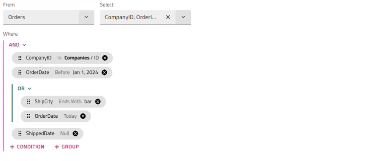

# Angular Query Builder (クエリ ビルダー) コンポーネントの概要

Angular Query Builder は、[Angular コンポーネント](https://jp.infragistics.com/products/ignite-ui-angular)の一部であり、開発者が指定されたデータ セットに対して複雑なデータ フィルタリング クエリを作成できる機能豊富な UI を提供します。このコンポーネントを使用すると、式のツリーを構築し、エディターと各フィールドのデータ タイプによって決定される条件リストを使用して、それらの間に AND/OR 条件を設定できます。式のグループ化やグループ解除、順序の変更は、ドラッグ アンド ドロップ機能を使用して実行できます。

<p class="highlight">

[`IgxQueryBuilderComponent`]({environment:angularApiUrl}/classes/igxquerybuildercomponent.html) コンポーネントは UI を使用して複雑なクエリを作成する方法を提供します。AND/OR 演算子、条件、および値を指定すると、クエリを記述する式ツリーが作成されます。 

</p>

## Angular Query Builder の例

この Angular Query Builder の例を作成して、Angular Query Builder コンポーネントのデフォルト機能を紹介しました。プラス ボタンをクリックして、条件、「and」グループ、および「or」グループを追加します。グループ解除または削除するには、サイド バーに移動します。

<code-view style="height:700px" 
           data-demos-base-url="{environment:demosBaseUrl}" 
           iframe-src="{environment:demosBaseUrl}/interactions/query-builder-request-sample/"
           alt="Angular Query Builder 概要の例">
</code-view>

<div class="divider--half"></div>

## Ignite UI for Angular Query Builder を使用した作業の開始

Ignite UI for Angular Query Builder コンポーネントを使用した作業を開始するには、Ignite UI for Angular をインストールする必要があります。既存の Angular アプリケーションで、以下のコマンドを入力します。

```cmd
ng add igniteui-angular
```

Ignite UI for Angular については、「[はじめに](general/getting-started.md)」トピックをご覧ください。

次に、**app.module.ts** ファイルに `IgxQueryBuilderModule` をインポートします。

```typescript
// app.module.ts

import { IgxQueryBuilderModule } from 'igniteui-angular';
// import { IgxQueryBuilderModule } from '@infragistics/igniteui-angular'; for licensed package

@NgModule({
    ...
    imports: [..., IgxQueryBuilderModule],
    ...
})
export class AppModule {}
```

あるいは、`16.0.0` 以降、`IgxQueryBuilderComponent` をスタンドアロンの依存関係としてインポートすることも、[`IGX_QUERY_BUILDER_DIRECTIVES`](https://github.com/IgniteUI/igniteui-angular/blob/master/projects/igniteui-angular/src/lib/query-builder/public_api.ts) トークンを使用してコンポーネントとそのすべてのサポート コンポーネントおよびディレクティブをインポートすることもできます。

```typescript
// home.component.ts

import { IGX_QUERY_BUILDER_DIRECTIVES, FilteringExpressionsTree, FieldType } from 'igniteui-angular';
// import { IGX_QUERY_BUILDER_DIRECTIVES, FilteringExpressionsTree, FieldType } from '@infragistics/igniteui-angular'; for licensed package

@Component({
    selector: 'app-home',
    template: `
    <igx-query-builder #queryBuilder
        [entities]="entities"
        [(expressionTree)]="expressionTree"
        (expressionTreeChange)="onExpressionTreeChange()">
    </igx-query-builder>
    `,
    styleUrls: ['home.component.scss'],
    standalone: true,
    imports: [IGX_QUERY_BUILDER_DIRECTIVES]
    /* or imports: [IgxQueryBuilderComponent] */
})
export class HomeComponent {
    public expressionTree: FilteringExpressionsTree;
    public entities: Array<any>;

    public onExpressionTreeChange() {
        ...
    }
}
```

Ignite UI for Angular Query Builder モジュールまたはディレクティブをインポートしたので、`igx-query-builder` コンポーネントの使用を開始できます。

## Angular Query Builder の使用

最初に式ツリーが設定されていない場合は、エンティティと、クエリが返すフィールドを選択することから始めます。その後、条件またはサブグループを追加できます。

条件を追加するには、フィールド、フィールドのデータ タイプに基づくオペランド、およびオペランドが単項でない場合は値を選択します。`In` オペランドと `Not In` オペランドを使用すると、単に値を指定するのではなく、異なるエンティティの条件を含む内部クエリを作成できます。条件が確定すると、条件情報を含むチップが表示されます。チップをクリックまたはホバーすると、チップを変更したり、その直後に別の条件やグループを追加したりできます。

各グループの上にある ([`AND`]({environment:angularApiUrl}/enums/filteringlogic.html#and) or [`OR`]({environment:angularApiUrl}/enums/filteringlogic.html#or)) ボタンをクリックすると、グループ タイプを変更したり、内部の条件をグループ化解除したりするためのオプションを含むメニューが開きます。

すべての条件は特定のエンティティの特定のフィールドに関連しているため、エンティティを変更すると、すべての事前設定された条件とグループがリセットされます。新しいエンティティを選択すると、[`showEntityChangeDialog`]({environment:angularApiUrl}/classes/igxquerybuildercomponent.html#showEntityChangeDialog) 入力プロパティが false に設定されていない限り、確認ダイアログが表示されます。

[`entities`]({environment:angularApiUrl}/classes/igxquerybuildercomponent.html#entities) プロパティを、エンティティ名とそのフィールドの配列を記述する配列に設定することで、コンポーネントの使用を開始できます。各フィールドは、名前とデータ タイプによって定義されます。フィールドが選択されると、データ タイプに基づいて対応するオペランドが自動的に割り当てられます。
Query Builder には [`expressionTree`]({environment:angularApiUrl}/classes/igxquerybuildercomponent.html#expressionTree) 入力プロパティがあります。これを使用して、コントロールの初期状態を設定し、ユーザー指定のフィルタリング ロジックにアクセスできます。

```typescript
ngAfterViewInit(): void {
    const innerTree = new FilteringExpressionsTree(FilteringLogic.And, undefined, 'Companies', ['ID']);
    innerTree.filteringOperands.push({
        fieldName: 'Employees',
        condition: IgxNumberFilteringOperand.instance().condition('greaterThan'),
        conditionName: 'greaterThan',
        searchVal: 100
    });
    innerTree.filteringOperands.push({
        fieldName: 'Contact',
        condition: IgxBooleanFilteringOperand.instance().condition('true'),
        conditionName: 'true'
    });

    const tree = new FilteringExpressionsTree(FilteringLogic.And, undefined, 'Orders', ['*']);
    tree.filteringOperands.push({
        fieldName: 'CompanyID',
        condition: IgxStringFilteringOperand.instance().condition('inQuery'),
        conditionName: 'inQuery',
        searchTree: innerTree
    });
    tree.filteringOperands.push({
        fieldName: 'OrderDate',
        condition: IgxDateFilteringOperand.instance().condition('before'),
        conditionName: 'before',
        searchVal: new Date('2024-01-01T00:00:00.000Z')
    });
    tree.filteringOperands.push({
        fieldName: 'ShippedDate',
        condition: IgxDateFilteringOperand.instance().condition('null'),
        conditionName: 'null'
    });

    this.queryBuilder.expressionTree = tree;
}
```

`expressionTree` は、双方向のバインド可能なプロパティです。これは、エンド ユーザーが条件を作成、編集、または削除して UI を変更したときに発行される、対応する `expressionTreeChange` 出力が実装されていることを意味します。通知を受信して変更に対応するために個別にサブスクライブすることもできます。

```html
<igx-query-builder #queryBuilder
    [entities]="entities"
    [(expressionTree)]="expressionTree"
    (expressionTreeChange)="onExpressionTreeChange()">
</igx-query-builder>
```

## 式のドラッグ

条件チップは、マウスの[**ドラッグ アンド ドロップ**](drag-drop.md)または[**キーボードによる並べ替え**](#キーボード操作)アプローチを使用して簡単に再配置できます。これらを使用すると、ユーザーはクエリ ロジックを動的に調整できます。
- チップをドラッグしても、その状態や内容は変更されず、位置のみが変更されます。
- チップはグループやサブグループにドラッグすることもできます。たとえば、式のグループ化/グループ解除は、式のドラッグ機能によって実行されます。
既存の条件をグループ化するには、まず「追加」グループ ボタンを使用して新しいグループを追加する必要があります。次に、ドラッグすることで、必要な式をそのグループに移動できます。グループを解除するには、すべての条件を現在のグループの外にドラッグします。最後の条件を移動したら、グループは削除されます。

>[!NOTE]
>あるクエリ ツリーのチップを別のクエリ ツリーにドラッグすることはできません (例: 親から内部へ、またはその逆)。


## キーボード操作

**キーの組み合わせ**
 - <kbd>Tab</kbd>/<kbd>Shift + Tab</kbd> - 次の/前のチップ、ドラッグ インジケーター、削除ボタン、式の「追加」ボタンに移動します。
 - <kbd>下矢印</kbd>/<kbd>上矢印</kbd> - チップのドラッグ インジケーターがフォーカスされている場合、チップを上下に移動できます。
 - <kbd>Space</kbd>/<kbd>Enter</kbd> - フォーカスされた式が編集モードに入ります。チップが移動された場合、これにより新しい位置が確認されます。
 - <kbd>Esc</kbd> - チップの並べ替えがキャンセルされ、元の位置に戻ります。

>[!NOTE]
>キーボードの並べ替えは、マウスのドラッグ アンド ドロップと同じ機能を提供します。チップを移動したら、ユーザーは新しい位置を確認するか、並べ替えをキャンセルする必要があります。



## テンプレート化

Ignite UI for Angular Query Builder コンポーネントでは、次の定義済み参照名を使用して、コンポーネントのヘッダーと検索値のテンプレートを定義できます。

### ヘッダー テンプレート

デフォルトでは、[`IgxQueryBuilderComponent`]({environment:angularApiUrl}/classes/igxquerybuildercomponent.html) ヘッダーは表示されません。これを定義するには、[`IgxQueryBuilderHeaderComponent`]({environment:angularApiUrl}/classes/igxquerybuilderheadercomponent.html) を `igx-query-builder` 内に追加する必要があります。

次に、ヘッダー タイトルを設定するために [`title`]({environment:angularApiUrl}/classes/igxquerybuilderheadercomponent.html#title) 入力を使用し、`igx-query-builder-header` 内にコンテンツを渡すことで、クエリ ビルダー ヘッダーをテンプレート化できます。 

以下のコードはこれを実行する方法を示します。

```html
<igx-query-builder #queryBuilder [entities]="this.entities">
        <igx-query-builder-header [title]="'Query Builder Template Sample'">  
        </igx-query-builder-header>
</igx-query-builder>
```

### 検索値

条件の検索値は、[`igxQueryBuilderSearchValue`]({environment:angularApiUrl}/classes/igxquerybuildersearchvaluetemplatedirective.html) ディレクティブを使用してテンプレート化でき、`igx-query-builder` 本体内の `<ng-template>` に適用されます。

```html
<igx-query-builder #queryBuilder
    [entities]="entities"
    [expressionTree]="expressionTree">
    <ng-template #searchValueTemplate
                igxQueryBuilderSearchValue 
                let-searchValue
                let-selectedField = "selectedField" 
                let-selectedCondition = "selectedCondition"
                let-defaultSearchValueTemplate = "defaultSearchValueTemplate">
        @if (
            selectedField?.field === 'Region' &&
            (selectedCondition === 'equals' || selectedCondition === 'doesNotEqual')
            ){
            <igx-select [placeholder]="'Select region'" [(ngModel)]="searchValue.value">
                <igx-select-item *ngFor="let reg of regionOptions" [value]="reg">
                    {{ reg.text }}
                </igx-select-item>
            </igx-select>
        } 
        @else if (
            selectedField?.field === 'OrderStatus' &&
            (selectedCondition === 'equals' || selectedCondition === 'doesNotEqual')
            ){
            <igx-radio-group>
                <igx-radio class="radio-sample"
                           *ngFor="let stat of statusOptions"
                           value="{{stat.value}}"
                           [(ngModel)]="searchValue.value">
                    {{stat.text}}
                </igx-radio>
            </igx-radio-group>
        }
            @else {  
            <ng-container #defaultTemplate *ngTemplateOutlet="defaultSearchValueTemplate"></ng-container>
        }
    </ng-template>
</igx-query-builder>
```

## フォーマッター

条件が編集モードではないときに表示されるチップ内の検索値の外観を変更するには、フィールド配列にフォーマッター関数を設定できます。検索値と選択された条件には、次のように value 引数と rowData 引数を通じてアクセスできます。

```ts
this.ordersFields = [
    { field: "CompanyID", dataType: "string" },
    { field: "OrderID", dataType: "number" },
    { field: "EmployeeId", dataType: "number" },
    { field: "OrderDate", dataType: "date" },
    { field: "RequiredDate", dataType: "date" },
    { field: "ShippedDate", dataType: "date" },
    { field: "ShipVia", dataType: "number" },
    { field: "Freight", dataType: "number" },
    { field: "ShipName", dataType: "string" },
    { field: "ShipCity", dataType: "string" },
    { field: "ShipPostalCode", dataType: "string" },
    { field: "ShipCountry", dataType: "string" },
    { field: "Region", dataType: "string", formatter: (value: any, rowData: any) => rowData === 'equals' || rowData === 'doesNotEqual' ? `${value.value}` : value }},
    { field: "OrderStatus", dataType: "number" }
];
```

## デモ

この Angular Query Builder の例は、Angular Query Builder コンポーネントのヘッダーと検索値のテンプレート化とフォーマッター機能を紹介するために作成しました。

<code-view style="height:700px" 
           data-demos-base-url="{environment:demosBaseUrl}" 
           iframe-src="{environment:demosBaseUrl}/interactions/query-builder-template-sample/" alt="Angular Query Builder テンプレートの例">
</code-view>

## スタイル設定

### Query Builder テーマのプロパティ マップ

プライマリ プロパティを変更すると、関連するすべての依存プロパティが自動的に更新され、変更が反映されます。

<table class="collapsible-table">
    <thead>
      <tr>
        <th>プライマリ プロパティ</th>
        <th>依存プロパティ</th>
        <th>説明</th>
      </tr>
    </thead>
    <tbody class="group">
      <tr class="primary">
        <td><details><summary><strong>$background</strong></summary></details></td>
        <td>$label-foreground</td>
        <td>クエリ ビルダーのラベル 「from」 と 「select」 の色</td>
      </tr>
      <tr class="dependent"><td></td><td>$header-background</td><td>クエリ ビルダー ヘッダーの背景の色</td></tr>
      <tr class="dependent"><td></td><td>$header-foreground</td><td>クエリ ビルダー ヘッダーの前景の色</td></tr>
      <tr class="dependent"><td></td><td>$subquery-header-background</td><td>サブクエリ ヘッダーの背景の色</td></tr>
      <tr class="dependent"><td></td><td>$subquery-border-color</td><td>クエリ ブロックの境界線の色</td></tr>
      <tr class="dependent"><td></td><td>$separator-color</td><td>クエリ ブロックのセパレーターの色</td></tr>
      <tr class="dependent"><td></td><td>$header-border (Bootstrap のみ)</td><td>クエリ ビルダーの、ヘッダーの境界線の色</td></tr>
    </tbody>
</table>

クエリ ビルダーのスタイル設定は、すべてのテーマ関数とコンポーネント ミックスインが存在する `index` ファイルをインポートする必要があります。

```scss
@use "igniteui-angular/theming" as *;

// IMPORTANT: Prior to Ignite UI for Angular version 13 use:
// @import '~igniteui-angular/lib/core/styles/themes/index';
```

クエリ ビルダーは、`background` パラメーターを使用して、そのテーマから背景の色を取得します。背景を変更するには、カスタム テーマを作成する必要があります。

```scss

$custom-query-builder: query-builder-theme(
  $schema: $dark-material-schema,
  $background: #292826,
  ...
);
```

クエリ ビルダー内には、ボタン、チップ、ドロップダウン、入力など、他のコンポーネントがあるため、それぞれに個別のテーマを作成する必要があります。

```scss
$custom-button: flat-button-theme(
  $schema: $dark-material-schema,
  $foreground: #ffcd0f,
);

$custom-input-group: input-group-theme(
  $schema: $dark-material-schema,
  $focused-secondary-color: #ffcd0f
);

$custom-chip: chip-theme(
  $schema: $dark-material-schema,
  $background: #ffcd0f,
);

$custom-icon-button: outlined-icon-button-theme(
  $schema: $dark-material-schema,
  $foreground: #ffcd0f,
);
```

この例では、リストされたコンポーネントのパラメーターの一部のみを変更しましたが、[`button-theme`]({environment:sassApiUrl}/themes#function-button-theme)、[`chip-theme`]({environment:sassApiUrl}/themes#function-chip-theme)、[`drop-down-theme`]({environment:sassApiUrl}/themes#function-drop-down-theme)、[`input-group-theme`]({environment:sassApiUrl}/themes#function-input-group-theme) テーマは、それぞれのスタイルを制御するためのより多くのパラメーターを提供します。

>[!NOTE]
>上記のようにカラーの値をハードコーディングする代わりに、[`palette`]({environment:sassApiUrl}/palettes#function-palette) および [`color`]({environment:sassApiUrl}/palettes#function-color) 関数を使用してカラーに関してより高い柔軟性を実現することができます。使い方の詳細については[`パレット`](./themes/sass/palettes.md)のトピックをご覧ください。

最後に、`css-vars` ミックスインを使用して新しいコンポーネント テーマを**含めます**。

```scss
@include css-vars($custom-query-builder);

:host {
  ::ng-deep {
    @include css-vars($custom-input-group);
    @include css-vars($custom-chip);
    @include css-vars($custom-icon-button);

    .igx-filter-tree__buttons {
      @include css-vars($custom-button);
    }
  }
}
```

> [!NOTE]
> コンポーネントが [`Emulated`](themes/sass/component-themes.md#表示のカプセル化) ViewEncapsulation を使用している場合、クエリ ビルダー コンポーネント内のコンポーネント (ボタン、チップ、ドロップダウンなど) のスタイルを設定するには、`::ng-deep` を使用してこのカプセル化を`解除する`必要があります。

### デモ

<code-view style="height:530px" 
           no-theming
           data-demos-base-url="{environment:demosBaseUrl}" 
           iframe-src="{environment:demosBaseUrl}/interactions/query-builder-style/" >
</code-view>

> [!NOTE]
> サンプルは、`Change Theme` (テーマの変更) で選択したグローバル テーマの影響を受けません。

<div class="divider--half"></div>

### Tailwind によるスタイル設定

カスタム Tailwind ユーティリティ クラスを使用して、query builder のスタイルを設定できます。まず [Tailwind を設定して](themes/misc/tailwind-classes.md)ください。

グローバル スタイルシートに Tailwind をインポートした上で、以下のように必要なテーマ ユーティリティを適用します:

```scss
@import "tailwindcss";
...
@use 'igniteui-theming/tailwind/utilities/material.css';
```

ユーティリティ ファイルには、`light` テーマと `dark` テーマの両方のバリエーションが含まれています。
- `light-*` クラスはライト テーマ用です。
- `dark-*` クラスはダーク テーマ用です。
- プレフィックスの後にコンポーネント名を追加します (例: `light-query-builder`、`dark-query-builder`)。

これらのクラスを適用すると、動的なテーマの計算が可能になります。そこから、`任意のプロパティ`を使用して、生成された CSS 変数をオーバーライドできます。コロンの後に、有効な CSS カラー形式 (HEX、CSS 変数、RGB など) を指定します。

プロパティの完全なリストは、[query-builder-theme]({environment:sassApiUrl}/themes#function-query-builder-theme) で確認できます。構文は次のとおりです:

```html
<igx-query-builder
  class="!light-query-builder ![--background:#90B69F]">
  ...
</igx-query-builder>
```

>[!NOTE]
>ユーティリティ クラスが優先されるようにするには、感嘆符 (`!`) が必要です。Tailwind はスタイルをレイヤーに適用しますが、これらのスタイルを重要としてマークしないと、コンポーネントのデフォルトのテーマによってオーバーライドしてしまいます。

最終的に、query builder は次のようになります:

<div class="sample-container loading" style="height:500px">
    <iframe id="query-builder-tailwind-style-iframe" data-src='{environment:demosBaseUrl}/interactions/query-builder-tailwind-style' width="100%" height="100%" seamless frameBorder="0" class="lazyload"></iframe>
</div>

[WYSIWYG App Builder™](https://jp.infragistics.com/products/appbuilder) と実際の UI コンポーネントを使用して、Angular アプリ開発を効率化することもできます。

## API リファレンス

<div class="divider--half"></div>

* [IgxQueryBuilderComponent API]({environment:angularApiUrl}/classes/igxquerybuildercomponent.html)
* [IgxQueryBuilderHeaderComponent]({environment:angularApiUrl}/classes/igxquerybuilderheadercomponent.html)
* [IgxQueryBuilderSearchValueTemplateDirective]({environment:angularApiUrl}/classes/igxquerybuildersearchvaluetemplatedirective.html)
* [IgxQueryBuilderComponent スタイル]({environment:sassApiUrl}/themes#function-query-builder-theme)

## その他のリソース

<div class="divider--half"></div>
コミュニティに参加して新しいアイデアをご提案ください。

* [Ignite UI for Angular **フォーラム** (英語)](https://www.infragistics.com/community/forums/f/ignite-ui-for-angular)
* [Ignite UI for Angular **GitHub** (英語)](https://github.com/IgniteUI/igniteui-angular)
