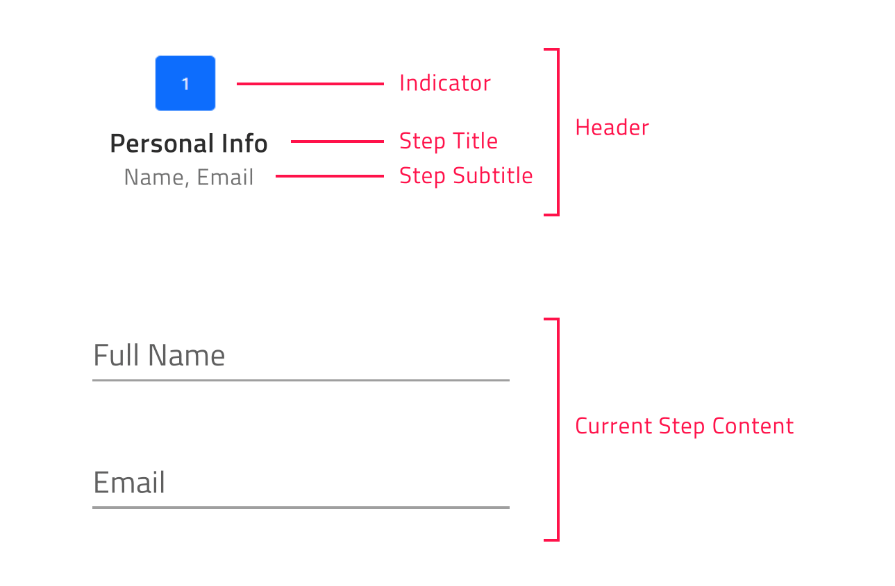
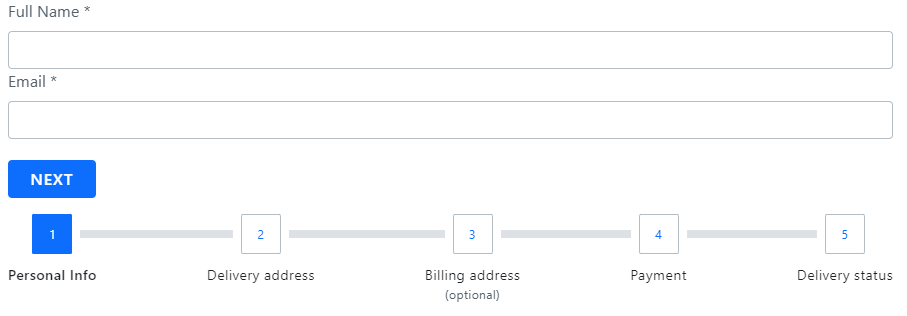

# Angular Stepper (ステッパー) コンポーネントの概要
Ignite UI for Angular Stepper は高度にカスタマイズ可能なコンポーネントで、必要なプロセスを可視化し、進行状況を各ステップで表示します。垂直線または水平線で表示されます。Ignite UI for [Angular コンポーネント ライブラリ](https://jp.infragistics.com/products/ignite-ui-angular)によって提供されるステッパー コンポーネントは、ウィザードのようなワークフローと、ステップ検証、スタイル設定、向き、キーボード ナビゲーションなどの複数の機能を提供します。


## Angular Stepper の例
この Angular Stepper の例では、クレジット カードをカスタマイズでき、カード タイプの選択、ビジネス情報の追加、個人情報の入力、出荷の詳細の提供、確認の 5 つの論理ステップでプロセスを実行します。
Angular ステッパー デモの 4 番目のステップは、2 番目のステップでユーザーがチェックボックスにチェックを付けた場合にのみ有効になります。

<code-view style="height: 725px" 
           data-demos-base-url="{environment:demosBaseUrl}" 
           iframe-src="{environment:demosBaseUrl}/layouts/stepper-overview-sample/" alt="Angular Stepper の例">
</code-view>

<div class="divider--half"></div>

これは、Angular Reactive Forms を使用して上記の機能を実現する方法を示すサンプルです。

<code-view style="height: 725px" 
           data-demos-base-url="{environment:demosBaseUrl}" 
           iframe-src="{environment:demosBaseUrl}/layouts/stepper-sample-reactive-forms/" alt="リアクティブ フォームを使用した Angular Stepper の例">
</code-view>

## Ignite UI for Angular Stepper を使用した作業の開始

Ignite UI for Angular Stepper コンポーネントを初期化するには、Ignite UI for Angular をインストールする必要があります。既存の Angular アプリケーションで、以下のコマンドを入力します。

```cmd
ng add igniteui-angular
```
Ignite UI for Angular については、「[はじめに](general/getting-started.md)」トピックをご覧ください。

次に、**app.module** ファイルに `IgxStepperModule` をインポートします。 

```typescript
// app.module.ts

...
import { IgxStepperModule } from 'igniteui-angular';
// import { IgxStepperModule } from '@infragistics/igniteui-angular'; for licensed package

@NgModule({
    ...
    imports: [..., IgxStepperModule],
    ...
})
export class AppModule {}
```

あるいは、`16.0.0` 以降、`IgxStepperComponent` をスタンドアロンの依存関係としてインポートすることも、[`IGX_STEPPER_DIRECTIVES`](https://github.com/IgniteUI/igniteui-angular/blob/master/projects/igniteui-angular/src/lib/stepper/public_api.ts) トークンを使用してコンポーネントとそのすべてのサポート コンポーネントおよびディレクティブをインポートすることもできます。

```typescript
// home.component.ts

import { HammerModule } from '@angular/platform-browser';
import { FormsModule } from '@angular/forms';
import { IGX_STEPPER_DIRECTIVES } from 'igniteui-angular';
// import { IGX_STEPPER_DIRECTIVES } from '@infragistics/igniteui-angular'; for licensed package

@Component({
    selector: 'app-home',
    template: `<igx-stepper>
        <igx-step> 
            <p igxStepTitle>Step 1</p>
        </igx-step>
        <igx-step> 
            <p igxStepTitle>Step 2</p>
        </igx-step>
    </igx-stepper>`,
    styleUrls: ['home.component.scss'],
    standalone: true,
    imports: [IGX_STEPPER_DIRECTIVES, FormsModule, HammerModule]
    /* or imports: [IgxStepperComponent, FormsModule, HammerModule] */
})
export class HomeComponent {
    public task: Task;
}
```

Angular Stepper モジュールまたはディレクティブをインポート後、`igx-stepper` とそのステップの基本設定を開始します。

## Angular Stepper の使用
[IgxStepComponent]({environment:angularApiUrl}/classes/igxstepcomponent.html) は、[IgxStepperComponent]({environment:angularApiUrl}/classes/igxsteppercomponent.html) に属するすべてのステップの表現です。ステップは [isValid]({environment:angularApiUrl}/classes/igxstepcomponent.html#isValid)、[active]({environment:angularApiUrl}/classes/igxstepcomponent.html#active)、[optional]({environment:angularApiUrl}/classes/igxstepcomponent.html#optional)、[disabled]({environment:angularApiUrl}/classes/igxstepcomponent.html#disabled)、[completed]({environment:angularApiUrl}/classes/igxstepcomponent.html#completed) プロパティを提供し、ビジネス要件に応じてステップの状態を構成できます。

### ステッパーの宣言
ステッパー モジュールをインポートした後で、構成を開始します。

ステップは、以下の方法のいずれかを使用して宣言できます。
- データセットの繰り返し

```html
<igx-stepper>
    <igx-step *ngFor="let step of stepsData" [disabled]=”step.disabled”>
        <igx-icon igxStepIndicator>
			{{step.indicator}}
        </igx-icon>

        <p igxStepTitle>
			{{step.title}}
        </p>
    </igx-step>
</igx-stepper>
```


- 静的ステップの作成

```html
<igx-stepper>
    <igx-step> 
       <p igxStepTitle>Step 1</p>
    </igx-step>
    <igx-step> 
       <p igxStepTitle>Step 2</p>
    </igx-step>
</igx-stepper>
```
各ステップで、`igxStepIndicator`、`igxStepTitle`、`igxStepSubtitle`、および `igxStepContent` ディレクティブを使用してインジケーター、タイトル、サブタイトル、コンテンツを構成できます。 

```html
<igx-stepper>
    <igx-step>
       <igx-icon igxStepIndicator>home</igx-icon>
       <p igxStepTitle>Home</p>
       <p igxStepSubtitle>Home Sub Title</p>
       <div igxStepContent>
          ...
       </div>
    </igx-step>
</igx-stepper>
```


### ステッパーの向きの変更
公開された [orientation]({environment:angularApiUrl}/classes/igxsteppercomponent.html#orientation) プロパティでステッパーの向きをカスタマイズできます。`IgxStepperOrientation` 列挙型の `Horizontal` メンバー (デフォルト値) または `Vertical` メンバーを取得します。

**水平方向のステッパー**

`igx-stepper` の [orientation]({environment:angularApiUrl}/classes/igxsteppercomponent.html#orientation) プロパティのデフォルト値は `horizontal` です。
ステッパーが水平方向の場合、ステップのコンテンツをステップのヘッダーの上または下に表示するかどうかを決定できます。これは、[IgxStepperComponent]({environment:angularApiUrl}/classes/igxsteppercomponent.html) の [contentTop]({environment:angularApiUrl}/classes/igxsteppercomponent.html#contentTop) ブール型プロパティを設定することで実現できます。デフォルト値は `false` です。有効な場合、ステップのコンテンツはステップのヘッダーの上に表示されます。



**水平方向のステッパー**

水平レイアウトから垂直レイアウトに簡単に切り替えることができます。デフォルトの方向を変更するには、[orientation]({environment:angularApiUrl}/classes/igxsteppercomponent.html#orientation) プロパティを `vertical` に設定します。
```html
<igx-stepper [orientation]="'vertical'">
	<igx-step>    
  		…   
	</igx-step>

	<igx-step>    
 		 …   
	</igx-step>
</igx-stepper>
```
以下のサンプルは、実行時にステッパーの[向き]({environment:angularApiUrl}/classes/igxsteppercomponent.html#orientation)と[タイトルの位置](stepper.md#ステップのカスタマイズ)を変更する方法を示しています。 

<code-view style="height: 528px" 
           data-demos-base-url="{environment:demosBaseUrl}" 
           iframe-src="{environment:demosBaseUrl}/layouts/stepper-label-position-and-orientation-sample/" alt="Angular Stepper 向きの例">
</code-view>

<div class="divider--half"></div>

### ステップ状態 
[IgxStepperComponent]({environment:angularApiUrl}/classes/igxsteppercomponent.html) は 4 つのステップ状態をサポートし、それぞれがデフォルトで異なるスタイルを適用します。
- [**active**]({environment:angularApiUrl}/classes/igxstepcomponent.html#active) - ステップが現在表示されているかどうかを決定します。設計上、ユーザーが明示的にステップの active 属性を `true` に設定しない場合、最初の有効なステップがアクティブになります。
- [**disabled**]({environment:angularApiUrl}/classes/igxstepcomponent.html#disabled) - ステップが操作可能かどうかを決定します。デフォルトでは、ステップの disabled 属性は `false` に設定されています。
- [**optional**]({environment:angularApiUrl}/classes/igxstepcomponent.html#optional) - デフォルトで、ステップの optional 属性は `false` に設定されます。リニア ステッパーのステップの有効性が必要ない場合、オプションの属性を有効にして、ステップの有効性とは関係なく前進できます。
- [**completed**]({environment:angularApiUrl}/classes/igxstepcomponent.html#completed) - デフォルトでは、ステップの completed 属性は `false` を返します。ユーザーは、completed 属性を必要に応じて設定することにより、このデフォルトの completed 動作をオーバーライドできます。ステップが完了済みとしてマークされると、ステップ ヘッダーのスタイルがデフォルトで変更されるだけでなく、完了したステップと次のステップの間の進捗線のスタイルも変更されます。両方のスタイルは、公開された [CSS 変数]({environment:sassApiUrl}/themes#function-stepper-theme)を使用して変更できます。

[IgxStepperComponent]({environment:angularApiUrl}/classes/igxsteppercomponent.html) は、双方向バインド可能な [**isValid**]({environment:angularApiUrl}/classes/igxstepcomponent.html#isValid) プロパティで各ステップの検証ロジックを設定できます。その値に基づいて、ユーザーがリニア ステッパー モードで前に進むことができるかどうかが決定されます。
デフォルトで、ステップの [isValid]({environment:angularApiUrl}/classes/igxstepcomponent.html#isValid) プロパティは `true` に設定されます。

### リニア ステッパー

`igx-stepper` は、[linear]({environment:angularApiUrl}/classes/igxsteppercomponent.html#linear) プロパティを使用してステップ フローを設定できます。デフォルトで、linear は `false` に設定され、ユーザーは [IgxStepperComponent]({environment:angularApiUrl}/classes/igxsteppercomponent.html) で無効にされていないステップを選択できます。

[linear]({environment:angularApiUrl}/classes/igxsteppercomponent.html#linear) プロパティが `true` に設定されている場合、ステッパーは次のステップに進む前に現在のオプションではないステップを有効にする必要があります。 

現在のオプションではないステップが有効でない場合、現在のステップを検証するまで次のステップに進むことができません。 

> [!NOTE]
> オプションのステップの有効性は考慮されません。

以下の例は、リニア ステッパーを構成する方法を示しています。

<code-view style="height: 430px" 
           data-demos-base-url="{environment:demosBaseUrl}" 
           iframe-src="{environment:demosBaseUrl}/layouts/stepper-linear-sample/" alt="Angular Linear Stepper の例">
</code-view>

<div class="divider--half"></div>

### ステップ操作

[IgxStepperComponent]({environment:angularApiUrl}/classes/igxsteppercomponent.html) は、ステップ操作に以下の API メソッドを提供します。
- [**navigateTo**]({environment:angularApiUrl}/classes/igxsteppercomponent.html#navigateTo) – 指定したインデックスでステップをアクティブ化します。
- [**next**]({environment:angularApiUrl}/classes/igxsteppercomponent.html#next) - 次の無効化されていないステップをアクティブ化します。
- [**prev**]({environment:angularApiUrl}/classes/igxsteppercomponent.html#prev) – 前の無効化されていないステップをアクティブ化します。
- [**reset**]({environment:angularApiUrl}/classes/igxsteppercomponent.html#reset) – ステッパーを初期状態にリセットします。

> [!NOTE]
> reset メソッドはステップの内容をクリアしません。これは手動で行う必要があります。

### ステップのカスタマイズ

Ignite UI for Angular Stepper では、タイトル、インジケーターなどのさまざまなオプションを構成できます。

これは、[IgxStepperComponent]({environment:angularApiUrl}/classes/igxsteppercomponent.html) の [stepType]({environment:angularApiUrl}/classes/igxsteppercomponent.html#stepType) プロパティで実現できます。`IgxStepType` 列挙型のメンバーを取得します。
- Full (フル、**デフォルト値**)
- Indicator (インジケーター)
- Title (タイトル)

**Full (フル)**

タイトルとサブタイトルが定義されている場合、この設定ではインジケーターとタイトルの両方が描画されます。

また、ユーザーはステップのタイトルの位置を定義できるため、ステップ インジケーターの前、後、上、または下に配置できます。
ユーザーは [titlePosition]({environment:angularApiUrl}/classes/igxsteppercomponent.html#titlePosition) プロパティを使用してタイトル位置を構成できます。両方のプロパティは `IgxStepperTitlePosition` 列挙型のメンバーを取得します。
- end
- start
- bottom
- top

`igx-stepper` が水平方向の場合、タイトル位置のデフォルト値は `bottom` です。

向きが垂直レイアウトに設定されている場合、タイトル位置のデフォルト値は `end` です。

> [!NOTE]
> [titlePosition]({environment:angularApiUrl}/classes/igxsteppercomponent.html#titlePosition) プロパティは、ステッパーの [stepType]({environment:angularApiUrl}/classes/igxsteppercomponent.html#stepType) プロパティが `full` に設定されている場合に**のみ**適用できます。

**Indicator (インジケーター)**

ステップのインジケーターのみを表示する場合は、[stepType]({environment:angularApiUrl}/classes/igxsteppercomponent.html#stepType) オプションを `indicator` に設定します。

ステップ インジケーターはすべてのコンテンツをサポートしますが、サイズが常に **24 ピクセル**になるという制限があります。この点に注意して、ステップ インジケーターとして [IgxIconComponent](icon.md) または [IgxAvatarComponent](avatar.md) を使用することをお勧めします。

**Title (タイトル)**

ステップのタイトルのみを表示する場合は、[stepType]({environment:angularApiUrl}/classes/igxsteppercomponent.html#stepType) オプションを `title` に設定します。

このように、サブタイトルが定義されている場合、それらもステップ タイトルの下に描画されます。

> [!NOTE]
> このコンテナーは、サイズ制限なしで要件に応じて再テンプレート化できます。たとえば、サイズが 24 ピクセルより大きいインジケーターを中に追加できます。

以下のサンプルは公開されたすべてのステップ タイプと変更方法を示しています。

<code-view style="height: 300px" 
           data-demos-base-url="{environment:demosBaseUrl}" 
           iframe-src="{environment:demosBaseUrl}/layouts/stepper-steptypes-sample/" alt="Angular ステップ タイプの例">
</code-view>

<div class="divider--half"></div>

[IgxStepperComponent]({environment:angularApiUrl}/classes/igxsteppercomponent.html) では、アクティブなステップ、無効なステップ、完了したステップの描画されたインジケーターをカスタマイズできます。これは、`igxStepActiveIndicator`、`igxStepInvalidIndicator`、および `igxStepCompletedIndicator` ディレクティブで実現できます。
```html
<igx-stepper>
    <ng-template igxStepActiveIndicator>
       <igx-icon>edit</igx-icon>
    </ng-template>

    <ng-template igxStepInvalidIndicator>
       <igx-icon>error</igx-icon>
    </ng-template>

    <ng-template igxStepCompletedIndicator>
       <igx-icon>check</igx-icon>
    </ng-template>
    ...
</igx-stepper>
```

> [!NOTE]
> このテンプレートは、関連する状態のすべてのステップに適用されます。

### Angular Stepper のアニメーション

Angular Stepper のアニメーションにより、エンドユーザーは定義されたステッをプ操作しているときに高いエクスペリエンスを得ることができます。使用可能なアニメーション オプションは、ステッパーの向きによって異なります。

ステッパーが**水平方向**の場合、デフォルトで `slide` アニメーションを使用するように構成されます。`fade` もサポートします。アニメーションは、[horizontalAnimationType]({environment:angularApiUrl}/classes/igxsteppercomponent.html#horizontalAnimationType) 入力を介して構成されます。

**垂直方向**のレイアウトでは、アニメーション タイプは [verticalAnimationType]({environment:angularApiUrl}/classes/igxsteppercomponent.html#verticalAnimationType) プロパティを使用して定義できます。デフォルトで値は `grow` で、ユーザーは `fade` に設定できます。

両方のアニメーション タイプ入力に `none` を設定すると、ステッパー アニメーションが無効になります。

[IgxStepperComponent]({environment:angularApiUrl}/classes/igxsteppercomponent.html) は、ステップ間のトランジションの期間を構成する機能を提供します。これは、引数として数値を受け取る [animationDuration]({environment:angularApiUrl}/classes/igxsteppercomponent.html#animationDuration) プロパティで実現できます。これは両方の方向に共通です。

## キーボード ナビゲーション

Ignite UI for Angular は、さまざまなキーボード操作をエンドユーザーに提供します。この機能はデフォルトで有効になっており、エンドユーザーは簡単にステップを移動できます。 
[IgxStepperComponent]({environment:angularApiUrl}/classes/igxsteppercomponent.html) ナビゲーションは [W3 アクセシビリティ標準](https://www.w3.org/WAI/ARIA/apg/example-index/tabs/tabs-manual.html#accessibilityfeatures)に準拠しており、便利に使用できます。

**キーの組み合わせ**

 - <kbd>Tab</kbd> - 次の移動可能な要素にフォーカスを移動します。
 - <kbd>Shift + Tab</kbd> - 前移動可能な要素にフォーカスを移動します。
 - <kbd>下矢印</kbd> - `igx-stepper` が**垂直方向**の場合、次のアクセス可能なステップのヘッダーにフォーカスを移動します。
 - <kbd>上矢印</kbd> - `igx-stepper` が**垂直方向**の場合、前のアクセス可能なステップのヘッダーにフォーカスを移動します。
 - <kbd>左矢印</kbd> - 両方の方向で前のアクセス可能なステップのヘッダーにフォーカスを移動します。
 - <kbd>右矢印</kbd> - 両方の方向で次にアクセス可能なステップのヘッダーにフォーカスを移動します。
 - <kbd>Home</kbd> - `igx-stepper` の最初の有効なステップのヘッダーにフォーカスを移動します。
 - <kbd>End</kbd> - `igx-stepper` の最後の有効なステップのヘッダーにフォーカスを移動します。
 - <kbd>Enter / Space</kbd> - 現在フォーカスされているステップをアクティブ化します。
 
 > [!NOTE]
 > ユーザーがステップ ヘッダーで <kbd>Tab</kbd> キーを押すと、フォーカスはステップ コンテンツ コンテナーに移動します。コンテナーをスキップする場合、開発者は `[tabIndex]="-1"` コンテンツ コンテナーを設定する必要があります。

Stepper コンポーネントは、ローコード [ドラッグアンドドロップ App Builder™](https://jp.infragistics.com/products/appbuilder) でも使用できます。

## Angular Stepper のスタイル設定

### Stepper テーマのプロパティ マップ

プライマリ プロパティを変更すると、関連するすべての依存プロパティが自動的に更新され、変更が反映されます。

<table class="collapsible-table">
    <thead>
        <tr>
        <th>プライマリ プロパティ</th>
        <th>依存プロパティ</th>
        <th>説明</th>
        </tr>
    </thead>
    <tbody class="group">
        <tr class="primary">
        <td><details><summary><strong>$step-background</strong></summary></details></td>
        <td>$step-hover-background</td>
        <td>ホバー時のステップ ヘッダーの背景</td>
        </tr>
        <tr class="dependent"><td></td><td>$step-focus-background</td><td>フォーカス時のステップ ヘッダーの背景</td></tr>
        <tr class="dependent"><td></td><td>$indicator-background</td><td>ステップ インジケーターの背景の色</td></tr>
        <tr class="dependent"><td></td><td>$title-color</td><td>ステップのタイトルの色</td></tr>
        <tr class="dependent"><td></td><td>$subtitle-color</td><td>ステップのサブタイトルの色</td></tr>
        <tr class="dependent"><td></td><td>$current-step-background</td><td>現在のステップ ヘッダーの背景</td></tr>
        <tr class="dependent"><td></td><td>$invalid-step-background</td><td>入力が不正なステップ ヘッダーの背景</td></tr>
        <tr class="dependent"><td></td><td>$complete-step-background</td><td>完了したステップ ヘッダーの背景</td></tr>
        <tr class="dependent"><td></td><td>$disabled-indicator-background</td><td>無効なステップのインジケーターの背景</td></tr>
        <tr class="dependent"><td></td><td>$disabled-title-color</td><td>無効なステップ タイトルの色</td></tr>
        <tr class="dependent"><td></td><td>$disabled-subtitle-color</td><td>無効なステップ サブタイトルの色</td></tr>
        <tr class="dependent"><td></td><td>$step-separator-color</td><td>ステップ間の区切りの境界線の色</td></tr>
    </tbody>
    <tbody class="group">
        <tr class="primary">
        <td><details><summary><strong>$indicator-background</strong></summary></details></td>
        <td>$indicator-outline</td>
        <td>ステップ インジケーターのアウトラインの色</td>
        </tr>
        <tr class="dependent"><td></td><td>$indicator-color</td><td>ステップ インジケーターのテキストの色</td></tr>
    </tbody>
    <tbody class="group">
        <tr class="primary">
        <td><details><summary><strong>$current-step-background</strong></summary></details></td>
        <td>$current-step-hover-background</td>
        <td>現在のステップ ヘッダーのホバー時の背景</td>
        </tr>
        <tr class="dependent"><td></td><td>$current-step-focus-background</td><td>現在のステップ ヘッダーのフォーカス時の背景</td></tr>
        <tr class="dependent"><td></td><td>$current-indicator-background</td><td>現在のステップ インジケーターの背景の色</td></tr>
        <tr class="dependent"><td></td><td>$current-title-color</td><td>現在のステップ タイトルの色</td></tr>
        <tr class="dependent"><td></td><td>$current-subtitle-color</td><td>現在のステップ サブタイトルの色</td></tr>
    </tbody>
    <tbody class="group">
        <tr class="primary">
        <td><details><summary><strong>$invalid-indicator-background</strong></summary></details></td>
        <td>$invalid-indicator-outline</td>
        <td>入力が不正なステップ インジケーターのアウトラインの色</td>
        </tr>
        <tr class="dependent"><td></td><td>$invalid-indicator-color</td><td>入力が不正なステップ インジケーターの色</td></tr>
        <tr class="dependent"><td></td><td>$invalid-title-color</td><td>入力が不正なステップ タイトルの色</td></tr>
        <tr class="dependent"><td></td><td>$invalid-subtitle-color</td><td>入力が不正なステップ サブタイトルの色</td></tr>
        <tr class="dependent"><td></td><td>$invalid-title-hover-color</td><td>入力が不正なステップタイトルのホバー時の色</td></tr>
        <tr class="dependent"><td></td><td>$invalid-subtitle-hover-color</td><td>入力が不正なステップ サブタイトルのホバー時の色</td></tr>
        <tr class="dependent"><td></td><td>$invalid-title-focus-color</td><td>入力が不正なステップ タイトルのフォーカス時の色</td></tr>
        <tr class="dependent"><td></td><td>$invalid-subtitle-focus-color</td><td>入力が不正なステップ サブタイトルのフォーカス時の色</td></tr>
    </tbody>
    <tbody class="group">
        <tr class="primary">
        <td><details><summary><strong>$complete-step-background</strong></summary></details></td>
        <td>$complete-step-hover-background</td>
        <td>完了したステップ ヘッダーのホバー時の背景</td>
        </tr>
        <tr class="dependent"><td></td><td>$complete-step-focus-background</td><td>完了したステップ ヘッダーのフォーカス時の背景</td></tr>
        <tr class="dependent"><td></td><td>$complete-indicator-background</td><td>完了したステップ インジケーターの背景の色</td></tr>
        <tr class="dependent"><td></td><td>$complete-indicator-color</td><td>完了したステップ インジケーターの色</td></tr>
        <tr class="dependent"><td></td><td>$complete-title-color</td><td>完了したステップ タイトルの色</td></tr>
        <tr class="dependent"><td></td><td>$complete-subtitle-color</td><td>完了したステップ サブタイトルの色</td></tr>
        <tr class="dependent"><td></td><td>$complete-title-hover-color</td><td>完了したステップ タイトルのホバー時の色</td></tr>
        <tr class="dependent"><td></td><td>$complete-subtitle-hover-color</td><td>完了したステップ サブタイトルのホバー時の色</td></tr>
        <tr class="dependent"><td></td><td>$complete-title-focus-color</td><td>完了したステップ タイトルのフォーカス時の色</td></tr>
        <tr class="dependent"><td></td><td>$complete-subtitle-focus-color</td><td>完了したステップ サブタイトルのフォーカス時の色</td></tr>
    </tbody>
</table>

[Ignite UI for Angular テーマ](themes/index.md)を使用して、`igx-stepper` の外観を変更できます。 

はじめに、テーマ エンジンによって公開されている関数を使用するために、スタイル ファイルに `index` ファイルをインポートする必要があります。 

```scss
@use "igniteui-angular/theming" as *;

// IMPORTANT: Prior to Ignite UI for Angular version 13 use:
// @import '~igniteui-angular/lib/core/styles/themes/index';
```

最もシンプルな方法として、[stepper-theme]({environment:sassApiUrl}/themes#function-stepper-theme) を拡張し、少数のベース パラメーターのみを指定して新しいテーマを作成します。テーマは、状態固有の色やアクセス可能なコントラストの前景など、必要なすべてのスタイルを自動的に生成します。外観をさらに調整したい場合は、他の任意のパラメーターをオーバーライドすることも可能です。

```scss
$stepper-theme: stepper-theme(
  $step-background: #351e65,
  $current-indicator-background: #f6cd28,

  $border-radius-step-header: 16px,
  $border-radius-indicator: 10px 4px 10px 4px,
);
```

最後にコンポーネントのテーマを含めます。

```scss
@include css-vars($custom-stepper-theme);
```

### デモ
以下のサンプルは、[Ignite UI for Angular テーマ](themes/index.md)で適用されるシンプルなスタイル設定を示します。

<code-view style="height: 264px" 
           data-demos-base-url="{environment:demosBaseUrl}" 
           iframe-src="{environment:demosBaseUrl}/layouts/stepper-styling-sample/" alt="Angular Stepper スタイル設定の例">
</code-view>

### Tailwind によるスタイル設定

カスタム Tailwind ユーティリティ クラスを使用して stepper をスタイル設定できます。まず [Tailwind を設定して](themes/misc/tailwind-classes.md)ください。

グローバル スタイルシートに Tailwind をインポートした上で、以下のように必要なテーマ ユーティリティを適用します:

```scss
@import "tailwindcss";
...
@use 'igniteui-theming/tailwind/utilities/material.css';
```

ユーティリティ ファイルには、`light` テーマと `dark` テーマの両方のバリエーションが含まれています。
- `light-*` クラスはライト テーマ用です。
- `dark-*` クラスはダーク テーマ用です。
- プレフィックスの後にコンポーネント名を追加します (例: `light-splitter`、`dark-splitter`)。

これらのクラスを適用すると、動的なテーマの計算が可能になります。そこから、`任意のプロパティ`を使用して、生成された CSS 変数をオーバーライドできます。コロンの後に、有効な CSS カラー形式 (HEX、CSS 変数、RGB など) を指定します。

プロパティの完全なリストは、[stepper-theme]({environment:sassApiUrl}/themes#function-stepper-theme) で確認できます。構文は次のとおりです:

```html
<igx-stepper
  class="!light-stepper ![--step-background:#7B9E89] ![--border-radius-step-header:6px]">
  ...
</igx-stepper>
```

>[!NOTE]
>ユーティリティ クラスが優先されるようにするには、感嘆符 (`!`) が必要です。Tailwind はスタイルをレイヤーに適用しますが、これらのスタイルを重要としてマークしないと、コンポーネントのデフォルトのテーマによってオーバーライドしてしまいます。

最終的に、stepper は次のようになります:

<div class="sample-container loading" style="height:200px">
    <iframe id="stepper-tailwind-styling-iframe" data-src='{environment:demosBaseUrl}/layouts/stepper-tailwind-styling-sample/' width="100%" height="100%" seamless frameBorder="0" class="lazyload"></iframe>
</div>

<div class="divider--half"></div>

## API リファレンス
* [IgxStepperComponent]({environment:angularApiUrl}/classes/igxsteppercomponent.html)
* [IgxStepComponent]({environment:angularApiUrl}/classes/igxstepcomponent.html)

## その他のリソース
コミュニティに参加して新しいアイデアをご提案ください。

* [Ignite UI for Angular **フォーラム** (英語)](https://www.infragistics.com/community/forums/f/ignite-ui-for-angular)
* [Ignite UI for Angular **GitHub** (英語)](https://github.com/IgniteUI/igniteui-angular)

