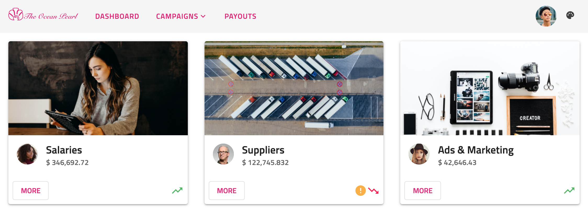
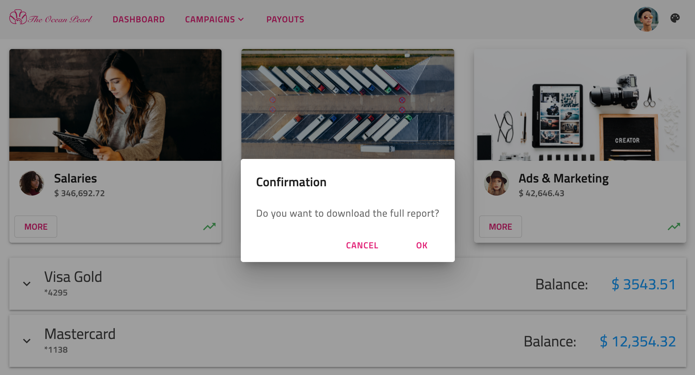
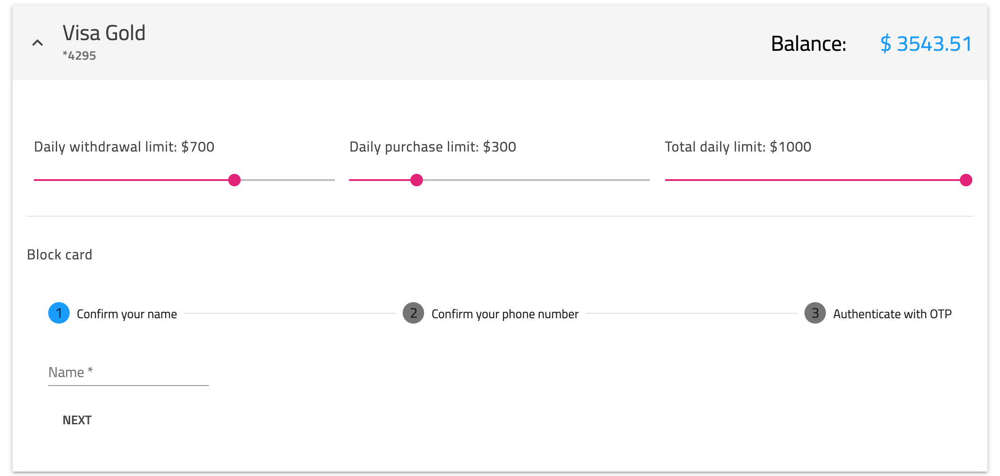

# Angular Material のテーマ
<p class="highlight">Ignite UI for Angular テーマ エンジンを使用すると、[`Angular Material`](https://material.angular.io/) ライブラリなどの他のテーマ ライブラリからインポートされた外部コンポーネントと一緒に簡単に使用できます。</p>
<div class="divider--half"></div>

## Ignite UI と Angular Material の概要

Angular Material は、モバイルおよびデスクトップの Angular Web アプリケーション用の UI コンポーネント ライブラリです。これには、いくつかの事前に作成されたテーマと、[`マテリアル デザイン仕様`](https://material.io/components)に基づく多数のコンポーネントが含まれています。

Ignite UI for Angular は、マテリアル ベースの UI ウィジェット、コンポーネント、および Sketch UI キットの完全なセットで、Angular のディレクティブをサポートします。テーマ エンジンは使いやすく、単一のコンポーネント、複数のコンポーネント、またはスイート全体からさまざまなレベルでテーマを設定できます。さらに、他のテーマ ライブラリのコンポーネントをほとんど手間をかけずにスタイル設定するために使用できます。

次の記事では、1 つのアプリケーションで Ignite UI コンポーネントと Angular Material コンポーネントの両方を使用する方法と、それらを同じように表示する方法を示します。

## Angular Material のテーマの例

<code-view style="height: 1050px" 
           data-demos-base-url="{environment:demosBaseUrl}" 
           iframe-src="{environment:demosBaseUrl}/theming/angular-sample" >
</code-view>

<div class="divider--half"></div>

## Ignite UI と Angular Material で作業を開始

### Angular Material のインストール方法

Angular CLI を使用しており、既存の Angular プロジェクトがある場合、以下のコマンドで Angular Material を追加できます。 

```cmd 
ng add @angular/material
```

次に、事前に作成されたテーマの 1 つを選択し、Angular Material のグローバル タイポグラフィ スタイルとブラウザー アニメーションを設定するかどうかを選択する必要があります。この構成が完了すると、アプリケーションで Angular Material コンポーネントを使用できるようになります。

Angular Material ライブラリの使用に関する詳細については、[`公式ドキュメント`](https://material.angular.io/guide/getting-started)を参照してください。

### Ignite UI for Angular のインストール方法 

Ignite UI for Angular パッケージをすべての依存関係、フォント インポート、およびスタイル参照と共にインストールするには、プロジェクトで以下のコマンドを実行します。

```cmd
ng add igniteui-angular
```

次に、*app.module.ts* ファイルにそれぞれのモジュールをインポートして Ignite UI コンポーネントを使用できます。

```ts
// manually addition of the Igx Avatar component 
import { IgxAvatarModule } from 'igniteui-angular';

@NgModule({
    imports: [
        ...,
        IgxAvatarModule,
        ...
    ]
)}
```

既存のプロジェクトで Ignite UI for Angular を使用する方法については、[`「作業の開始」`](../../general/getting-started.md)トピックを参照してください。各コンポーネントをインポートして使用する方法の詳細およびガイド付きの例は、コンポーネントのドキュメントを参照してください。

## Ignite UI と Angular Material コンポーネント

デモ サンプルの実行方法を見てみましょう。Ignite UI コンポーネントと Angular Material コンポーネントを組み合わせたもので、1 つのアプリケーションにうまく収まります。この例のナビゲーションは、[`igx-buttons`]({environment:angularApiUrl}/classes/igxbuttondirective.html) および [`igx-avatar`]({environment:angularApiUrl}/classes/igxavatarcomponent.html) とともに material [`mat-toolbar`](https://material.angular.io/components/toolbar/overview) を使用して作成されます。[Campaigns] ボタンの下の[`メニュー`](https://material.angular.io/components/menu/overview)も Angular Material ライブラリから取得されます。ナビゲーションの下で、[`igx-card`]({environment:angularApiUrl}/classes/igxcardcomponent.html) コンポーネントを使用して統計を表示します。カード内に複数の項目を配置しました - [`igx-avatars`]({environment:angularApiUrl}/classes/igxavatarcomponent.html)、[`igx-icons`]({environment:angularApiUrl}/classes/igxiconcomponent.html)、および material [`buttons`](https://material.angular.io/components/button/overview)。



`[その他]` ボタンをクリックすると、[`igx-dialog`]({environment:angularApiUrl}/classes/igxdialogcomponent.html) が表示されます。



次に、クレジット カードに関する情報を表示する [`igx-expansion-panel`]({environment:angularApiUrl}/classes/igxexpansionpanelcomponent.html) を追加しました。その内容には、[`mat-sliders`](https://material.angular.io/components/slider/overview)、[`igx-divider`]({environment:angularApiUrl}/classes/igxdividerdirective.html)、[`mat-form-fields`](https://material.angular.io/components/form-field/overview) を含む [`mat-stepper`](https://material.angular.io/components/stepper/overview) があります。



最後に、右上隅に Ignite UI for Angular [`アイコン ボタン`]({environment:angularApiUrl}/classes/igxbuttondirective.html)を挿入し、アプリ全体のテーマを変更します。  


## Angular コンポーネントのスタイル設定 

Ignite UI テーマ エンジンを使用してコンポーネントのスタイル設定を開始するには、グローバル テーマのベース ファイルとなる scss ファイルを作成します。このファイルを `_variables.scss` と呼びます。次に、Ignite UI の `index` ファイルと Angular Material の `theming` ファイルをインポートする必要があります。

```scss
// _variables.scss

@import '~igniteui-angular/lib/core/styles/themes/index';
@import "~@angular/material/theming";
``` 

### カラー パレット

Ignite UI for Angular の [`igx-palette`]({environment:sassApiUrl}/index.html#function-igx-palette) 関数は、`primary`、`secondary`、`grays` 影の 3 つのサブパレットと、`info`、`success`、`warn`、`error` および `surface` の 5 つの追加カラーを含むカラー パレット マップを生成します。テーマ エンジンは、カラー バリエーションごとに、ビルド時にテキストのコントラスト カラーを自動的に生成します。これもパレットに含まれています。以下に、事前定義されたライト マテリアル パレットを示します:

```scss
$igx-light-palette: igx-palette(
    $primary: #09f,
    $secondary: #e41c77
    $info: #1377d5,
    $success: #4eb862,
    $warn: #fbb13c,
    $error: #ff134a,
    $grays: #000,
    $surface: #fff
);
```

Ignite UI パレットとは異なり、Angular Material カラー パレット マップには、1 つの色とそれに対応するコントラスト カラーの影のみが含まれています。たとえば、`$mat-purple` パレットを示します: 

```scss
$light-primary-text: white;
$dark-primary-text: rgba(black, 0.87);

$mat-purple: (
  50: #f3e5f5,
  100: #e1bee7,
  ...,
  A700: #aa00ff,
  contrast: (
    50: $dark-primary-text,
    100: $dark-primary-text,
    ...,
    A700: $light-primary-text,
  )
);
```

### テーマ パレットの生成

テーマ パレットを定義するには、色相から色へのマップを生成するマテリアルの `mat-palette` 関数を使用する必要があります。このサンプルでは、Ignite UI テーマを使用して Angular Material コンポーネントのスタイルを設定するため、構造に応じて `$ light-material-palette` を変換する必要があります。

これを実現するために、すべてのカラー バリアントのマップとそれに続くコントラスト カラーを返す `$color`、`$saturations`、および `$ palette` のパラメーターを使用して Sass 関数を作成します。使用している彩度は、[`マテリアル デザイン カラー システム`](https://material.io/design/color/the-color-system.html)に従います。

```scss
$saturations: (50, 100, 200, 300, 400, 500, 600, 700, 800, 900, A100, A200, A400, A700);

@function material-like-palette(
    $color,
    $saturations,
    $palette,
) {
    $shade: ();
    $contrast: ();
    $result: ();
    @each $saturation in $saturations {
        $shade: map-merge($shade, (
            $saturation: igx-color($palette, $color, $saturation)
        ));
        $contrast: map-merge($contrast, (
            $saturation: igx-color($palette, $color, #{$saturation}-contrast)
        ));
        $result: map-merge($shade, (contrast: $contrast));
    }

    @return $result;
}
```

#### ライト テーマ パレット

Ignite UI の `primary` カラー `$igx-light-palette` と新しく作成した `material-like-palette` 関数を使用して、ライト プライマリ マテリアル テーマ パレットを定義します。結果をパラメーターとして `mat-palette` 関数に渡す必要があります。この関数は、`default`、`lighter`、`darker`、および `text` 影のカラー値を生成し、それらをパレット マップに追加します。

```scss
$light-palette-primary: mat-palette(
    material-like-palette('primary', $saturations, $igx-light-palette)
);
```

ライト アクセント パレットについても同じことをしましょう:

```scss
$light-palette-accent: mat-palette(
    material-like-palette('secondary', $saturations, $igx-light-palette)
);
```

最後に、2 つのカラー パレットを `mat-light-theme` 関数に渡す準備ができました。これにより、Ignite UI マテリアルのカラー パレットから取得した色で Angular Material テーマが作成されます。

```scss
$custom-mat-light-theme: mat-light-theme(
    $light-palette-primary,
    $light-palette-accent
);
```

>[!NOTE]
>Ignite UI for Angular が提供するパレットと新しいパレットの作成方法については、[`Sass のパレット`](../sass/palettes.md) セクションを参照してください。

#### ダーク テーマ パレット

前のアプローチに従って、ダーク モードのマテリアル パレットを作成します。今回は、カスタムの `igx-palette` も定義します。

```scss
// Custom igx-palette
$custom-dark-palette: igx-palette(
    $primary: #011627,
    $secondary: #72da67,
    $grays: #fff,
    $surface: #222,
);

// Material dark primary palette
$dark-palette-primary: mat-palette(
    material-like-palette('primary', $saturations, $custom-dark-palette)
);
// Material dark accent palette
$dark-palette-accent: mat-palette(
    material-like-palette('secondary', $saturations, $custom-dark-palette)
);
// Material dark theme
$custom-mat-dark-theme: mat-dark-theme(
    $dark-palette-primary,
    $dark-palette-accent
);
```

### テーマ

`light` モードと `dark` モードを切り替えるために、ボタン クリックで変更されるカスタム `dark` クラスを追加します。スタイルシート ファイルに、各クラスにスコープされた異なるカラー パレットを含めます。

Ignite UI for Angular には、[マテリアル デザイン](https://material.io/design)に基づいて事前定義されたテーマが付属しています。それらを使用するには、最初に `igx-core` ミックスインを含め、次に組み込みのテーマ ミックスイン - [igx-theme]({environment:sassApiUrl}/index.html#mixin-igx-theme) を含める必要があります。また、事前定義されたマテリアル パレット - [$light-material-palette]({environment:sassApiUrl}/index.html#variable-light-material-palette) および [$dark-material-palette]({environment:sassApiUrl}/index.html#variable-dark-material-palette) も使用します。 

Angular Material コンポーネントの場合、前述のカスタム マテリアル テーマに `mat-core` ミックスインを含めてから、`angular-material-theme` ミックスインを含める必要があります。 

```scss
// Make sure you always include the igx-core mixin first
@include igx-core();

::ng-deep {
    @include mat-core();
    @include igx-theme($igx-light-palette, $legacy-support: true);
    @include angular-material-theme($custom-mat-light-theme);

    .dark {
        @include igx-dark-theme($custom-dark-palette, $legacy-support: true);
        @include angular-material-theme($custom-mat-dark-theme);
    }
}
```

>[!WARNING]
>[`Emulated`](../sass/component-themes.md#view-encapsulation) ViewEncapsulation を`解除する`ために、上記のコードを `::ng-deep` セレクター内に配置してください。

#### ライト モード

カラー パレットとテーマの構成が完了したら、コンポーネントにいくつかの追加の色変更を加えることができます。アプリケーションの背景色は、host 要素で明示的に設定する必要があります。サンプルでは、渡されたパレットの `surface` カラーを使用します。ロゴは SVG 画像であるため、CSS を使用して簡単に色を変更できます:

```scss
:host {
    &.light {
        // The background color of the application in light mode
        background: igx-color($igx-light-palette, 'surface');

        // The application logo fill color
        #Path1 {
            fill: igx-color($igx-light-palette, 'secondary');
        }

        // The application logo stroke color
        #Path2 {
            stroke: igx-color($igx-light-palette, 'secondary');
            stroke-width: "0.8";
        }
    }
}
```

#### ダーク モード

ダーク バリアントでは、同じ CSS スタイルを適用しますが、`$custom-dark-palette` を使用します。また、`mat-stepper` コンポーネントと `mat-slider` コンポーネントの色の一部を変更して、アプリにうまく収まるようにします。 

```scss
:host {
    &.dark {
        // The background color of the application in dark mode
        background: igx-color($custom-dark-palette, 'surface');

        // The application logo fill color
        #Path1 {
            fill: igx-color($custom-dark-palette, 'secondary');
        }

        // The application logo stroke color
        #Path2 {
            stroke: igx-color($custom-dark-palette, 'secondary');
            stroke-width: "0.8";
        }

        ::ng-deep {
            // The background of the selected step icon inside the material stepper
            .mat-step-header .mat-step-icon-selected {
                background-color: igx-color($custom-dark-palette, 'secondary');
            }

            // The background of the material slider thumb and track
            .mat-accent .mat-slider-thumb,
            .mat-accent .mat-slider-track-fill {
                background-color: igx-color($custom-dark-palette, 'primary', 100);
            }

            // The background of the material stepper
            .mat-stepper-horizontal {
                background: igx-color($custom-dark-palette, 'surface');
            }
        }
    }
}
```

### クラスの生成

Angular Material `toolbar` は背景色に CSS クラスを使用します。サンプルでは、選択したテーマに応じてカラーを変更するため、`igx-color-classes` ミックスインを使用します。指定したプロパティおよびカラー パレットのすべてのカラーの CSS クラス名を生成し、オプションでプレフィックスとサフィックスをクラス名に添付します。デモでは、ミックスインを 2 回使用します。1 回目はそれぞれの `$igx-light-palette` を最初の値として使用する light モード、2 回目は `$custom-dark-palette` を使用する dark モードです。

```scss
:host {
    &.light {
        @include igx-color-classes(
            $palette: $igx-light-palette,
            $prop: 'background',
            $prefix: 'bg'
        );
    }

    &.dark {
        @include igx-color-classes(
            $palette: $custom-dark-palette,
            $prop: "background",
            $prefix: "bg"
        );
    }
}
```

次に、「bg-パレットのカラー-カラー バリアント」パターンに従って CSS クラスを navbar コンポーネントに追加します。サンプル アプリでは `bg-grays-100` を使用しています。

### Angular コンポーネントのタイポグラフィ

Ignite UI for Angular は、テーマごとに 4 つのデフォルト タイプ スケールを公開します。これは、[`igx-typography`]({environment:sassApiUrl}/index.html#mixin-igx-typography) ミックスイン内でアプリケーションのグローバル タイポグラフィ スタイルを定義するために使用できます。この例では、material で定義済みの `typeface` および `type-scale` を適用しますが、必要に応じてカスタムの書体を作成できます。 

```scss
:host {
    @include igx-typography($font-family: $material-typeface, $type-scale: $material-type-scale);
}
```

Angular Material のタイポグラフィをカスタマイズするには、`mat-typography-config` 関数を使用する必要があります。次のように、`$ font-family` を Ignite UI の `$material-typeface` と `$ button` スタイルでオーバーライドします。 

```scss
$custom-typography: mat-typography-config(
    $font-family: $material-typeface,
    $button: mat-typography-level(14px, $font-weight: 600)
);
```

次に、タイポグラフィ設定を `mat-core` ミックスインに渡す必要があります。

```scss
::ng-deep {
    @include mat-core($custom-typography);
}
```

または `angular-material-typography` ミックスインに渡すことができます:

```scss
::ng-deep {
    @include angular-material-typography($custom-typography);
}
```

詳細については、Angular Material [`タイポグラフィ ドキュメント`](https://material.angular.io/guide/typography)をご覧ください。  

## API リファレンス
<div class="divider--half"></div>

* [Light Material パレット]({environment:sassApiUrl}/index.html#variable-light-material-palette)
* [Dark Material パレット]({environment:sassApiUrl}/index.html#variable-dark-material-palette)
* [Light Material テーマ]({environment:sassApiUrl}/index.html#mixin-igx-light-theme)
* [Dark Material テーマ]({environment:sassApiUrl}/index.html#mixin-igx-dark-theme)
* [Palette Function]({environment:sassApiUrl}/index.html#function-igx-palette)
* [Typography Mixin]({environment:sassApiUrl}/index.html#mixin-igx-typography)

関連トピック: 

* [パレット](../sass/palettes.md)
* [コンポーネント テーマ](../sass/component-themes.md)
* [タイポグラフィ](../sass/typography.md)
* [Avatar コンポーネント](../../avatar.md)
* [Button コンポーネント](../../button.md)
* [Dialog コンポーネント](../../dialog.md)
* [Icon コンポーネント](../../icon.md)
* [Expansion Panel コンポーネント](../../expansion-panel.md)

## その他のリソース
<div class="divider--half"></div>

コミュニティに参加して新しいアイデアをご提案ください。
* [Ignite UI for Angular **フォーラム** (英語)](https://www.infragistics.com/community/forums/f/ignite-ui-for-angular)
* [Ignite UI for Angular **GitHub** (英語)](https://github.com/IgniteUI/igniteui-angular)
