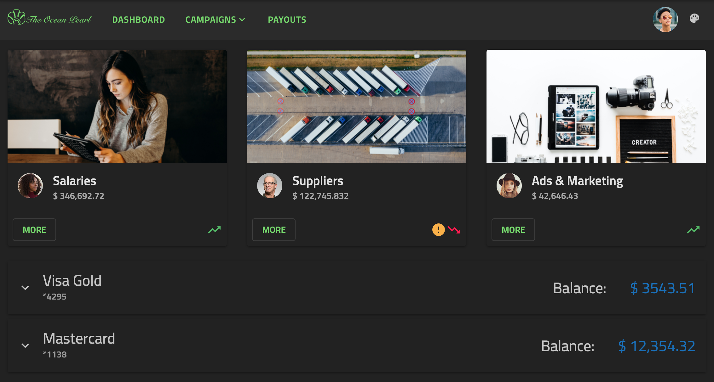

# Angular Material のテーマ
<p class="highlight">The Ignite UI for Angular theming engine makes it easy to be used together with external components imported from other theming libraries like the [`Angular Material`](https://material.angular.io/) library.</p>
<div class="divider--half"></div>

## Ignite UI と Angular Material の概要

Angular Material is a UI component library for mobile and desktop Angular web applications. It includes several prebuilt themes and a great number of components that are based on the [`Material Design specification`](https://material.io/components). 

Ignite UI for Angular は、マテリアル ベースの UI ウィジェット、コンポーネント、および Sketch UI キットの完全なセットで、Angular のディレクティブをサポートします。テーマ エンジンは使いやすく、単一のコンポーネント、複数のコンポーネント、またはスイート全体からさまざまなレベルでテーマを設定できます。 Furthermore, it can be used to style components from other theming libraries with very little effort.

The following article demonstrates how to use both Ignite UI and Angular Material components in one application and how to style them to look similar.

## Angular Material のテーマの例

<code-view style="height: 1050px" 
           data-demos-base-url="{environment:demosBaseUrl}" 
           iframe-src="{environment:demosBaseUrl}/theming/angular-sample" >
</code-view>

<div class="divider--half"></div>

## Ignite UI と Angular Material で作業を開始

### How to install Angular Material

Angular CLI を使用しており、既存の Angular プロジェクトがある場合、以下のコマンドで Angular Material を追加できます。 

```cmd 
ng add @angular/material
```

Then, you will have to choose one of the prebuilt themes and whether to set up global typography styles and browser animations for Angular Material. Once you're done with this configuration, your application is ready to use the Angular Material components.

You can find more information about using the Angular Material library at their [`official documentation`](https://material.angular.io/guide/getting-started).

### Ignite UI for Angular のインストール方法 

Ignite UI for Angular パッケージをすべての依存関係、フォント インポート、およびスタイル参照と共にインストールするには、プロジェクトで以下のコマンドを実行します。

```cmd
ng add igniteui-angular
```

次に、*app.module.ts* ファイルにそれぞれのモジュールをインポートして Ignite UI コンポーネントを使用できます。

```ts
// manually addition of the Igx Avatar component 
import { IgxAvatarModule } from 'igniteui-angular';

@NgModule({
    imports: [
        ...,
        IgxAvatarModule,
        ...
    ]
)}
```

既存のプロジェクトで Ignite UI for Angular を使用する方法については、[`「作業の開始」`](../../general/getting-started.md)トピックを参照してください。各コンポーネントをインポートして使用する方法の詳細およびガイド付きの例は、コンポーネントのドキュメントを参照してください。

## Ignite UI と Angular Material コンポーネント

デモ サンプルの実行方法を見てみましょう。Ignite UI コンポーネントと Angular Material コンポーネントを組み合わせたもので、1 つのアプリケーションにうまく収まります。この例のナビゲーションは、[`igx-buttons`]({environment:angularApiUrl}/classes/igxbuttondirective.html) および [`igx-avatar`]({environment:angularApiUrl}/classes/igxavatarcomponent.html) とともに material [`mat-toolbar`](https://material.angular.io/components/toolbar/overview) を使用して作成されます。[Campaigns] ボタンの下の[`メニュー`](https://material.angular.io/components/menu/overview)も Angular Material ライブラリから取得されます。ナビゲーションの下で、[`igx-card`]({environment:angularApiUrl}/classes/igxcardcomponent.html) コンポーネントを使用して統計を表示します。カード内に複数の項目を配置しました - [`igx-avatars`]({environment:angularApiUrl}/classes/igxavatarcomponent.html)、[`igx-icons`]({environment:angularApiUrl}/classes/igxiconcomponent.html)、および material [`buttons`](https://material.angular.io/components/button/overview)。


`[その他]` ボタンをクリックすると、[`igx-dialog`]({environment:angularApiUrl}/classes/igxdialogcomponent.html) が表示されます。


次に、クレジット カードに関する情報を表示する [`igx-expansion-panel`]({environment:angularApiUrl}/classes/igxexpansionpanelcomponent.html) を追加しました。 Inside its content, there are [`mat-sliders`](https://material.angular.io/components/slider/overview), an [`igx-divider`]({environment:angularApiUrl}/classes/igxdividerdirective.html) and a [`mat-stepper`](https://material.angular.io/components/stepper/overview) with [`mat-form-fields`](https://material.angular.io/components/form-field/overview).


最後に、右上隅に Ignite UI for Angular [`アイコン ボタン`]({environment:angularApiUrl}/classes/igxbuttondirective.html)を挿入し、アプリ全体のテーマを変更します。  



## Angular コンポーネントのスタイル設定 

Ignite UI テーマ エンジンを使用してコンポーネントのスタイル設定を開始するには、グローバル テーマのベース ファイルとなる scss ファイルを作成します。このファイルを `_variables.scss` と呼びます。 Next, we need to import the Ignite UI `index` file as well the Angular Material `theming` file:

```scss
// _variables.scss

@import '~igniteui-angular/lib/core/styles/themes/index';
@import "~@angular/material/theming";
``` 

### カラー パレット

Ignite UI for Angular's [`igx-palette`]({environment:sassApiUrl}/index.html#function-igx-palette) function produces a color palette map including three sub-palettes for the `primary`, `secondary` and `grays` shades as well as five additional colors for `info`, `success`, `warn`, `error` and `surface`. For each color variant, our theming engine automatically generates text contrast colors at build-time, that are also included in the palette. Below, you can see the predefined light material palette:

```scss
$igx-light-palette: igx-palette(
    $primary: #09f,
    $secondary: #e41c77
    $info: #1377d5,
    $success: #4eb862,
    $warn: #fbb13c,
    $error: #ff134a,
    $grays: #000,
    $surface: #fff
);
```

Unlike Ignite UI palettes, Angular Material color palette maps include shades for only one color and their corresponding contrast colors. For example, we can see the `$mat-purple` palette: 

```scss
$light-primary-text: white;
$dark-primary-text: rgba(black, 0.87);

$mat-purple: (
  50: #f3e5f5,
  100: #e1bee7,
  ...,
  A700: #aa00ff,
  contrast: (
    50: $dark-primary-text,
    100: $dark-primary-text,
    ...,
    A700: $light-primary-text,
  )
);
```

### Generating Theme Palettes

To define a theme palete, we will have to use material `mat-palette` function which generates a map of hues to colors. In our sample, we want to style Angular Material components with Ignite UI theme therefore we need to transform our `$light-material-palette` according to their structure. 

To achieve this, we are going to create a Sass function with parameters for `$color`, `$saturations` and `$palette` that returns a map of all color variants followed by the contrast colors. The saturations we are using follow the [`Material Design color system`](https://material.io/design/color/the-color-system.html).

```scss
$saturations: (50, 100, 200, 300, 400, 500, 600, 700, 800, 900, A100, A200, A400, A700);

@function material-like-palette(
    $color,
    $saturations,
    $palette,
) {
    $shade: ();
    $contrast: ();
    $result: ();
    @each $saturation in $saturations {
        $shade: map-merge($shade, (
            $saturation: igx-color($palette, $color, $saturation)
        ));
        $contrast: map-merge($contrast, (
            $saturation: igx-color($palette, $color, #{$saturation}-contrast)
        ));
        $result: map-merge($shade, (contrast: $contrast));
    }

    @return $result;
}
```

#### Light Theme Palette

We will define a light primary material theme palette using the `primary` color of the Ignite UI `$igx-light-palette` and our newly created `material-like-palette` function. The result has to be passed as a parameter to the `mat-palette` function which will generate color values for the `default`, `lighter`, `darker` and `text` shades and add them to the palette map:

```scss
$light-palette-primary: mat-palette(
    material-like-palette('primary', $saturations, $igx-light-palette)
);
```

Let's do the same for the light accent palette:

```scss
$light-palette-accent: mat-palette(
    material-like-palette('secondary', $saturations, $igx-light-palette)
);
```

Finally, we are ready to pass the two color palettes to the `mat-light-theme` function which will create an Angular Material theme with colors taken from the Ignite UI material color palette:

```scss
$custom-mat-light-theme: mat-light-theme(
    $light-palette-primary,
    $light-palette-accent
);
```

>[!NOTE]
>Ignite UI for Angular が提供するパレットと新しいパレットの作成方法については、[`Sass のパレット`](../sass/palettes.md) セクションを参照してください。

#### Dark Theme Palette

Following the previous approach, we are going to create material palettes for the dark mode. This time, we are also going to define a custom `igx-palette`: 

```scss
// Custom igx-palette
$custom-dark-palette: igx-palette(
    $primary: #011627,
    $secondary: #72da67,
    $grays: #fff,
    $surface: #222,
);

// Material dark primary palette
$dark-palette-primary: mat-palette(
    material-like-palette('primary', $saturations, $custom-dark-palette)
);
// Material dark accent palette
$dark-palette-accent: mat-palette(
    material-like-palette('secondary', $saturations, $custom-dark-palette)
);
// Material dark theme
$custom-mat-dark-theme: mat-dark-theme(
    $dark-palette-primary,
    $dark-palette-accent
);
```

### テーマ

In order to switch between `light` and `dark` mode, we are adding a custom `dark` class which will be changed on button click. スタイルシート ファイルに、各クラスにスコープされた異なるカラー パレットを含めます。

Ignite UI for Angular comes with predefined themes inspired by the [Material Design](https://material.io/design). To use them, first, you have to include our `igx-core` mixin and then our built-in theme mixin - [igx-theme]({environment:sassApiUrl}/index.html#mixin-igx-theme). We will also make use of our predefined material palettes - [$light-material-palette]({environment:sassApiUrl}/index.html#variable-light-material-palette) and [$dark-material-palette]({environment:sassApiUrl}/index.html#variable-dark-material-palette).

For the Angular Material components, we need to include their `mat-core` mixin and then the `angular-material-theme` mixin with the aforementioned custom material themes. 

```scss
// Make sure you always include the igx-core mixin first
@include igx-core();

::ng-deep {
    @include mat-core();
    @include igx-theme($igx-light-palette, $legacy-support: true);
    @include angular-material-theme($custom-mat-light-theme);

    .dark {
        @include igx-dark-theme($custom-dark-palette, $legacy-support: true);
        @include angular-material-theme($custom-mat-dark-theme);
    }
}
```

>[!WARNING]
>[`Emulated`](../sass/component-themes.md#view-encapsulation) ViewEncapsulation を`解除する`ために、上記のコードを `::ng-deep` セレクター内に配置してください。

#### Light Mode

Once we are done configuring color palettes and themes, we can make some additional color changes to our components. アプリケーションの背景色は、host 要素で明示的に設定する必要があります。サンプルでは、渡されたパレットの `surface` カラーを使用します。 The logo is an SVG image hence we can easily change its color using the CSS:

```scss
:host {
    &.light {
        // The background color of the application in light mode
        background: igx-color($igx-light-palette, 'surface');

        // The application logo fill color
        #Path1 {
            fill: igx-color($igx-light-palette, 'secondary');
        }

        // The application logo stroke color
        #Path2 {
            stroke: igx-color($igx-light-palette, 'secondary');
            stroke-width: "0.8";
        }
    }
}
```

#### Dark Mode

For our dark variant, we are going to apply the same CSS styles but using the `$custom-dark-palette`. Also, we will change some of the colors of the `mat-stepper` and `mat-slider` components so that they can fit better in our app: 

```scss
:host {
    &.dark {
        // The background color of the application in dark mode
        background: igx-color($custom-dark-palette, 'surface');

        // The application logo fill color
        #Path1 {
            fill: igx-color($custom-dark-palette, 'secondary');
        }

        // The application logo stroke color
        #Path2 {
            stroke: igx-color($custom-dark-palette, 'secondary');
            stroke-width: "0.8";
        }

        ::ng-deep {
            // The background of the selected step icon inside the material stepper
            .mat-step-header .mat-step-icon-selected {
                background-color: igx-color($custom-dark-palette, 'secondary');
            }

            // The background of the material slider thumb and track
            .mat-accent .mat-slider-thumb,
            .mat-accent .mat-slider-track-fill {
                background-color: igx-color($custom-dark-palette, 'primary', 100);
            }

            // The background of the material stepper
            .mat-stepper-horizontal {
                background: igx-color($custom-dark-palette, 'surface');
            }
        }
    }
}
```

### クラスの生成

Angular Material `toolbar` は背景色に CSS クラスを使用します。サンプルでは、選択したテーマに応じてカラーを変更するため、`igx-color-classes` ミックスインを使用します。指定したプロパティおよびカラー パレットのすべてのカラーの CSS クラス名を生成し、オプションでプレフィックスとサフィックスをクラス名に添付します。デモでは、ミックスインを 2 回使用します。1 回目はそれぞれの `$igx-light-palette` を最初の値として使用する light モード、2 回目は `$custom-dark-palette` を使用する dark モードです。

```scss
:host {
    &.light {
        @include igx-color-classes(
            $palette: $igx-light-palette,
            $prop: 'background',
            $prefix: 'bg'
        );
    }

    &.dark {
        @include igx-color-classes(
            $palette: $custom-dark-palette,
            $prop: "background",
            $prefix: "bg"
        );
    }
}
```

次に、「bg-パレットのカラー-カラー バリアント」パターンに従って CSS クラスを navbar コンポーネントに追加します。サンプル アプリでは `bg-grays-100` を使用しています。

### Angular コンポーネントのタイポグラフィ

Ignite UI for Angular は、テーマごとに 4 つのデフォルト タイプ スケールを公開します。これは、[`igx-typography`]({environment:sassApiUrl}/index.html#mixin-igx-typography) ミックスイン内でアプリケーションのグローバル タイポグラフィ スタイルを定義するために使用できます。この例では、material で定義済みの `typeface` および `type-scale` を適用しますが、必要に応じてカスタムの書体を作成できます。 

```scss
:host {
    @include igx-typography($font-family: $material-typeface, $type-scale: $material-type-scale);
}
```

To customize the Angular Material typography, we need to use their `mat-typography-config` function. We will override their `$font-family` with the Ignite UI `$material-typeface` and their `$button` styles as follows: 

```scss
$custom-typography: mat-typography-config(
    $font-family: $material-typeface,
    $button: mat-typography-level(14px, $font-weight: 600)
);
```

Then, the typography config has to be passed either to the `mat-core` mixin:

```scss
::ng-deep {
    @include mat-core($custom-typography);
}
```

or to the `angular-material-typography` mixin:

```scss
::ng-deep {
    @include angular-material-typography($custom-typography);
}
```

Check Angular Material [`Typography documentation`](https://material.angular.io/guide/typography) for more detailed information.  

## API リファレンス
<div class="divider--half"></div>

* [Light Material パレット]({environment:sassApiUrl}/index.html#variable-light-material-palette)
* [Dark Material パレット]({environment:sassApiUrl}/index.html#variable-dark-material-palette)
* [Light Material テーマ]({environment:sassApiUrl}/index.html#mixin-igx-light-theme)
* [Dark Material テーマ]({environment:sassApiUrl}/index.html#mixin-igx-dark-theme)
* [Palette Function]({environment:sassApiUrl}/index.html#function-igx-palette)
* [Typography Mixin]({environment:sassApiUrl}/index.html#mixin-igx-typography)

関連トピック: 

* [パレット](../sass/palettes.md)
* [コンポーネント テーマ](../sass/component-themes.md)
* [タイポグラフィ](../sass/typography.md)
* [Avatar コンポーネント](../../avatar.md)
* [Button コンポーネント](../../button.md)
* [Dialog コンポーネント](../../dialog.md)
* [Icon コンポーネント](../../icon.md)
* [Expansion Panel コンポーネント](../../expansion-panel.md)

## その他のリソース
<div class="divider--half"></div>

コミュニティに参加して新しいアイデアをご提案ください。
* [Ignite UI for Angular **フォーラム** (英語)](https://www.infragistics.com/community/forums/f/ignite-ui-for-angular)
* [Ignite UI for Angular **GitHub** (英語)](https://github.com/IgniteUI/igniteui-angular)
