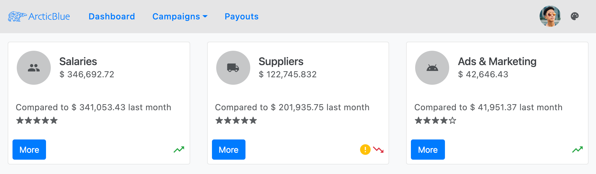
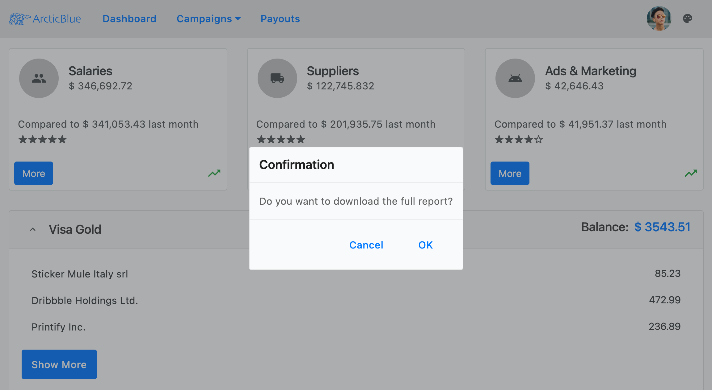
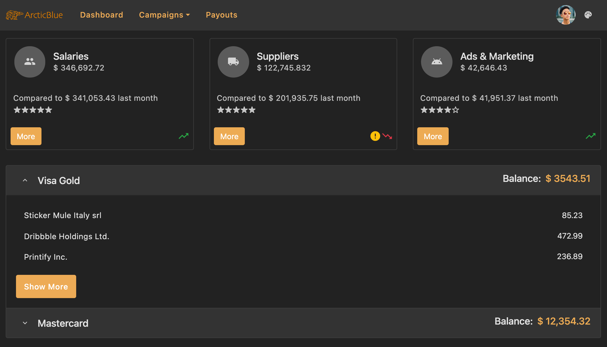

# Bootstrap のテーマ
<p class="highlight">Ignite UI for Angular テーマ エンジンは、Bootstrap のマークアップと CSS に基づいた人気のある [`NG Bootstrap`](https://ng-bootstrap.github.io/) などの他のコンポーネント ライブラリと組み合わせて使用できます。</p>
<div class="divider--half"></div>

## 概要

Ignite UI for Angular は、マテリアル ベースの UI ウィジェット、コンポーネント、および Sketch UI キットの完全なセットで、Angular のディレクティブをサポートします。テーマ エンジンは使いやすく、単一のコンポーネント、複数のコンポーネント、またはスイート全体からさまざまなレベルでテーマを設定できます。そのため、一部のユーザーが Ignite UI コンポーネントだけでなく他のライブラリでも利用できます。このトピックでは、Ignite UI と Ng Bootstrap コンポーネントの使用方法について説明します。

## デモ

<code-view style="height: 1000px" 
           data-demos-base-url="{environment:demosBaseUrl}" 
           iframe-src="{environment:demosBaseUrl}/theming/bootstrap-sample" >
</code-view>

<div class="divider--half"></div>

## 基本的な使用方法

### NG Bootstrap の追加

Angular CLI を使用しており、既存の Angular プロジェクトがある場合、以下のコマンドで NG Bootstrap をインストールできます。 

```cmd 
ng add @ng-bootstrap/ng-bootstrap
```

インストール後、NG Bootstrap メイン モジュールを *app.module.ts* ファイルにインポートする必要があります。 

```ts
import {NgbModule} from '@ng-bootstrap/ng-bootstrap';

@NgModule({
    imports: [
        ...,
        NgbModule,
        ...
    ]
)}
```

これで、アプリケーションで NG Bootstrap コンポーネントを使用する準備が整いました。Bootstrap ライブラリの使用方法の詳細については、[`公式ドキュメント`](https://ng-bootstrap.github.io/#/getting-started)を参照してください。

### Ignite UI for Angular の追加 

Ignite UI for Angular パッケージをすべての依存関係、フォント インポート、およびスタイル参照と共にインストールするには、プロジェクトで以下のコマンドを実行します。

```cmd
ng add igniteui-angular
```

次に、*app.module.ts* ファイルにそれぞれのモジュールをインポートして Ignite UI コンポーネントを使用できます。

```ts
// manually addition of the Igx Avatar component 
import { IgxAvatarModule } from 'igniteui-angular';

@NgModule({
    imports: [
        ...,
        IgxAvatarModule,
        ...
    ]
)}
```

既存のプロジェクトで Ignite UI for Angular を使用する方法については、[`「作業の開始」`](../../general/getting-started.md)トピックを参照してください。各コンポーネントをインポートして使用する方法の詳細およびガイド付きの例は、コンポーネントのドキュメントを参照してください。

## コンポーネント

デモ サンプルの実行方法を見てみましょう。Ignite UI コンポーネントと NG Bootstrap コンポーネントを組み合わせたもので、1 つのアプリケーションにうまく収まります。この例のナビゲーションは、[`igx-buttons`]({environment:angularApiUrl}/classes/igxbuttondirective.html) および [`igx-avatar`]({environment:angularApiUrl}/classes/igxavatarcomponent.html) とともに bootstrap [`navbar`](https://getbootstrap.com/docs/4.0/components/navbar/) を使用して作成されます。[Campaigns] ボタンの下の [`Dropdown`](https://ng-bootstrap.github.io/#/components/dropdown/examples) も bootstrap ライブラリから取得されます。ナビゲーションの下で、[`igx-card`]({environment:angularApiUrl}/classes/igxcardcomponent.html) コンポーネントを使用して統計を表示します。カード内に複数の項目を配置しました - [`igx-avatars`]({environment:angularApiUrl}/classes/igxavatarcomponent.html)、[`igx-icons`]({environment:angularApiUrl}/classes/igxiconcomponent.html)、[`buttons`](https://getbootstrap.com/docs/4.0/components/buttons/) および [`ngb-ratings`](https://ng-bootstrap.github.io/#/components/rating/examples)。 



`[More]` ボタンをクリックすると、[`igx-dialog`]({environment:angularApiUrl}/classes/igxdialogcomponent.html) が表示されます。



次に、クレジット カードに関する情報を表示する [`ngb-accordion`](https://ng-bootstrap.github.io/#/components/accordion/examples) を追加しました。コンテンツの中には、[`igx-list`]({environment:angularApiUrl}/classes/igxlistcomponent.html) と `igx-button` があります。


最後に、右上隅に Ignite UI for Angular `アイコン ボタン`を挿入し、アプリ全体のテーマを変更します。  



## スタイル設定

Ignite UI テーマ エンジンを使用してコンポーネントのスタイル設定を開始するには、グローバル テーマのベース ファイルとなる scss ファイルを作成します。このファイルを `_variables.scss` と呼びます。次に、すべてのテーマ関数とコンポーネント ミックスインが存在する `index` ファイルをインポートする必要があります。 

```scss
// _variables.scss

@import '~igniteui-angular/lib/core/styles/themes/index';
``` 

### パレット

Bootstrap ライブラリは、[`$theme-colors`](https://getbootstrap.com/docs/4.0/getting-started/theming/#theme-colors) と呼ばれる Sass マップを使用して、8 カラーで構成されるパレットを提供します。

```scss
$theme-colors: (
    "primary":    $primary,
    "secondary":  $secondary,
    "success":    $success,
    "info":       $info,
    "warning":    $warning,
    "danger":     $danger,
    "light":      $light,
    "dark":       $dark
);
```

Ignite UI for Angular の [`igx-palette`]({environment:sassApiUrl}/index.html#function-igx-palette) 関数は、`primary`、`secondary`、`grays`、`info`、`success`、`warn`、`error` の各カラーとそのカラー バリアントを含むカラー パレット マップを生成します。定義済みの bootstrap パレットは 7 カラーで構成されます。

```scss
$bootstrap-palette: igx-palette(
    $primary: #007bff,
    $secondary: #6c757d,
    $info: #17a2b8,
    $success: #28a745,
    $warn: #ffc107,
    $error: #dc3545,
    $surface: #f8f9fa
);
```

ご覧の通り、Bootstrap パレットのほとんどのカラーは、Ignite UI for Angular の Bootstrap パレットで定義されたカラーと重複しています。したがって、Bootstrap テーマのカラーを light (明るい) または dark (暗い) bootstrap palette カラーにマップできます。

最初に、[`$light-bootstrap-palette`]({environment:sassApiUrl}/index.html#variable-light-bootstrap-palette) から値を抽出する Sass 変数を定義します。

```scss
// Colors from the Ignite UI light bootstrap color palette
$light-primary: igx-color($light-bootstrap-palette, "primary");
$light-secondary: igx-color($light-bootstrap-palette, "secondary");
$light-success: igx-color($light-bootstrap-palette, "success");
$light-info: igx-color($light-bootstrap-palette, "info");
$light-warning: igx-color($light-bootstrap-palette, "warn");
$light-danger: igx-color($light-bootstrap-palette, "error");
```

その後、サンプルの dark モードに使用する新しいカラー パレットを作成します。

```scss
// Defining custom color palette
$custom-dark-palette: igx-palette(
    $primary: #ecaa53,
    $secondary: #011627,
    $grays: #fff,
    $surface: #222
);

// Creating Sass variables for primary and secondary colors
$dark-primary: igx-color($custom-dark-palette, "primary");
$dark-secondary: igx-color($custom-dark-palette, "secondary");
```

>[!NOTE]
>Ignite UI for Angular が提供するパレットと新しいパレットの作成方法については、[`Sass のパレット`](../sass/palettes.md) セクションを参照してください。

### テーマ

`Light` モードと `Dark` モードを切り替えるために、ボタン クリックで変更されるカスタム要素を `host` 要素に追加します。スタイルシート ファイルに、各クラスにスコープされた異なるカラー パレットを含めます。

#### Light モード

Ignite UI for Angular には、[Bootstrap 4](https://getbootstrap.com/) ライブラリに基づいて構築された定義済みのテーマがあります。これらを使用するには、まず `igx-core` ミックスインを含めて、次に定義済みテーマ ミックスイン ([igx-bootstrap-light-theme]({environment:sassApiUrl}/index.html#mixin-igx-bootstrap-light-theme)) を含める必要があります。定義済みの bootstrap パレット ([$light-bootstrap-palette]({environment:sassApiUrl}/index.html#variable-light-bootstrap-palette)) も使用します。

アプリケーションの背景色は、host 要素で明示的に設定する必要があります。サンプルでは、渡されたパレットの `surface` カラーを使用します。

この時点で、Bootstrap の `$theme-colors` マップを前に作成した Sass 変数で変更する必要があります。

```scss
// Make sure you always include the igx-core mixin first
@include igx-core();

:host {
    &.light {
        // The background color of the application in light mode
        background: igx-color($light-bootstrap-palette, 'surface');

        ::ng-deep {
            // Applying the igx predefined light bootstrap palette and theme
            @include igx-bootstrap-light-theme($light-bootstrap-palette);

            $theme-colors: (
                "primary": $light-primary,
                "secondary": $light-secondary,
                "success": $light-success,
                "info": $light-info,
                "warning": $light-warning,
                "danger": $light-danger
            );
        }
    }
}
```

Ignite UI パレットに対応する値がない `$theme-colors` マップの `light` カラーと `dark` カラーは、当社の任意により、他の値に置き換えることができます。次に例を示します。 

```scss
$custom-light: igx-color($light-bootstrap-palette, "grays", 100);
$custom-dark: igx-color($light-bootstrap-palette, "grays", 800);

:host {
    &.light {
        ::ng-deep {
            $theme-colors: (
                "light": $custom-light,
                "dark": $custom-dark,
            );
        }
    }
}
```

#### Dark モード

Dark バリアントには、新しく作成した `$custom-dark-palette` を使用します。`dark` クラス スタイルに追加し、`$theme-colors` マップを新しい値で変更する必要があります。 

Ignite UI for Angular のすべてのコンポーネントは渡されたパレット カラーを使用するため、追加の調整なしで dark モードにうまくフィットします。ただし、ng-bootstrap コンポーネントのスタイル設定を変更する必要があります。

```scss
:host {
    &.dark {
        // The background color of the application in dark mode
        background: igx-color($custom-dark-palette, 'surface');

        ::ng-deep {
            // Applying our custom dark palette 
            @include igx-bootstrap-dark-theme($custom-dark-palette);

            // Overriding bootstrap button colors with colors from the custom dark palette
            .igx-card-actions .btn-primary {
                background-color: $dark-primary;
                border-color: $dark-primary;

                &:hover {
                    background-color: igx-color($custom-dark-palette, 'primary', 600);
                }
            }

            // Overriding ngb-accordion colors with colors from the custom dark palette
            .accordion {
                .card-header {
                    background-color: igx-color($custom-dark-palette, 'grays', 200);
                    color: igx-color($custom-dark-palette, 'grays', 900);
                }

                .card {
                    background-color: igx-color($custom-dark-palette, 'surface');
                    border-color: igx-color($custom-dark-palette, 'grays', 300);
                }
            }

            // Overriding bootstrap dropdown colors with colors from the custom dark palette
            .dropdown .dropdown-menu {
                background-color: igx-color($custom-dark-palette, 'surface');
                border-color: igx-color($custom-dark-palette, 'grays', 300);

                .dropdown-item {
                    color: igx-color($custom-dark-palette, 'grays', 800);

                    &:hover {
                        background-color: igx-color($custom-dark-palette, 'grays', 200);
                    }
                }
            }
            
            // Modifying the bootstrap color map
            $theme-colors: (
                "primary": $dark-primary,
                "secondary": $dark-secondary
            );
        }
    }
}
```

最後に、Bootstrap ライブラリをインポートする必要があります。**常に最後にインポートしてください**。

```scss
:host {
    ::ng-deep {
        // Importing Bootstrap .scss file
        // Make sure you always import it last
        @import "~bootstrap/scss/bootstrap";
    }
}
```

`$theme-colors` マップの変更終了後、bootstrap コンポーネントはすでに igx `$light-bootstrap-palette` のカラーを light モードに使用し、`$custom-dark-palette` を dark モードに使用します。

>[!WARNING]
>[`Emulated`](../sass/component-themes.md#表示のカプセル化) ViewEncapsulation を`解除する`ために、上記のコードを `::ng-deep` セレクター内に配置してください。


### クラスの生成

Bootstrap `navbar` は背景色に CSS クラスを使用します。サンプルでは、選択したテーマに応じてカラーを変更するため、`igx-color-classes` ミックスインを使用します。指定したプロパティおよびカラー パレットのすべてのカラーの CSS クラス名を生成し、オプションでプレフィックスとサフィックスをクラス名に添付します。デモでは、ミックスインを 2 回使用します。1 回目はそれぞれの `$light-bootstrap-palette` を最初の値として使用する light モード、2 回目は `$custom-dark-palette` を使用する dark モードです。

```scss
:host {
    &.light {
        @include igx-color-classes(
            $palette: $light-bootstrap-palette,
            $prop: 'background',
            $prefix: 'bg'
        );
    }

    &.dark {
        @include igx-color-classes(
            $palette: $custom-dark-palette,
            $prop: 'background',
            $prefix: 'bg'
        );
    }
}
```

次に、「bg-パレットのカラー-カラー バリアント」パターンに従って CSS クラスを navbar コンポーネントに追加します。サンプル アプリでは `bg-grays-200` を使用しています。

### タイポグラフィ

Ignite UI for Angular は、テーマごとに 4 つのデフォルト タイプ スケールを公開します。これは、[`igx-typography`]({environment:sassApiUrl}/index.html#mixin-igx-typography) ミックスイン内でアプリケーションのグローバル タイポグラフィ スタイルを定義するために使用できます。この例では、bootstrap で定義済みの `typeface` および `type-scale` を適用しますが、必要に応じてカスタムの書体を作成できます。 

```scss
:host {
    @include igx-typography($font-family: $bootstrap-typeface, $type-scale: $bootstrap-type-scale);
}
```

## API リファレンス
<div class="divider--half"></div>

* [Light Bootstrap パレット]({environment:sassApiUrl}/index.html#variable-light-bootstrap-palette)
* [Dark Bootstrap パレット]({environment:sassApiUrl}/index.html#variable-dark-bootstrap-palette)
* [Light Bootstrap テーマ]({environment:sassApiUrl}/index.html#mixin-igx-bootstrap-light-theme)
* [Dark Bootstrap テーマ]({environment:sassApiUrl}/index.html#mixin-igx-bootstrap-dark-theme)
* [Palette Function]({environment:sassApiUrl}/index.html#function-igx-palette)
* [Typography Mixin]({environment:sassApiUrl}/index.html#mixin-igx-typography)

関連トピック: 

* [パレット](../sass/palettes.md)
* [コンポーネント テーマ](../sass/component-themes.md)
* [タイポグラフィ](../sass/typography.md)
* [Avatar コンポーネント](../../avatar.md)
* [Button コンポーネント](../../button.md)
* [Dialog コンポーネント](../../dialog.md)
* [Icon コンポーネント](../../icon.md)
* [List コンポーネント](../../list.md)

## その他のリソース
<div class="divider--half"></div>

コミュニティに参加して新しいアイデアをご提案ください。
* [Ignite UI for Angular **フォーラム** (英語)](https://www.infragistics.com/community/forums/f/ignite-ui-for-angular)
* [Ignite UI for Angular **GitHub** (英語)](https://github.com/IgniteUI/igniteui-angular)
