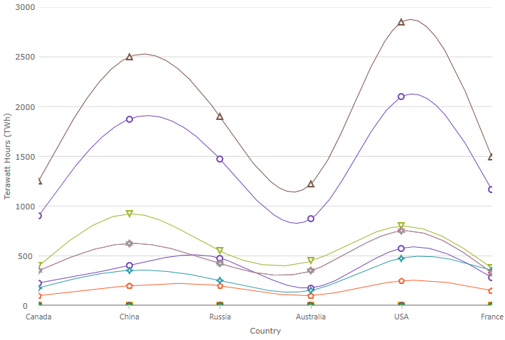

## 카테고리 차트

카테고리 차트 컴포넌트는 카테고리 데이터를 간단히 시각화할 수 있게 해주는 Ignite UI for Angular 차트 컴포넌트입니다. 이 컨트롤은 복잡한 데이터 비주얼라이제이션 도메인을 API로 단순화하여 관리할 수 있습니다.

### 데모

<div class="sample-container loading" style="height: 500px">
    <iframe id="category-chart-overview-iframe" src='{environment:dvDemosBaseUrl}/charts/category-chart-overview' width="100%" height="100%" seamless frameBorder="0" onload="onXPlatSampleIframeContentLoaded(this);"></iframe>
</div>

<div>
    <button data-localize="stackblitz" disabled class="stackblitz-btn"   data-iframe-id="category-chart-overview-iframe" data-demos-base-url="{environment:dvDemosBaseUrl}">STACKBLITZ 에서 보기
    </button>
</div>

<div class="divider--half"></div>

 사용자가 데이터 수집 및 수집 그룹에 바인딩하여 데이터를 지정하는 속성을 설정하면 차트 컨트롤이 나머지 작업을 실행합니다. 컴포넌트는 데이터를 분석한 후 데이터를 표시하기 위한 최적의 차트 유형을 자동으로 선택합니다.

스마트 데이터 어댑터를 사용하여 데이터를 분석하여 적절한 비주얼라이제이션을 렌더링합니다. 예를 들면, [`ChartType`]({environment:dvApiBaseUrl}/products/ignite-ui-angular/api/docs/typescript/latest/enums/charttype.html) 속성이 [`Auto`]({environment:dvApiBaseUrl}/products/ignite-ui-angular/api/docs/typescript/latest/enums/categorycharttype.html#auto)로 설정된 경우, 컨트롤은 작은 데이터 세트를 위해 세로막대형 차트를 사용하거나 더 큰 데이터 세트를 위해 선형 차트를 사용합니다.

그러나, [`ChartType`]({environment:dvApiBaseUrl}/products/ignite-ui-angular/api/docs/typescript/latest/enums/charttype.html)를 명시적으로 다음과 같이 설정하여 차트 유형을 지정할 수도 있습니다:

-   [`line`]({environment:dvApiBaseUrl}/products/ignite-ui-angular/api/docs/typescript/latest/enums/charttype.html#line)
-   [`area`]({environment:dvApiBaseUrl}/products/ignite-ui-angular/api/docs/typescript/latest/enums/charttype.html#area)
-   [`Column`]({environment:dvApiBaseUrl}/products/ignite-ui-angular/api/docs/typescript/latest/enums/categorycharttype.html#column)
-   [`Point`]({environment:dvApiBaseUrl}/products/ignite-ui-angular/api/docs/typescript/latest/enums/categorycharttype.html#point)
-   [`Spline`]({environment:dvApiBaseUrl}/products/ignite-ui-angular/api/docs/typescript/latest/enums/categorycharttype.html#spline)
-   [`SplineArea`]({environment:dvApiBaseUrl}/products/ignite-ui-angular/api/docs/typescript/latest/enums/categorycharttype.html#splinearea)
-   [`StepArea`]({environment:dvApiBaseUrl}/products/ignite-ui-angular/api/docs/typescript/latest/enums/categorycharttype.html#steparea)
-   [`StepLine`]({environment:dvApiBaseUrl}/products/ignite-ui-angular/api/docs/typescript/latest/enums/categorycharttype.html#stepline)
-   [`waterfall`]({environment:dvApiBaseUrl}/products/ignite-ui-angular/api/docs/typescript/latest/enums/charttype.html#waterfall)

카테고리 차트 컴포넌트의 직관적인 동작의 다른 예로서 명시적으로 레이블을 설정할 필요가 없다는 것입니다. 카테고리 차트는 제공한 데이터 내에서 최초의 적절한 문자열 속성을 사용하고 이를 레이블에 사용합니다.

### 의존성

차트 패키지를 설치할 때 코어 패키지도 설치해야 합니다.

-   **npm install --save igniteui-angular-core**
-   **npm install --save igniteui-angular-charts**

### 필요한 모듈

`XamCategoryChart`에는 다음 모듈이 필요합니다:

```ts
// app.module.ts
import { IgxCategoryChartModule } from 'igniteui-angular-charts';

@NgModule({
    imports: [
        // ...
        IgxCategoryChartModule,
        // ...
    ]
})
export class AppModule {}
```

사용 가능한 시리즈의 서브세트 및 다른 옵션의 기능을 제외하는 카테고리 차트의 최소 구성을 로드할 수 있으며, 이로써 [`IgxCategoryChartCoreModule`]({environment:dvApiBaseUrl}/products/ignite-ui-angular/api/docs/typescript/latest/classes/igxcategorychartcoremodule.html) 및 [`IgxLineSeriesDynamicModule`]({environment:dvApiBaseUrl}/products/ignite-ui-angular/api/docs/typescript/latest/classes/igxlineseriesdynamicmodule.html)등의 사용되는 시리즈의 동적 모듈만 로딩할 수 있습니다. [`ChartType`]({environment:dvApiBaseUrl}/products/ignite-ui-angular/api/docs/typescript/latest/enums/charttype.html)이 [`Auto`]({environment:dvApiBaseUrl}/products/ignite-ui-angular/api/docs/typescript/latest/enums/categorycharttype.html#auto)이면 로딩된 시리즈 유형이 선택됩니다.

<div class="divider--half"></div>

### 사용 방법

카테고리 차트 모듈을 불러오기 한 후 다음 단계는 데이터에 바인딩합니다.

카테고리 차트 컴포넌트를 작성하려면 먼저 데이터를 바인딩해야 합니다. 다음의 코드 조작은 간단한 데이터 소스를 작성하는 방법을 보여줍니다.

```ts
var data = [
 { "CountryName": "China", "Pop1995": 1216, "Pop2005": 1297, "Pop2015": 1361, "Pop2025": 1394 },
 { "CountryName": "India", "Pop1995": 920, "Pop2005": 1090, "Pop2015": 1251, "Pop2025": 1396 },
 { "CountryName": "United States", "Pop1995": 266, "Pop2005": 295, "Pop2015": 322, "Pop2025": 351 },
 { "CountryName": "Indonesia", "Pop1995": 197, "Pop2005": 229, "Pop2015": 256, "Pop2025": 277 },
 { "CountryName": "Brazil", "Pop1995": 161, "Pop2005": 186, "Pop2015": 204, "Pop2025": 218 }
];
```

다음의 코드는 카테고리 차트를 상기의 데이터에 바인딩하는 방법을 보여줍니다.

```html
 <igx-category-chart [dataSource]="data"
                     width="700px"
                     height="500px">
 </igx-category-chart>
```

<div class="divider--half"></div>

### 차트 유형

카테고리 차트의 기본 동작을 무효화하고 표시할 차트 유형을 설정할 수 있습니다. 이는 [`ChartType`]({environment:dvApiBaseUrl}/products/ignite-ui-angular/api/docs/typescript/latest/enums/charttype.html) 속성을 설정하여 실행합니다.
카테고리 차트가 지원하는 모든 유형은 다음과 같습니다.

> [!NOTE]
> 특별히 속성의 [`Auto`]({environment:dvApiBaseUrl}/products/ignite-ui-angular/api/docs/typescript/latest/enums/categorycharttype.html#auto) 설정이 있습니다. [`Auto`]({environment:dvApiBaseUrl}/products/ignite-ui-angular/api/docs/typescript/latest/enums/categorycharttype.html#auto)를 사용한 경우, 차트는 데이터를 분석하고 가장 적합한 차트 유형을 할당합니다.

### 지원되는 차트 유형

| 속성                                                                                                                                       | 설명                                                                          | 예                                            |
| ---------------------------------------------------------------------------------------------------------------------------------------- | --------------------------------------------------------------------------- | -------------------------------------------- |
| [`line`]({environment:dvApiBaseUrl}/products/ignite-ui-angular/api/docs/typescript/latest/enums/charttype.html#line)                     | 각 데이터 점에 마커로 카테고리 선형 시리즈를 지정합니다                                             |        |
| [`area`]({environment:dvApiBaseUrl}/products/ignite-ui-angular/api/docs/typescript/latest/enums/charttype.html#area)                     | 카테고리 영역 시리즈를 지정합니다                                                          |        |
| [`Column`]({environment:dvApiBaseUrl}/products/ignite-ui-angular/api/docs/typescript/latest/enums/categorycharttype.html#column)         | Specifies category column chart with vertical rectangles at each data point |      |
| [`Point`]({environment:dvApiBaseUrl}/products/ignite-ui-angular/api/docs/typescript/latest/enums/categorycharttype.html#point)           | 각 데이터 점에 수직 직사각형으로 카테고리 세로막대형 차트를 지정합니다                                     |       |
| [`StepLine`]({environment:dvApiBaseUrl}/products/ignite-ui-angular/api/docs/typescript/latest/enums/categorycharttype.html#stepline)     | 카테고리 스텝 선형 차트를 지정합니다                                                        |    |
| [`StepArea`]({environment:dvApiBaseUrl}/products/ignite-ui-angular/api/docs/typescript/latest/enums/categorycharttype.html#steparea)     | 카테고리 스텝 영역 차트를 지정합니다                                                        |    |
| [`Spline`]({environment:dvApiBaseUrl}/products/ignite-ui-angular/api/docs/typescript/latest/enums/categorycharttype.html#spline)         | 각 데이터 점에 마커로 카테고리 스플라인 선형 시리즈를 지정합니다                                        |      |
| [`SplineArea`]({environment:dvApiBaseUrl}/products/ignite-ui-angular/api/docs/typescript/latest/enums/categorycharttype.html#splinearea) | 카테고리 스플라인 영역 시리즈를 지정합니다                                                     |  |
| [`waterfall`]({environment:dvApiBaseUrl}/products/ignite-ui-angular/api/docs/typescript/latest/enums/charttype.html#waterfall)           | 카테고리 워터폴 차트를 지정합니다                                                          |   |
| [`Auto`]({environment:dvApiBaseUrl}/products/ignite-ui-angular/api/docs/typescript/latest/enums/categorycharttype.html#auto)             | 데이터 어댑터의 제안을 기반으로 차트 유형의 자동 선택을 지정합니다                                       |                                              |
