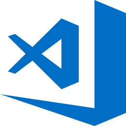

## Getting started with Ignite UI for Angular

[`Ignite UI for Angular`](https://github.com/IgniteUI/igniteui-angular) is a complete set of Material-based UI Widgets, Components & Sketch UI kits and supporting directives for Angular by Infragistics. Ignite UI for Angular is designed to enable developers to build the most modern, high-performance HTML5 & JavaScript apps for modern desktop browsers, mobile experiences and progressive web apps (PWA’s) targeting Google's Angular framework.

Before you can run Ignite UI for Angular, there are 2 steps to get everything on your machine set up to run any Angular app, including Ignite UI for Angular, and to build Ignite UI for Angular apps.

To get started, you must install both NodeJS and Visual Studio Code on your machine. Modern web development with Angular requires NodeJS, it’s sort of like an ASP.NET app running in the browser and requires ASP.NET runtime deployed on the server. For development, there is nothing better than Visual Studio Code to build Angular apps. Getting started is easy, just download and install both Node.js and Visual Studio Code.

<div>
    <div style="display:inline-block;width:45%;text-align:center;">
      
      <a target="_blank" href="https://nodejs.org/en/download/"
         style="color:white;background-color:#09f;text-decoration:none;font-weight:700;font-size:16px;padding: 5px 15px 5px 15px;">
        DOWNLOAD NODE
      </a>
    </div>
    <div style="display:inline-block;width:45%;text-align:center;">
      
      <a target="_blank" href="https://code.visualstudio.com/download"
         style="color:white;background-color:#09f;text-decoration:none;font-weight:700;font-size:16px;padding: 5px 15px 5px 15px;">
        DOWNLOAD VS CODE
      </a>
    </div>
</div>
<div class="divider--half"></div>

## Installing Ignite UI for Angular

Now that we have everything we need, we can start creating/updating our application!

### Create an application by using the Ignite UI CLI

Let's start by opening a preferred terminal and installing the [`Ignite UI CLI`](https://github.com/IgniteUI/igniteui-cli):

```cmd
npm install -g igniteui-cli 
```

#### Using guided experience

The shortest and easiest way to bootstrap an application is to use the Ignite UI CLI [`guided experience`](https://github.com/IgniteUI/igniteui-cli/wiki/step-by-step), which builds a configured app that the developer can get up and running with the ease of a single command. 

```cmd
ig
```

<div style="display:inline-block;">
    <a style="background: url(../../images/general/buildCLIapp.gif); display:flex; justify-content:center; min-width:540px; min-height:315px;"
       href="https://youtu.be/QK_NsdtdA70" target="_blank">
        
    </a>
    <p style="text-align:center;">Building Your First Ignite UI CLI App</p>
</div>

#### Using commands

We can always use the Ignite UI CLI [`commands`](https://github.com/IgniteUI/igniteui-cli/wiki#available-commands) for generating an Ignite UI project, adding a new component or building and serving the project by ourselves. For that purpose, we can use the following commands:

```cmd
ig new <project name> --framework=angular --type=igx-ts 
cd <project name>
ig add <component/template> <component_name>
ig start 
```

- The full list of available **component/template** values is [`here`](https://github.com/IgniteUI/igniteui-cli/wiki/add#ignite-ui-for-angular-templates).
- Both the **project name** and the **component_name** are custom values, provided by the developer.

Here is an example of creating a new Ignite UI for Angular project with an igxGrid control:

```cmd
ig new newAngularProject --framework=angular --type=igx-ts
cd newAngularProject
ig add grid newGrid
ig start
```

After executing those simple commands, your new project will be built and served. It will automatically open in your default browser and you will be able to inspect your grid control and to make changes to the project.

### Add Ignite UI for Angular to an existing application

What if you want to use Ignite UI for Angular in an existing Angular CLI project (one that you have from before or you have just created by using the Angular CLI)? We have you covered! All you have to do is execute the command below:

```cmd
ng add igniteui-angular
```

This will automatically install the [`igniteui-angular`](https://github.com/IgniteUI/igniteui-angular) package, along with all of its dependencies, font imports and styles references to the existing project. After the installation has finished, we can now execute Ignite UI CLI [`commands`](https://github.com/IgniteUI/igniteui-cli/wiki#available-commands) in our updated application in order to further enrich it by using Ignite UI for Angular components!

## Using Ignite UI for Angular

We are now ready to start using Ignite UI for Angular components!

### Add components automatically

#### Import modules and use components
In order to easily add new components to our application, we can take advantage of the Ignite UI CLI!

```cmd
ig add
```

> [!NOTE]
> Please note that the [`ig add`](https://github.com/IgniteUI/igniteui-cli/wiki/add) command can be used if the application was created by using the Ignite UI CLI or
> if it was created by using the Angular CLI with Ignite UI for Angular added to it by using the **ng add igniteui-angular** command.

After going through the options of the menu and choosing which component we want to add to our application, we will notice that we have a brand new component in our project, which we can use anywhere on our page!

#### Run application

Now let’s run our application with the [`ig start`](https://github.com/IgniteUI/igniteui-cli/wiki/start) command to see our awesome page!

```cmd
ig start
```

### Add components manually

#### Import modules

First we have to import the respective modules of the components we want to use in the **app.module.ts** file. We will go ahead and do this for the [**igxGrid**](../grid/grid.md)! Please note that some components have animations depending on BrowserAnimationsModule, so let’s import that one as well:

```typescript
// app.module.ts

import { BrowserModule } from '@angular/platform-browser';
import { BrowserAnimationsModule } from '@angular/platform-browser/animations';
import { NgModule } from '@angular/core';
import { AppComponent } from './app.component';

// Here we import the IgxGridModule, so we can use the igxGrid!
import { IgxGridModule } from 'igniteui-angular';

@NgModule({
  declarations: [
    AppComponent
  ],
  imports: [
    BrowserModule,
    BrowserAnimationsModule,
    IgxGridModule
  ],
  providers: [],
  bootstrap: [AppComponent]
})
export class AppModule { }
```

#### Use components

We are now ready to use the igxGrid in our markup! Let's go ahead and define it in our **app.component.html** file:

```html
<!-- app.component.html -->

<div style="text-align:center; margin-bottom: 20px;">
  <h1>
    Welcome to {{title}}!
  </h1>
</div>

<div style="text-align: center;">
  <igx-grid [data]="localData" width="600px" height="400px" style="margin: auto" [allowFiltering]="true">
    <igx-column field="Name" dataType="string"></igx-column>
    <igx-column field="Age" dataType="number"></igx-column>
  </igx-grid>
</div>
```

We will also define the data of the grid and the title of our application that are referenced from the **app.component.ts**:

```typescript
// app.component.ts

import { Component } from '@angular/core';

@Component({
  selector: 'app-root',
  templateUrl: './app.component.html',
  styleUrls: ['./app.component.css']
})
export class AppComponent {
  localData = [
    { Name:'John', Age: 29 },
    { Name:'Alice', Age: 27 },
    { Name:'Jessica', Age: 31 },
  ];

  title = 'My Ignite UI project';
}
```

#### Run application

Finally, we can run our new application by using one of the following commands:

- If the application was created by using the Ignite UI CLI:

```cmd
ig start
```

- If the application was created by using the Angular CLI:

```cmd
ng serve
```

The final result should look something like this:


## API References

In this article we learned how to create our own Ignite UI for Angular application from scratch by taking advantage of the fully-automated process of Ignite UI for Angular projects creation in the Ignite UI CLI. We also learned and how to add Ignite UI for Angular to an existing application by using the Angular CLI. We designed our own page by including the [`IgxGridComponent`]({environment:angularApiUrl}/classes/igxgridcomponent.html) to it, which itself offers some awesome features, which you can take a look at by referring to the navigation menu.

* [IgxGridComponent]({environment:angularApiUrl}/classes/igxgridcomponent.html)
* [IgxGridComponent Styles]({environment:sassApiUrl}/index.html#function-igx-grid-theme)

## Additional Resources
<div class="divider--half"></div>

* [Ignite UI CLI](https://github.com/IgniteUI/igniteui-cli)
* [Ignite UI CLI Commands](https://github.com/IgniteUI/igniteui-cli/wiki#available-commands)
* [Grid overview](../grid/grid.md)

<div class="divider--half"></div>
Our community is active and always welcoming to new ideas.

* [Ignite UI for Angular **Forums**](https://www.infragistics.com/community/forums/f/ignite-ui-for-angular)
* [Ignite UI for Angular **GitHub**](https://github.com/IgniteUI/igniteui-angular)
