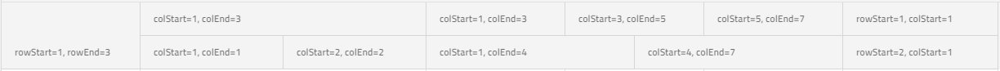

---
title: 그리드 - 다중 행 레이아웃 - 네이티브 Angular | Ignite UI for Angular
_description: Multi row layout allow positioning and sizing the columns in a more powerful and flexible way. Every single column layout is a representation of a complete grid layout which consists of column fields.
_keywords: Ignite UI for Angular, UI controls, Angular widgets, web widgets, UI widgets, Angular, Native Angular Components Suite, Native Angular Controls, Native Angular Components Library, Angular Grid, Angular Table, Angular Data Grid component, Angular Data Table component, Angular Data Grid control, Angular Data Table control, Angular Grid component, Angular Table component, Angular Grid control, Angular Table control, Angular High Performance Grid, Angular High Performance Data Table, Multi Row Layout, Angular Multi Row Layout, Angular Data Table Multi Row Layout, Grid Layout, Angular Grid Layout, Column Layout, ColumnLayout, igxColumnLayout
_language: kr
---

### 다중 행 레이아웃

다중 행 레이아웃은 `igxGridComponent`의 렌더링 기능을 확장합니다. 이 기능을 사용하면 단일 데이터 레코드를 여러 가시적인 행으로 분할할 수 있습니다.

#### 데모

<div class="sample-container loading" style="height:600px">
    <iframe id="grid-multi-row-layout-iframe" src='{environment:demosBaseUrl}/grid/grid-multi-row-layout' width="100%" height="100%" seamless frameBorder="0" onload="onSampleIframeContentLoaded(this);"></iframe>
</div>
<br/>
<div>
<button data-localize="stackblitz" disabled class="stackblitz-btn" data-iframe-id="grid-multi-row-layout-iframe" data-demos-base-url="{environment:demosBaseUrl}">STACKBLITZ 에서 보기</button>
</div>

다중 행 레이아웃 선언은 [`igx-column-layout`]({environment:angularApiUrl}/classes/igxcolumnlayoutcomponent.html) 컴포넌트를 통해 이루어집니다. 각 `igx-column-layout` 컴포넌트는 하나 이상의 `igx-column` 컴포넌트를 포함하는 블록으로 간주해야 합니다. 일부 그리드 기능은 블록 수준에서 작동합니다(아래의 "기능 통합" 섹션에서 열거). 예를 들면, 가상화는 블록을 사용하여 가상 청크를 결정하므로 성능을 향상하려면 레이아웃이 허용하는 경우, 열을 더 많은 `igx-column-layout` 블록으로 분할합니다. 다중 행 레이아웃을 구성할 경우, 이러한 블록 이외에 열이 없어야 하며, `IgxColumnGroupComponent`를 사용하지 않아야 합니다. 다중 행 레이아웃은 [grid layout](https://www.w3.org/TR/css-grid-1/) 사양 상에서 구현되며 요구 사항을 준수해야 합니다.

`IgxColumnComponent` 네 개의 `@Input` 속성을 노출하여 각 셀의 위치와 범위를 결정합니다.
* [`colStart`]({environment:angularApiUrl}/classes/igxcolumncomponent.html#colstart) - 필드가 시작되는 열 인덱스입니다. 이 속성은 **mandatory**입니다.
* [`rowStart`]({environment:angularApiUrl}/classes/igxcolumncomponent.html#rowstart) - 필드가 시작되는 행 인덱스입니다. 이 속성은 **mandatory**입니다.
* [`colEnd`]({environment:angularApiUrl}/classes/igxcolumncomponent.html#colend) - 현재 필드가 끝나는 열 인덱스입니다. colStart와 colEnd 사이의 열의 양은 해당 필드에 대한 스패닝 열의 양을 결정합니다. 이 속성은 **optional**입니다. 설정되지 않은 경우, 기본값은 `colStart + 1`입니다.
* [`rowEnd`]({environment:angularApiUrl}/classes/igxcolumncomponent.html#rowend) - 현재 필드가 끝나는 행 인덱스입니다. rowStart와 rowEnd 사이의 행의 양은 해당 필드에 대한 스패닝 행의 양을 결정합니다. 이 속성은 **optional**입니다. 설정되지 않은 경우, 기본값은 `rowStart + 1`입니다.


```html
<igx-column-layout>
	<igx-column [rowStart]="1" [colStart]="1" [rowEnd]="3" field="ID"></igx-column>
</igx-column-layout>
<igx-column-layout>
	<igx-column [rowStart]="1" [colStart]="1" [colEnd]="3" field="CompanyName"></igx-column>
	<igx-column [rowStart]="2" [colStart]="1" [colEnd]="2" field="ContactName"></igx-column>
	<igx-column [rowStart]="2" [colStart]="2" [colEnd]="3" field="ContactTitle"></igx-column>
</igx-column-layout>
<igx-column-layout>
	<igx-column [rowStart]="1" [colStart]="1" [colEnd]="3" field="Country"></igx-column>
	<igx-column [rowStart]="1" [colStart]="3" [colEnd]="5" field="Region"></igx-column>
	<igx-column [rowStart]="1" [colStart]="5" [colEnd]="7" field="PostalCode"></igx-column>
	<igx-column [rowStart]="2" [colStart]="1" [colEnd]="4" field="City"></igx-column>
	<igx-column [rowStart]="2" [colStart]="4" [colEnd]="7" field="Address"></igx-column>
</igx-column-layout>
<igx-column-layout>
		<igx-column [rowStart]="1" [colStart]="1" field="Phone"></igx-column>
		<igx-column [rowStart]="2" [colStart]="1" field="Fax"></igx-column>
</igx-column-layout>
```

위의 구성 결과는 아래 스크린 숏에서 볼 수 있습니다:




> [!NOTE]
> [`rowStart`]({environment:angularApiUrl}/classes/igxcolumncomponent.html#rowstart) 및 [`colStart`]({environment:angularApiUrl}/classes/igxcolumncomponent.html#colstart) 속성은 각 `igx-column`에 대해 `igx-column-layout`에 설정해야 합니다. `igxColumnLayout` 컴포넌트는 레이아웃이 올바른지 확인하지 않으며 이에 대한 오류나 경고를 표시하지 않습니다. 개발자는 레이아웃 선언이 정확하고 완전한지 확인해야 하는데 그렇지 않으면 정렬 오류, 중복 및 브라우저 불일치로 잘못된 레이아웃으로 끝날 수 있습니다.

### 기능 통합
다중 행 레이아웃의 렌더링 방식이 완전히 다르기 때문에 일부 열 기능은 `igx-column-layout` 컴포넌트에서만 작동합니다. 이러한 기능은 Column Pinning 및 Column Hiding입니다. 정렬 및 그룹화 같은 객체는 `igx-column` 컴포넌트에서 동일한 방식으로 작동합니다.
- 필터링 - Excel 스타일 필터링만 지원됩니다. `filterMode`를 명시적으로 `FilterMode.quickFilter`로 설정해도 아무런 효과가 없습니다.
- 페이징 - 시각적 행이 아닌 레코드에서 작동합니다.
- 그룹화 - `hideGroupedColumns` 옵션은 다중 행 레이아웃에 영향을 미치지 않습니다. 그룹화된 열은 항상 표시됩니다.

현재 지원되지 **않는** 기능은 다음과 같습니다:
- 열 이동 
- 복수 열 헤더
- Excel로 내보내기
- 요약

### 키보드 탐색

IgxGridComponent with Multi-Row Layouts provides build-in keyboard navigation.

#### TAB navigation
* <kbd>TAB</kbd> and <kbd>Shift</kbd> + <kbd>TAB</kbd> - move to the next/previous cell in a row unaffected by the column layouts that are defined.  The navigation is done through all of the cells by focusing each one only once for each row, meaning that it should skip cell if it doesn't have the same `rowStart` as the currently selected cell. When the row is in edit mode, the navigation is restricted to the cells into that row and to the CANCEL and DONE buttons.

#### Horizontal nagivation
* <kbd>Arrow Left</kbd> or <kbd>Arrow Right</kbd> - move to the adjacent cell on the left/right within the current row unaffected by the column layouts that are defined. If the current cell spans on more than one row, <kbd>Arrow Left</kbd> and <kbd>Arrow Right</kbd> should navigate to the first cell on the left and right with the same `rowStart`, unless you have navigated to some other adjacent cell before. The navigation stores the starting navigation cell and navigates to the cells with the same `rowStart` if possible.
* <kbd>Ctrl</kbd> + <kbd>Arrow Left</kbd> (<kbd>HOME</kbd>) or <kbd>Ctrl</kbd> + <kbd>Arrow Right</kbd> (<kbd>END</kbd>) - navigate to the start or end of the row and select the cell with accordance to the starting navigation cell.


#### Vertical nagivation
* <kbd>Arrow Up</kbd> or <kbd>Arrow Down</kbd> - move to the cell above/below in relation to a starting position and is unaffected by the rows. If the current cell spans on more than one column the next active cell will be selected with accordance to the starting navigation cell.
* <kbd>Ctrl</kbd> + Arrow Up</kbd> or <kbd>Ctrl</kbd> + <kbd>Down</kbd> - Navigate and apply focus on the same column on the first or on the last row.
* <kbd>Ctrl</kbd> + <kbd>Home</kbd> or <kbd>Ctrl</kbd> + <kbd>End</kbd> - Navigate to the first row and focus first cell or navigate to the last row and focus the last cell.
	
	
> [!Note]
> Navigation through cells which span on multiple rows or columns is done with accordance to the starting navigation cell and will allow returning to the starting cell using the key for the opposite direction. The same approach is used when navigating through group rows.

> [!Note]
> Selection and multi cell selection are working on layout, meaning that when a cell is active, its layout will be selected. Also all features of multiple selection like drag selection are applicable and will work per layout not per cell.

#### Custom Keyboard Navigation

The grid allows customizing the default navigation behavior when a certain key is pressed. Actions like `going to the next cell` or `cell below` could be handled easily with the powerful keyboard navigation API:

- [`onGridKeydown`]({environment:angularApiUrl}/classes/igxgridbasedirective.html#ongridkeydown) is exposed. The event will emit [`IGridKeydownEventArgs`]({environment:angularApiUrl}/interfaces/igridkeydowneventargs.html). This event is available only through the keyboard key combinations mentioned above, for all other key actions you can use `keydown` event `(keydown)="onKeydown($event)"`
- [`navigateTo`]({environment:angularApiUrl}/classes/igxgridbasedirective.html#navigateto) - this method allows you to navigate to a position based on provided `rowindex` and `visibleColumnIndex`

The demo below adds additional navigation down/up via the <kbd>Enter</kbd> and <kbd>Shift</kbd> + <kbd>Enter</kbd> keys, similar to the behavior observed in Excel.

#### Demo

<div class="sample-container loading" style="height:605px">
    <iframe id="grid-mrl-custom-navigation-iframe" src='{environment:demosBaseUrl}/grid/grid-mrl-custom-navigation' width="100%" height="100%" seamless frameBorder="0" onload="onSampleIframeContentLoaded(this);"></iframe>
</div>
<br/>
<div>
<button data-localize="stackblitz" disabled class="stackblitz-btn" data-iframe-id="grid-mrl-custom-navigation-iframe" data-demos-base-url="{environment:demosBaseUrl}">view on stackblitz</button>
</div>

### Layout Configurator


Sometimes when configuring a column layout it might be a challenge to calculate and set the proper [`colStart`]({environment:angularApiUrl}/classes/igxcolumncomponent.html#colstart)  and [`colEnd`]({environment:angularApiUrl}/classes/igxcolumncomponent.html#colend)  or [`rowStart`]({environment:angularApiUrl}/classes/igxcolumncomponent.html#rowstart)  and [`rowEnd`]({environment:angularApiUrl}/classes/igxcolumncomponent.html#rowend). Especially when there are a lot of columns in a single layout. That is why we have created a small configurator, so you can easily do that and have a similar preview of how it would look inside the igxGrid when applied. You can do the following interactions with it:

* Set number of rows for the whole configuration. All layouts must have the same amount of rows.
* Add/Remove column layouts by clicking the `Add Layout` chip or reordering them by dragging a layout chip left/right.
* Set specific settings for each layout as number of columns and how wide they will be. The setting refer to the currently selected layout.
* Resize column cells in the layout preview so they can span more columns/rows or clear them using the `Delete` button.
* Set columns in the preview by dragging a column chip in the place your will want it to be.
* Add/Remove new columns by using the `Add Column` chip.
* Get template output of the whole configuration ready to by placed inside an igxGrid or the JSON representation that can also be used and parsed in your template using [`NgForOf`](https://angular.io/api/common/NgForOf) for example.

By default we have set the same columns as our previous sample, but it can be cleared and configured to match your desired configuration.

<div class="sample-container loading" style="height:500px">
    <iframe id="grid-multi-row-layout-configuration-iframe" src='{environment:demosBaseUrl}/grid/grid-multi-row-layout-configuration' width="100%" height="100%" seamless frameBorder="0" onload="onSampleIframeContentLoaded(this);"></iframe>
</div>

### Styling
The igxGrid allows styling through the [Ignite UI for Angular Theme Library](../themes/component-themes.md). The grid's [theme]({environment:sassApiUrl}/index.html#function-igx-grid-theme) exposes a wide variety of properties, which allow the customization of all the features of the grid. 

In the below steps, we are going through the steps of customizing the grid's Multi Row Layout styling.     

 #### Importing global theme
To begin the customization of the Multi Row Layout feature, you need to import the `index` file, where all styling functions and mixins are located.

```scss
@import '~igniteui-angular/lib/core/styles/themes/index'
```   

#### Defining custom theme
Next, create a new theme, that extends the [`igx-grid-theme`]({environment:sassApiUrl}/index.html#function-igx-grid-theme) and accepts the parameters, required to customize the feature layout as desired.   

```scss
$custom-theme: igx-grid-theme(
    $cell-active-border-color: #ffcd0f,
    $cell-selected-background: #6f6f6f,
    $row-hover-background: #fde069,
    $row-selected-background: #8d8d8d,
    $header-background: #494949,
    $header-text-color: #fff,
    $sorted-header-icon-color: #ffcd0f,
    $sortable-header-icon-hover-color: #e9bd0d
);
```    

#### Defining a custom color palette
In the approach, that was described above, the color values were hardcoded. Alternatively, you can achieve greater flexibility, using the [`igx-palette`]({environment:sassApiUrl}/index.html#function-igx-palette) and [`igx-color`]({environment:sassApiUrl}/index.html#function-igx-color) functions.   
`igx-palette` generates a color palette, based on provided primary and secondary colors.  

 ```scss
$black-color: #494949;
$yellow-color: #FFCD0F;

$custom-palette: igx-palette(
  $primary: $black-color,
  $secondary: $yellow-color
);
```   

After a custom palette has been generated, the `igx-color` function can be used to obtain different varieties of the primary and the secondary colors.

```scss
$custom-theme: igx-grid-theme(
    $cell-active-border-color: igx-color($custom-palette, "secondary", 500),
    $cell-selected-background: igx-color($custom-palette, "primary", 300),
    $row-hover-background: igx-color($custom-palette, "secondary", 300),
    $row-selected-background: igx-color($custom-palette, "primary", 100),
    $header-background: igx-color($custom-palette, "primary", 500),
    $header-text-color: igx-contrast-color($custom-palette, "primary", 500),
    $sorted-header-icon-color: igx-color($custom-palette, "secondary", 500),
    $sortable-header-icon-hover-color: igx-color($custom-palette, "secondary", 600)
);
```

#### Defining custom schemas
You can go even further and build flexible structure that has all the benefits of a [**schema**](../themes/schemas.md). The **schema** is the recipe of a theme.   
Extend one of the two predefined schemas, that are provided for every component. In our case, we would use `$_light_grid`.   
```scss
$custom-grid-schema: extend($_light-grid,(
    cell-active-border-color: (igx-color:('secondary', 500)),
    cell-selected-background: (igx-color:('primary', 300)),
    row-hover-background: (igx-color:('secondary', 300)),
    row-selected-background: (igx-color:('primary', 100)),
    header-background: (igx-color:('primary', 500)),
    header-text-color: (igx-contrast-color:('primary', 500)),
    sorted-header-icon-color: (igx-color:('secondary', 500)),
    sortable-header-icon-hover-color: (igx-color:('secondary', 600)) 
));
```   

In order for the custom schema to be applied, either `light`, or `dark` globals has to be extended. The whole process is actually supplying a component with a custom schema and adding it to the respective component theme afterwards.   

```scss
$my-custom-schema: extend($light-schema, ( 
    igx-grid: $custom-grid-schema
));
 $custom-theme: igx-grid-theme(
    $palette: $custom-palette,
    $schema: $my-custom-schema
);
```

#### Applying the custom theme
The easiest way to apply your theme is with a `sass` `@include` statement in the global styles file:  
```scss
@include igx-grid($custom-theme);
```

#### Scoped component theme

In order for the custom theme do affect only specific component, you can move all of the styles you just defined from the global styles file to the custom component's style file (including the import of the `index` file).

This way, due to Angular's [ViewEncapsulation](https://angular.io/api/core/Component#encapsulation), your styles will be applied only to your custom component.

 >[!NOTE]
 >If the component is using an [`Emulated`](../themes/component-themes.md#view-encapsulation) ViewEncapsulation, it is necessary to penetrate this encapsulation using `::ng-deep` in order to style the grid.
 >[!NOTE]
 >Wrap the statement inside of a `:host` selector to prevent your styles from affecting elements *outside of* our component: 

```scss
:host {
    ::ng-deep {
        @include igx-grid($custom-theme);
    }
}
```

#### Demo 

<div class="sample-container loading" style="height:755px">
    <iframe id="grid-multi-row-layout-styling" data-src='{environment:demosBaseUrl}/grid/grid-multi-row-layout-styling' width="100%" height="100%" seamless frameBorder="0" class="lazyload no-theming"></iframe>
</div>
<div>
    <button data-localize="stackblitz" disabled class="stackblitz-btn" data-iframe-id="grid-multi-row-layout-styling" data-demos-base-url="{environment:demosBaseUrl}">view on stackblitz</button>
</div>

### API 참조
<div class="divider--half"></div>

* [@@igxNameComponent]({environment:angularApiUrl}/classes/@@igTypeDoc.html)
* [@@igxNameComponent 스타일]({environment:sassApiUrl}/index.html#function-igx-grid-theme)
* [IgxColumnLayoutComponent]({environment:angularApiUrl}/classes/igxcolumnlayoutcomponent.html)
* [IgxColumnComponent]({environment:angularApiUrl}/classes/igxcolumncomponent.html)
<div class="divider--half"></div>

### 추가 리소스
<div class="divider--half"></div>

* [@@igComponent 개요](@@igMainTopic.md)
* [가상화 및 성능](virtualization.md)
* [페이징](paging.md)
* [정렬](sorting.md)
* [열 크기 조정](column_resizing.md)
* [선택](selection.md)

<div class="divider--half"></div>
커뮤니티는 활동적이고 새로운 아이디어를 항상 환영합니다.

* [Ignite UI for Angular **포럼**](https://www.infragistics.com/community/forums/f/ignite-ui-for-angular)
* [Ignite UI for Angular **GitHub**](https://github.com/IgniteUI/igniteui-angular)
